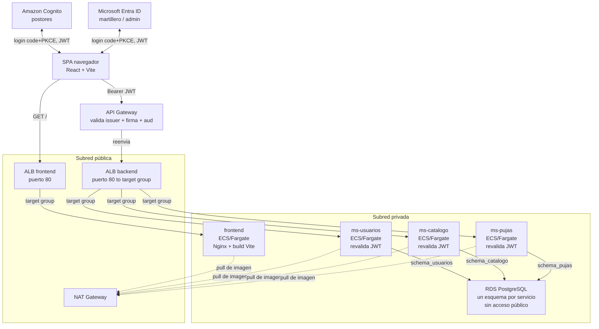

# Despliegue de SubastaLive en AWS — guía paso a paso (consola web)

Esta guía levanta, desde cero y en una sola cuenta de AWS Academy, toda la infraestructura de la **Etapa 1**:
red (con subredes privadas de verdad), base de datos, cómputo en contenedores, balanceo de carga, identidad
federada, puerta de entrada con validación de JWT, y el frontend — que se despliega **como otro contenedor
más en ECS**, con el mismo patrón que los tres microservicios (no como sitio estático en S3+CloudFront, ver
la nota en la sección 10).

**Todo se configura en el portal web de AWS (y el portal de Azure para Entra ID) — no se usa la CLI de AWS en
ningún paso.** Los únicos comandos de terminal que vas a necesitar son los normales de Docker (construir
imágenes) y de npm (compilar el frontend). Ningún `aws ec2 ...`/`aws ecs ...` — esos los ejecuta **GitHub
Actions por ti** una vez que dejes cargados los Secrets. RDS queda en una subred privada, pero no hace falta
conectarse a ella a mano: cada microservicio crea y actualiza su propio esquema solo, con Flyway, al
arrancar (ver sección 3).

## Por qué cada uno despliega todo

Es tentador dividir el trabajo así: "yo hago el backend, tú el front, alguien más sube todo a AWS al final".
Ese reparto deja a dos de cada tres personas del equipo sin haber tocado nunca la consola de AWS — y en la
presentación de la pauta, cualquiera puede tener que explicar por qué el API Gateway valida el JWT antes de
llegar al ALB, o por qué RDS vive en una subred privada.

Por eso esta guía asume que **una sola persona** despliega la arquitectura completa en su propia cuenta —
pero está pensada para que las tres personas del equipo la sigan, cada una en su propio laboratorio de
Canvas, usando una imagen de contenedor de práctica mientras los microservicios reales todavía se están
construyendo. Al final, los tres han creado una VPC con subredes privadas, un NAT Gateway, una RDS, un
cluster ECS, un ALB, un API Gateway con autorizador JWT y un User Pool de Cognito con sus propias manos — no
solo lo vieron en un diagrama.

## Antes de empezar

Instala esto en tu máquina:

- **Docker Desktop** — para construir la imagen de práctica (esto sí abre una terminal, es inevitable).
- **Postman** (o Insomnia) — para probar el API Gateway con un token, sin usar `curl`.
- **Node.js 20+** — para el build del frontend (`npm run build`).
- El repositorio de SubastaLive clonado localmente.

> **Específico de AWS Academy Learner Lab.** No puedes crear roles ni políticas IAM — la cuenta ya trae uno
> preparado llamado `LabRole`, y es el que vas a elegir en todos los menús desplegables donde ECS pida un
> rol. Si un asistente te deja escribir un nombre de rol nuevo y falla con "not authorized", es porque
> intentaste crear uno — busca `LabRole` en la lista en vez de escribir uno.
>
> La sesión del laboratorio dura unas horas y las credenciales que le vas a pasar a GitHub expiran con ella.
> Si un despliegue automático empieza a fallar de un día para otro, lo primero que hay que revisar es si el
> laboratorio se venció (hay que volver a Canvas, reiniciarlo, y actualizar los Secrets en GitHub).
>
> **El NAT Gateway cobra por hora + por dato**, incluso parado no existe "pausarlo" — o está creado (cobrando)
> o está borrado. Si te preocupa el gasto de créditos del laboratorio, bórralo cuando termines de trabajar
> (sección 13) y créalo de nuevo la próxima sesión — es rápido (unos minutos), pero cualquier deploy que se
> dispare mientras no exista va a fallar con `CannotPullContainerError` hasta que vuelva a estar arriba.

## El mapa completo

Este es el camino que recorre una petición real una vez que todo esté desplegado, mostrando qué vive en
subred **pública** y qué en subred **privada**. Cada sección de esta guía construye una de estas piezas, en
este orden.



Dos ALB separados: uno solo lo usa el navegador para cargar el frontend, el otro solo lo usa el API Gateway
para llegar a los microservicios — así no hay que mezclar reglas de listener por path en uno solo. Las tareas
de ECS y RDS no tienen IP pública ni son alcanzables desde internet: las tareas salen a buscar su imagen a
través del NAT Gateway, y a RDS no se entra desde afuera del todo — cada microservicio gestiona su propio
esquema al arrancar (Flyway, ver sección 3), sin que nadie necesite conectarse a mano.

## 1. Entrar a la consola de AWS

En Canvas, abre el laboratorio (AWS Academy Learner Lab). Cuando el círculo se ponga verde, haz clic en el
botón **AWS** (no en "AWS Details" todavía) — te abre la consola web de AWS ya autenticada, sin pedirte
usuario ni contraseña. Todo lo que sigue ocurre ahí, en el navegador.

Anota, mirando la esquina superior derecha de la consola:

- La **región** activa (normalmente `us-east-1` — si no es esa, elígela ahí para todo lo que sigue).
- Tu **Account ID**, haciendo clic en el nombre de la cuenta en esa misma esquina.

Vas a necesitar ambos datos más adelante para las URLs de ECR y de los issuers de Cognito.

## 2. Red — VPC, subredes propias y NAT Gateway

Todo lo demás vive dentro de esta red, así que va antes que la base de datos.

### VPC default: borrar sus subredes y crear las 4 propias

El VPC default trae subredes públicas ya creadas (una por AZ), pero para tener control total de los rangos
se borran y se crean 4 propias desde cero: 2 públicas y 2 privadas.

1. **VPC → Your VPCs** → entra al que dice `Default VPC` → anota su **CIDR** (normalmente `172.31.0.0/16`).
2. **VPC → Subnets**, filtra por ese VPC → selecciona todas las subredes existentes → **Actions → Delete
   subnet** → confirma. (No se toca el Internet Gateway, sigue attacheado al VPC.)
3. **Create subnet**, VPC: el default. En el mismo asistente, con "Add new subnet" se agregan las 4 de una:

   | Nombre | Availability Zone | IPv4 CIDR |
   |---|---|---|
   | `subastalive-public-1a` | AZ 1 — **elígela explícitamente**, ej. `us-east-1f` | `172.31.0.0/20` |
   | `subastalive-private-1a` | **la misma AZ que `public-1a`** (ej. `us-east-1f`) | `172.31.32.0/20` |
   | `subastalive-public-1b` | AZ 2 — **elígela explícitamente, distinta a la AZ 1** (ej. `us-east-1a`) | `172.31.16.0/20` |
   | `subastalive-private-1b` | **la misma AZ que `public-1b`** (ej. `us-east-1a`) | `172.31.48.0/20` |

   Un `/16` partido en bloques `/20` da bloques de 4096 IPs cada uno, y cada bloque debe empezar en un
   múltiplo de 16 en el tercer octeto (`.0`, `.16`, `.32`, `.48`...) para no solaparse — por eso las CIDR de
   la tabla van de 16 en 16, no de 1 en 1.

   > **No dejes "Sin preferencia" en Availability Zone.** Si lo haces en varias subredes seguidas, AWS no
   > garantiza repartirlas — pueden terminar **todas en la misma AZ** (nos pasó probando esto: las 4
   > terminaron en `us-east-1f`). El ALB necesita sus 2 subredes públicas en AZs distintas, y el DB Subnet
   > Group de RDS necesita sus 2 subredes privadas en AZs distintas — si eliges la AZ a mano para cada una,
   > como en la tabla de arriba, no hay ambigüedad.

4. **Create subnet**.
5. Selecciona `subastalive-public-1a` → **Actions → Edit subnet settings** → activa **"Enable auto-assign
   public IPv4 address"** → **Save**. Repite con `subastalive-public-1b`. Las 2 privadas se quedan como están
   (esa casilla apagada, por defecto).

Las 4 subredes nuevas quedan asociadas automáticamente a la tabla de rutas **principal** del VPC (que ya
tiene `0.0.0.0/0 → Internet Gateway`) — por eso, apenas activado el auto-assign, las dos `public-*` ya son
funcionalmente públicas sin nada más que hacer. Las privadas se cambian de tabla de rutas más abajo.

### NAT Gateway

6. **VPC → NAT Gateways → Create NAT gateway**.
7. Name: `subastalive-nat`.
8. **Modo de disponibilidad:** **Zonal** (no "Regional" — esa es una opción nueva de la consola pensada para
   alta disponibilidad automática en varias AZ, con más costo; acá se usa un solo NAT Gateway en una subred
   específica, que es justo lo que "Zonal" permite elegir).
9. **Subnet** (aparece al elegir Zonal): `subastalive-public-1a` (el NAT vive en una pública, presta salida
   a las privadas).
10. **Tipo de conectividad:** `Pública`.
11. **Método de asignación de IP elástica (EIP):** **Automático** — deja que AWS cree y gestione la IP sola.
12. **Create NAT gateway**. Tarda unos minutos en pasar a **Available** — no sigas hasta que lo esté.

### Tabla de rutas para las subredes privadas

13. **VPC → Route Tables → Create route table**. Name: `subastalive-private-rt`. VPC: el default.
14. Entra a la tabla creada → pestaña **Routes → Edit routes → Add route**: Destination `0.0.0.0/0`, Target
    **NAT Gateway** → selecciona `subastalive-nat` → **Save changes**.
15. Pestaña **Subnet associations → Edit subnet associations** → marca `subastalive-private-1a` y
    `subastalive-private-1b` → **Save associations**.

> **Si más adelante borras y recreas alguna subred privada** (por ejemplo corrigiendo una AZ mal elegida, ver
> el recuadro de arriba), esa subred nueva **no hereda** la asociación a `subastalive-private-rt` — vuelve a
> quedar en la tabla principal por defecto. Hay que repetir el paso 15 a mano cada vez. Si se te olvida, el
> síntoma no aparece de inmediato en la creación de la subred, sino mucho después, al intentar correr una
> tarea de ECS ahí: la tarea queda "Pendiente" y el servicio termina fallando con algo como
> `ResourceInitializationError: unable to pull secrets or registry auth ... dial tcp ...: i/o timeout` — la
> tarea no tiene ruta de salida a internet para llegar a ECR. Antes de crear el Service de ECS (sección 6),
> confirma en **VPC → Route Tables → `subastalive-private-rt` → pestaña Routes** que sigue existiendo la ruta
> `0.0.0.0/0 → subastalive-nat` (no solo la `local`) — si falta, agrégala de nuevo (paso 14) y el problema se
> resuelve sin tener que tocar nada más.

### Verificación — así deben quedar las 4 subredes

Antes de seguir, confirma en **VPC → Subnets** (columnas: Availability Zone y Route table) que quedó así —
si algo no calza, corrígelo ahora, porque el ALB y el DB Subnet Group de RDS fallan si no:

| Subred | AZ | CIDR | Tabla de rutas | Auto-assign IPv4 pública |
|---|---|---|---|---|
| `subastalive-public-1a` | AZ 1 (ej. `us-east-1f`) | `172.31.0.0/20` | la **principal** del VPC (tiene ruta al Internet Gateway) | Sí |
| `subastalive-private-1a` | **misma AZ 1** | `172.31.32.0/20` | `subastalive-private-rt` | No |
| `subastalive-public-1b` | AZ 2, distinta (ej. `us-east-1a`) | `172.31.16.0/20` | la **principal** del VPC | Sí |
| `subastalive-private-1b` | **misma AZ 2** | `172.31.48.0/20` | `subastalive-private-rt` | No |

Es decir: cada AZ tiene una pública y una privada; las dos públicas están en la tabla principal (con salida
directa a internet); las dos privadas están en `subastalive-private-rt` (con salida solo por el NAT Gateway).

## 3. Base de datos — Amazon RDS (privada)

### Grupo de subredes privado

1. **RDS → Subnet groups → Create DB subnet group**.
2. Name: `subastalive-private-subnet-group`. VPC: el default.
3. Availability Zones: las 2 que usaste para las subredes privadas. Subnets: selecciona
   `subastalive-private-1a` y `subastalive-private-1b` (no las públicas).
4. **Create**.

### La instancia

5. **RDS → Create database → Standard create**.
6. Motor: **PostgreSQL**, versión 16.x (la más reciente que ofrezca).
7. Templates: **Free tier** (si aparece disponible) o **Dev/Test**.
8. Settings: DB instance identifier `subastalive-db`; Master username `subastalive`; define una master
   password y anótala.
9. Instance configuration: la clase más pequeña disponible, `db.t3.micro`.
10. Storage: 20 GiB, tipo gp3.
11. Connectivity: "Don't connect to an EC2 compute resource"; VPC: la default; **DB subnet group**:
    `subastalive-private-subnet-group`; **Public access: No**; VPC security group: **Create new**, nómbralo
    `subastalive-rds-sg`.
12. Additional configuration → Initial database name: `subastalive` (anótalo, lo necesitas al conectarte).
13. **Create database**. Espera a que el estado pase a **Available** (5–10 minutos).
14. Entra a la instancia → pestaña **Connectivity & security** → copia el **Endpoint**.

### Security group: sin acceso desde afuera todavía

15. `subastalive-rds-sg` nace sin reglas de entrada — así se queda por ahora. Más adelante (sección 6) le
    agregas la única regla que va a tener: acceso desde `subastalive-ecs-sg`, para que las tareas de ECS
    puedan conectarse. No hay ninguna otra vía de entrada, y no hace falta ninguna.

### No hace falta aplicar los esquemas a mano

RDS queda arriba, privada, y **vacía** — y así se queda hasta que el primer microservicio con código se
despliegue. Cada microservicio trae Flyway (ver [`../db/README.md`](../db/README.md), sección "Migraciones
automáticas") y, al arrancar por primera vez, crea su propio esquema y tablas solo, usando el mismo
`V1__init.sql` que ya está en este repo. No hay ningún paso manual de base de datos en esta guía — ni ahora
ni en deploys futuros.

Si en algún momento necesitas mirar datos a mano (debugging puntual), no hay una vía permanente para eso en
esta arquitectura — tocaría levantar un acceso temporal (por ejemplo, una EC2 chica solo para esa sesión) y
volver a borrarlo después. No es parte del flujo normal.

## 4. Una imagen para practicar el pipeline (opcional)

Si ninguno de tus microservicios tiene código todavía, arma una imagen de práctica ("ms-demo") solo para
aprender el camino **ECR → ECS → ALB → API Gateway** de punta a punta, y reemplázala por el servicio real
más adelante — la mecánica es idéntica.

```dockerfile
# Dockerfile
FROM python:3.12-alpine
WORKDIR /app
COPY index.html .
EXPOSE 8080
CMD ["python3", "-m", "http.server", "8080"]
```

```html
<!-- index.html -->
<h1>ms-demo OK</h1>
```

**En este proyecto ya no hace falta**: `ms-pujas` está implementado de verdad (Spring Boot + Postgres +
Flyway) y ya probado localmente con Docker Compose, así que las secciones siguientes lo usan directo a él
como primer servicio desplegado — sin placeholder. Si algún día partes de cero con un servicio nuevo, usa
esta sección como referencia.

## 5. Registro de imágenes — Amazon ECR

1. Consola → **ECR → Create repository**. Nombre: `subastalive/ms-pujas` → **Create repository**.
2. Entra al repositorio recién creado y haz clic en **View push commands** (arriba a la derecha).
3. Copia las 4 líneas (login, build, tag, push) — ya vienen armadas con tu Account ID y región correctos.
4. En tu terminal, muévete a la carpeta del servicio antes de pegarlas: `cd ms-pujas`.

> **Si usas PowerShell y la primera línea es `(Get-ECRLoginCommand).Password | docker login ...`, va a
> fallar** con `El término 'Get-ECRLoginCommand' no se reconoce...` — es un cmdlet de un módulo de AWS para
> PowerShell (`AWS.Tools.ECR`) que normalmente no está instalado. Usa el equivalente con la CLI de AWS en su
> lugar:
>
> ```powershell
> # Credenciales del laboratorio (panel "AWS Details" en Canvas) para esta ventana de PowerShell:
> $env:AWS_ACCESS_KEY_ID = "..."
> $env:AWS_SECRET_ACCESS_KEY = "..."
> $env:AWS_SESSION_TOKEN = "..."
> $env:AWS_DEFAULT_REGION = "us-east-1"
>
> aws ecr get-login-password --region us-east-1 | docker login --username AWS --password-stdin <ACCOUNT_ID>.dkr.ecr.us-east-1.amazonaws.com
> ```
>
> Esto sí requiere tener la CLI de AWS instalada localmente (`aws --version`) — es la única excepción real a
> "todo por consola web": no existe una forma de autenticar Docker contra ECR solo con clics. Las variables
> `$env:...` se pierden al cerrar la ventana, y el login expira a las ~12 horas — hay que repetirlo si pasa
> alguna de las dos cosas, o si el laboratorio se reinicia con credenciales nuevas.

## 6. Cómputo — ECS con Fargate

### Cluster

1. Consola → **ECS → Clusters → Create cluster**.
2. Nombre: `subastalive-cluster`. Infraestructura: **AWS Fargate (serverless)** → **Create**.

> **Si sale el error "Unable to assume the service linked role. Please verify that the ECS service linked
> role exists."** — pasa la primera vez que se usa ECS en una cuenta nueva; el rol
> `AWSServiceRoleForECS` a veces tarda en crearse solo. Simplemente **reintenta** crear el cluster con los
> mismos datos. Si vuelve a fallar: **IAM → Roles → Create role → AWS service** → busca "Elastic Container
> Service" → **Next → Create role** (esto crea específicamente ese rol vinculado al servicio, no un rol
> custom, así que debería estar permitido aunque el laboratorio bloquee IAM en general) → reintenta el cluster.

### Security groups

Antes de la task definition, crea dos grupos de seguridad (**EC2 → Security Groups → Create security
group** — la consola exige una **Description**, no la dejes vacía):

- `subastalive-alb-sg` — Description: `ALB publico de SubastaLive - recibe trafico HTTP desde internet y lo reenvia hacia las tareas de ECS`. Sin reglas de entrada todavía (se las agregas en el paso del ALB).
- `subastalive-ecs-sg` — Description: `Tareas de ECS de SubastaLive (microservicios) - solo acepta trafico desde el ALB`. Sin reglas todavía (se las agregas después de crear `subastalive-alb-sg`, porque la regla apunta *a ese* security group como origen).

Vuelve a `subastalive-ecs-sg` → **Inbound rules → Add rule**: Type Custom TCP, Port `8083` (el puerto de
`ms-pujas`), Source: elige **Custom** y busca `subastalive-alb-sg` en el desplegable → **Save**.

Edita también `subastalive-rds-sg` (el de la sección 3) → **Add rule**: Type PostgreSQL, Source:
`subastalive-ecs-sg` → **Save** — así las tareas de ECS pueden llegar a la base de datos.

> **Dos errores fáciles de cometer acá, revisa antes de seguir:**
> - Si el asistente de creación de RDS (sección 3) te ofreció agregar tu IP actual como regla de entrada y
>   aceptaste, te queda una regla `PostgreSQL / tu-IP/32` en `subastalive-rds-sg` — es un resto de un enfoque
>   que ya no usamos (nadie se conecta a mano a RDS, ver sección 3). Bórrala si aparece.
> - Al buscar el origen de la regla nueva, es fácil escribir "subastalive-rds" y seleccionar por error
>   `subastalive-rds-sg` **a sí mismo** en vez de `subastalive-ecs-sg`. Verifica en **Inbound rules** que
>   quede exactamente **una** regla, `PostgreSQL / 5432 / Source: subastalive-ecs-sg`.

### Task definition

1. **ECS → Task definitions → Create new task definition**.
2. Family: `subastalive-ms-pujas`. Launch type: **AWS Fargate**.
3. CPU: `.25 vCPU`, Memory: `0.5 GB`.
4. Task role y Task execution role: busca y selecciona **LabRole** en ambos desplegables — no escribas un
   nombre nuevo.
5. Container details: Name `ms-pujas`. Image: usa el selector de la consola (**Select image from Amazon
   ECR**) → elige el repo `subastalive/ms-pujas` → selecciona por **"Etiqueta de imagen" = `latest`**, no
   por el SHA256/digest — si fijas el digest, la Task Definition queda pegada a esa imagen para siempre y
   los despliegues futuros de GitHub Actions (que sí actualizan el tag `latest`) no se van a reflejar nunca.
6. Port mappings: Container port `8083`, Protocol TCP.

   > **La consola precarga este campo en `80` — cámbialo, no lo dejes así.** Si lo dejas en 80 (el puerto
   > `ms-pujas` no escucha ahí, escucha en `8083`), la Task Definition queda mal y esto se arrastra hasta el
   > Service y el Target Group sin dar ningún error en el momento: la tarea arranca y queda "Running", pero el
   > ALB no puede completar el health check contra el puerto real de la app. El síntoma aparece recién al
   > final, en la sección 7: el Target Group muestra el target en estado **Unhealthy** con motivo
   > **"Request timed out"**, y `http://<DNS-del-ALB>/health` responde **504 Gateway Timeout** en el
   > navegador (no 503 — el ALB sí encuentra un target, pero nadie responde en ese puerto). Si ya te pasó:
   > **ECS → Task definitions → `subastalive-ms-pujas` → Create new revision** → corrige el Container port a
   > `8083` → **Create** → luego **ECS → Services → `ms-pujas` → Update service** → elige la revisión nueva →
   > en **Load balancing**, confirma que el campo **Contenedor** ahora dice `ms-pujas 8083:8083` (lo toma solo
   > de la revisión nueva) → **Update**. El **Listener** del ALB se queda en `HTTP:80` sin tocarlo — ese es el
   > puerto público de entrada, no tiene relación con el puerto del contenedor.
   >
   > Después de **Update service**, el Target Group pasa por un estado transitorio normal: los targets viejos
   > (los del puerto `80`) quedan en **`Draining`** ("Target deregistration is in progress") mientras la tarea
   > nueva (puerto `8083`) termina de arrancar y de pasar su propio health check. No es un error — solo espera
   > 1-2 minutos y refresca; cuando el target viejo desaparece y el nuevo queda en **`Healthy`**, recién ahí
   > `http://<DNS-del-ALB>/health` empieza a responder.
7. Environment variables:

   | Key | Value |
   |---|---|
   | `SPRING_PROFILES_ACTIVE` | `local` |
   | `DB_HOST` | el Endpoint de RDS (sección 3) |
   | `DB_PORT` | `5432` |
   | `DB_NAME` | `subastalive` |
   | `DB_USERNAME` | `subastalive` |
   | `DB_PASSWORD` | la master password que definiste |
   | `DB_POOL_MAX_SIZE` | `5` |
   | `MS_CATALOGO_BASE_URL` | `http://localhost:8082` (placeholder — se ajusta cuando exista `ms-catalogo` desplegado) |
   | `SERVER_PORT` | `8083` |

   `SPRING_PROFILES_ACTIVE=local` es intencional: activa el mismo modo de autenticación simplificada
   (`local:<sub>:<ROL>`) que se probó en Docker Compose, para poder desplegar y probar `ms-pujas` en AWS
   antes de que Cognito/Entra ID existan (sección 8). Estos valores quedan en texto plano en la Task
   Definition — es una simplificación deliberada para un laboratorio temporal, no un descuido; la
   alternativa más segura es AWS Secrets Manager con `valueFrom` en vez de `value`, fuera del alcance de
   esta guía.
8. En la sección de logging, deja marcada la casilla que auto-configura CloudWatch Logs (según la versión de
   consola puede decir "Use log collection" o similar) — así no falla por falta de un log group que no
   existe todavía.
9. **Create**.

## 7. Balanceador — Application Load Balancer

1. **EC2 → Load Balancers → Create load balancer → Application Load Balancer**.
2. Name: `subastalive-alb`. Scheme: **Internet-facing**.
3. VPC: la default. Mappings: selecciona `subastalive-public-1a` y `subastalive-public-1b` (el ALB va en
   público, distinto de las tareas).
4. Security groups: `subastalive-alb-sg` (quita el "default" si aparece preseleccionado).
5. Listeners: HTTP puerto 80 → Default action: **Create target group**.
   - Target type: **IP**. Name: `subastalive-tg-pujas`. Protocol HTTP, Port `8083`. VPC: la default.
   - Health check path: `/health` (el endpoint que expone `ms-pujas`).
   - **Next → Create target group**, y de vuelta en el asistente del ALB, selecciónalo como destino del
     listener.
6. Vuelve a `subastalive-alb-sg` → **Inbound rules → Add rule**: Type HTTP (puerto 80), Source **Anywhere**
   (`0.0.0.0/0`) → **Save**.
7. **Create load balancer**. Cuando el estado sea **Active**, copia su **DNS name** (pestaña Description) —
   se usa en la sección 9 (API Gateway).

### Service de ECS

1. **ECS → Clusters → subastalive-cluster → Service → Create**.
2. Launch type: **Fargate**. Task definition: `subastalive-ms-pujas`. Service name: `ms-pujas`. Desired tasks: `1`.
3. Networking: VPC default, subredes **privadas** (`subastalive-private-1a`, `subastalive-private-1b`),
   Security group: `subastalive-ecs-sg`.
4. **Public IP: Turned OFF** — ya no lo necesita, sale a internet por el NAT Gateway de la sección 2.
5. Load balancing: **Application Load Balancer** → selecciona `subastalive-alb`, listener 80, target group
   `subastalive-tg-pujas`.
6. **Health check grace period**: `240` segundos. Un Spring Boot típico (con JPA/Hibernate + pool de
   conexiones a RDS + Flyway) tarda 85-95 segundos en arrancar; sin este valor (por defecto es `0`), el ALB
   empieza a marcar fallos de health check desde el segundo 1, antes de que la app esté lista para responder,
   y ECS puede interpretar eso como un despliegue fallido — ver el recuadro de abajo para el cálculo completo.
7. En el Target Group `subastalive-tg-pujas` (sección anterior) → **Comprobaciones de estado → Editar** →
   baja el **Umbral en buen estado** de `5` (el valor por defecto) a `2` (igual que el umbral no saludable).
   Con 5, el ALB exige 5 chequeos exitosos **seguidos** cada 30s — 150 segundos completos sin un solo fallo —
   antes de marcar el target como `Healthy`; con 2 alcanza con 60 segundos, y es tiempo de sobra para
   confirmar que la app responde de forma estable.
8. **Create**.

> **Consideraciones — fallos reales encontrados desplegando `ms-pujas`, en el orden en que aparecen:**
>
> - **`CannotPullContainerError`** — el NAT Gateway no estaba `Available` todavía (o su subred perdió la
>   asociación a `subastalive-private-rt`, ver la nota de la sección 2). Sin salida a internet, la tarea no
>   puede llegar a ECR. Confirma `Available` en VPC → NAT Gateways antes de crear el service, y que
>   `subastalive-private-rt` tenga la ruta `0.0.0.0/0 → subastalive-nat`.
> - **Target `Unhealthy` con "Request timed out"**, y `/health` responde **504** en el navegador — el
>   Container port de la Task Definition quedó en `80` (el valor que precarga la consola) en vez de `8083`.
>   El ALB no encuentra nada escuchando en el puerto que registró. Se corrige con una nueva revisión de la
>   Task Definition (ver la nota en la sección de Task definition, más arriba) — no alcanza con editar el
>   service solo.
> - **El target de la revisión corregida queda `Unhealthy` un rato y luego ECS revierte solo a la revisión
>   anterior** (reaparece un target en el puerto viejo) — esto pasa si el **Health check grace period** quedó
>   en `0`, o quedó **demasiado corto**. Ojo con esto último: `150` segundos suena razonable (Spring Boot
>   tarda ~90s en arrancar) pero **no alcanza**, porque el umbral saludable *por defecto* del Target Group
>   pide 5 chequeos exitosos seguidos cada 30s = 150 segundos **adicionales** después de que la app ya está
>   lista — total real, ~240 segundos desde que arranca la tarea. Con un grace period de 150s, el reloj de
>   ECS se agota antes de que el ALB llegue a marcar `Healthy`, y ECS lo interpreta como despliegue fallido:
>   mata la tarea y hace rollback, una y otra vez, en un ciclo que no se corta solo (se ve en los logs de
>   CloudWatch: la app arranca bien cada vez, corre ~3 minutos, y aparece `Shutdown initiated` sin que nadie
>   la haya tocado). La solución real combina dos cosas — no alcanza con solo una:
>   1. Baja el **Umbral en buen estado** del Target Group de `5` a `2` (paso 7 de la creación del service,
>      arriba) — reduce lo que el ALB necesita ver para marcar `Healthy`, de 150s a solo 60s.
>   2. Sube el **Health check grace period** del service a `240` segundos.
>
>   Si el ciclo ya empezó: **Update service** → revisión correcta de la Task Definition (la del puerto 8083)
>   + grace period `240` — y de paso corrige el umbral del Target Group, que no depende del service y queda
>   corregido para cualquier despliegue futuro sin tener que tocarlo de nuevo.
>
> Ninguno de estos tres se nota antes de crear el service — todos aparecen recién en el Target Group o en el
> historial de despliegue, minutos después. Si ves cualquiera de estos síntomas, no hace falta borrar nada:
> **Update service** con la corrección correspondiente resuelve los tres.

**Camino feliz** (con el umbral saludable del Target Group en `2`, el grace period del service en `240`
segundos, y el container port en `8083` desde la primera revisión de la Task Definition): la tarea pasa a
**Running** en 1-2 minutos, el target en `subastalive-tg-pujas` pasa de `Initial` a `Healthy` en un solo
ciclo, sin pasar por `Unhealthy` ni por ningún rollback, y `http://<DNS-del-ALB>/health` responde
`ms-pujas up` apenas se cumplen esos ~150 segundos totales — sin necesidad de ningún `Update service`
posterior.

## 8. Identidad — Cognito y Entra ID

### Amazon Cognito (postores)

1. Consola → **Cognito → User pools → Create user pool**.
2. Configure sign-in experience: método de inicio de sesión **Email**.
3. Configure security requirements: política de contraseña por defecto está bien; MFA: **No MFA** (para el
   laboratorio).
4. Configure sign-up experience: activa **self-registration**; atributos requeridos: `email`.
5. Configure message delivery: deja **Send email with Cognito** (suficiente para pruebas).
6. Integrate your app:
   - User pool name: `subastalive-postores`.
   - Hosted authentication pages: **Use the Cognito Hosted UI**. Dominio: `subastalive-<algo-único>`.
   - Initial app client: público, nombre `subastalive-frontend`. **No generes client secret** (queda
     desmarcado — es una SPA pública).
   - Allowed callback URLs: `http://localhost:5173/auth/callback/postor`.
   - Allowed sign-out URLs: `http://localhost:5173`.
   - Identity providers: Cognito user pool.
   - OAuth grant types: **Authorization code grant**.
   - OpenID Connect scopes: `openid`, `email`, `profile`.
7. **Review and create → Create user pool**.
8. Entra al user pool creado → pestaña **App integration** → anota el **Client ID** y el **dominio de Cognito**
   completo. En **User pool overview**, anota el **User pool ID**.

Crea un usuario de prueba:

9. **Users → Create user**. Username/email: `postor.prueba@example.com`. Marca "Mark email as verified".
   Define una contraseña permanente (evita la temporal, para no tener que cambiarla en el primer login).

### Microsoft Entra ID (martillero / administrador)

Esto es Azure, no AWS — vía [portal.azure.com](https://portal.azure.com):

1. **Microsoft Entra ID → App registrations → New registration.** Tipo de cuenta: solo tu tenant.
2. **Redirect URI**, tipo SPA: `http://localhost:5173/auth/callback/staff`.
3. **App roles → Create app role:** crea `MARTILLERO` y `ADMINISTRADOR`.
4. **Enterprise applications** → tu app → **Users and groups** → asigna un usuario de prueba a cada rol.
5. Anota **Application (client) ID** y **Directory (tenant) ID** — la authority es
   `https://login.microsoftonline.com/<TENANT_ID>/v2.0`.

## 9. Puerta de entrada — API Gateway

1. Consola → **API Gateway → Create API → HTTP API → Build**.
2. **Add integration**: Integration type **HTTP**; Method **ANY**; Integration URL:
   `http://<DNS-del-ALB>` (el que copiaste en la sección 7).
3. **Configure routes**: método **ANY**, path `/{proxy+}`, apuntando a esa integración.
4. **Configure stages**: deja el stage `$default` con auto-deploy activado.
5. **Create**. En el resumen de la API, copia la **Invoke URL**.

### Autorizador JWT

6. Menú izquierdo de tu API → **Authorizers → Create**.
7. Tipo: **JWT**. Name: `cognito-postores`. Identity source: `$request.header.Authorization`.
8. Issuer URL: `https://cognito-idp.<tu-región>.amazonaws.com/<User-pool-ID>`.
9. Audience: el **Client ID** de Cognito que anotaste antes.
10. **Create**.
11. Ve a **Routes**, selecciona la ruta `ANY /{proxy+}` → **Attach authorizer** → elige `cognito-postores` →
    **Save**.

### Probar sin terminal

- **Sin token:** pega la Invoke URL en el navegador. Abre las DevTools (F12) → pestaña **Network**, recarga
  → verás la petición con status **401** y el cuerpo del error.
- **Con token, usando el propio frontend:** en `frontend/.env.local`, pon `VITE_AUTH_MODE=oidc` y completa
  `VITE_COGNITO_AUTHORITY` (`https://cognito-idp.<región>.amazonaws.com/<User-pool-ID>`) y
  `VITE_COGNITO_CLIENT_ID`. Corre `npm run dev`, entra como postor de verdad con el usuario de prueba que
  creaste. Una vez logueado, abre DevTools → pestaña **Application** → **Session Storage** →
  `http://localhost:5173` → busca la clave que empieza con `oidc.user:` y copia el valor de `id_token` de
  adentro.
- Abre **Postman → New Request → GET**, pega la Invoke URL, pestaña **Headers** → agrega
  `Authorization: Bearer <el id_token copiado>` → **Send**. Debe responder **200**.

> **Un solo issuer por autorizador.** Un autorizador JWT nativo de API Gateway valida contra **un** issuer.
> Para aceptar Cognito *y* Entra ID en la misma ruta (como pide el contrato), la salida real es un
> autorizador Lambda que pruebe ambos issuers, o dos autorizadores en rutas separadas. Esta guía prueba el
> mecanismo con uno solo — la decisión de cuál camino tomar queda documentada en
> [`ms-catalogo/README.md`](../ms-catalogo/README.md), sección 5.6 del plan.

## 10. Frontend — mismo patrón, su propio ALB

> **Por qué no S3 + CloudFront.** Es lo que proponía el plan original (sección 6.3), pero este laboratorio de
> AWS Academy no otorga permiso para crear Origin Access Control
> (`cloudfront:CreateOriginAccessControl` → `AccessDenied`) — es un límite real de la cuenta, no algo que se
> pueda resolver desde la consola. Como ECR/ECS/ALB sí funcionan sin problema (ya lo probaste con `ms-pujas`),
> el frontend se despliega igual que un microservicio más: un contenedor Nginx sirviendo el build de Vite.

Igual que `ms-pujas`, el frontend de este repo **ya tiene su `Dockerfile`**
(`frontend/Dockerfile` + `frontend/nginx.conf`) — no hace falta inventar nada, y tampoco hace falta construir
la imagen a mano: la sube GitHub Actions la primera vez que hagas push. Lo único que armas acá es la
infraestructura que la va a recibir.

### ECR

1. Consola → **ECR → Create repository**. Nombre: `subastalive/frontend` → **Create repository**.

### Security groups y ALB propio

El frontend necesita su **propio** ALB — el que ya tienes (`subastalive-alb`) es el que usa el API Gateway
para llegar a los microservicios, y no queremos mezclar reglas de listener por path a esta altura.

2. **EC2 → Security Groups → Create security group**: `subastalive-frontend-alb-sg`, sin reglas de entrada
   todavía.
3. Crea otro: `subastalive-frontend-ecs-sg`, tampoco con reglas todavía.
4. Vuelve a `subastalive-frontend-ecs-sg` → **Inbound rules → Add rule**: Type Custom TCP, Port `80`, Source
   **Custom** → busca `subastalive-frontend-alb-sg` → **Save**.
5. Vuelve a `subastalive-frontend-alb-sg` → **Add rule**: Type HTTP (puerto 80), Source **Anywhere**
   (`0.0.0.0/0`) → **Save**.
6. **EC2 → Load Balancers → Create load balancer → Application Load Balancer**.
   - Name: `subastalive-frontend-alb`. Scheme: **Internet-facing**.
   - VPC: la default, subredes `subastalive-public-1a` y `subastalive-public-1b` (mismas que `subastalive-alb`).
   - Security group: `subastalive-frontend-alb-sg`.
   - Listener HTTP puerto 80 → **Create target group**: Target type **IP**, Name `subastalive-tg-frontend`,
     Protocol HTTP, Port `80`, Health check path `/`.
   - **Create load balancer**. Copia su **DNS name** cuando quede **Active** — esa va a ser la URL pública
     del frontend.

### Task definition

7. **ECS → Task definitions → Create new task definition**.
8. Family: `subastalive-frontend`. Launch type: **AWS Fargate**. CPU `.25 vCPU`, Memory `0.5 GB`.
9. Task role y Task execution role: **LabRole** en ambos.
10. Container: Name `frontend`; Image URI: `<ACCOUNT_ID>.dkr.ecr.<región>.amazonaws.com/subastalive/frontend:latest`
    (con tu Account ID y región — la imagen todavía no existe, es la que va a subir GitHub Actions en el
    siguiente paso; ECS recién la va a poder descargar después de eso).
11. Port mappings: Container port `80`.
12. Logging: deja marcada la casilla que auto-configura CloudWatch Logs.
13. **Create**.

### Service de ECS

14. **ECS → Clusters → subastalive-cluster → Service → Create**.
15. Launch type **Fargate**. Task definition `subastalive-frontend`. Service name `frontend`. Desired tasks `1`.
16. Networking: subredes **privadas** (`subastalive-private-1a`, `subastalive-private-1b`), Security group
    `subastalive-frontend-ecs-sg`, **Public IP: Turned OFF**.
17. Load balancing: marca **"Usar un equilibrio de carga"** (no lo dejes en blanco/None) → Tipo: **Application
    Load Balancer** → **Usar un balanceador de carga existente** → `subastalive-frontend-alb` → **Usar un
    agente de escucha existente** → `HTTP:80` → **Usar un grupo de destino existente** → `subastalive-tg-frontend`.
18. **Health check grace period**: `60` segundos.
19. Revisa que **Public IP** haya quedado en **Desactivado/OFF** — la consola a veces lo deja en "Activado"
    por defecto en este asistente, distinto al de `ms-pujas`. Si se te pasa, no rompe nada de inmediato, pero
    contradice el diseño (la tarea no debería tener IP pública).
20. **Create**.

> **Si el Service queda creado pero el Target Group nunca registra ningún destino** (la tarea llega a
> `Running` sin problema, pero `subastalive-tg-frontend` se queda en `0 Destinos totales` para siempre) —
> revisa **ECS → Services → frontend → Configuration and networking → Load balancing**. Si aparece vacío
> ("Sin equilibradores de carga"), es porque el paso 17 no se guardó al crear el service — pasa si el radio
> button quedó sin marcar o se marcó "Crear nuevo agente de escucha" en vez de "Usar uno existente" (esto
> último tira un error explícito, "el puerto ya existe", que sí se nota; la primera falla en cambio es
> silenciosa). **No se puede agregar un load balancer a un service que ya existe sin uno** — la única
> solución es **Delete service** y **Create** de nuevo, esta vez confirmando que el bloque de "Equilibrio de
> carga" quede completo antes de crear.

La tarea va a quedar fallando al intentar descargar la imagen (`subastalive/frontend:latest` todavía no
existe en ECR) — es esperado, se resuelve en el paso siguiente.

### Disparar el primer build desde GitHub

19. Configura los Secrets y Variables de GitHub (siguiente sección, incluyendo `ECR_REPOSITORY_FRONTEND` y
    `ECS_SERVICE_FRONTEND`).
20. Dispara el workflow: un `git push` que toque algo en `frontend/`, o **Actions → Deploy frontend → Run
    workflow** manualmente. Esto construye la imagen, la sube a ECR, y fuerza a ECS a re-desplegar.
21. Espera un par de minutos — la tarea de ECS debería pasar a **Running** y el target en
    `subastalive-tg-frontend` a **healthy**. Abre `http://<DNS-del-ALB-frontend>` en el navegador — debe
    cargar SubastaLive.

## 11. Conectar GitHub Actions

Con toda la infraestructura arriba, ve al repositorio en GitHub → **Settings → Secrets and variables →
Actions**. Ahí hay dos pestañas separadas — **Secrets** y **Variables** — cada una con su propio botón "New
repository secret" / "New repository variable". No confundirlas: si un valor sensible (las credenciales AWS)
se carga como Variable en vez de Secret, queda visible en los logs del workflow.

### Pestaña "Secrets" — 3 valores, credenciales del laboratorio

En Canvas, dentro del laboratorio (AWS Academy Learner Lab), haz clic en **"AWS Details"** (al lado del botón
"AWS" que abre la consola) → se despliega un panel con un bloque **"AWS CLI"** que trae las tres líneas
`aws_access_key_id`, `aws_secret_access_key` y `aws_session_token` ya armadas — copia el valor de cada una
(sin la comilla ni el nombre de la variable, solo el valor después del `=`).

| Nombre del Secret | Valor |
|---|---|
| `AWS_ACCESS_KEY_ID` | el valor de `aws_access_key_id` en el panel AWS Details |
| `AWS_SECRET_ACCESS_KEY` | el valor de `aws_secret_access_key` en el panel AWS Details |
| `AWS_SESSION_TOKEN` | el valor de `aws_session_token` en el panel AWS Details |

> Estas credenciales expiran junto con la sesión del laboratorio (dura unas horas). Cuando un workflow que
> antes funcionaba empiece a fallar en el paso "Configurar credenciales AWS" con un error de autenticación,
> lo primero es volver a Canvas, reiniciar el laboratorio si hace falta, y repetir estos 3 valores acá — se
> sobrescriben con el mismo nombre, no hay que borrarlos primero.

### Pestaña "Variables" — nombres e IDs que ya generaste en la consola

| Nombre de la Variable | Valor | De dónde sale exactamente |
|---|---|---|
| `AWS_REGION` | `us-east-1` | Esquina superior derecha de la consola de AWS |
| `ECR_REPOSITORY_PUJAS` | `subastalive/ms-pujas` | El nombre que le pusiste al repo en **ECR** (sección 5) |
| `ECR_REPOSITORY_CATALOGO` | `subastalive/ms-catalogo` | Igual, cuando crees ese repo (sección 12) |
| `ECR_REPOSITORY_USUARIOS` | `subastalive/ms-usuarios` | Igual, cuando crees ese repo (sección 12) |
| `ECS_CLUSTER` | `subastalive-cluster` | Nombre del cluster (sección 6) |
| `ECS_SERVICE_PUJAS` | `ms-pujas` | Nombre exacto del Service en **ECS → Clusters → subastalive-cluster → Services** |
| `ECS_SERVICE_CATALOGO` / `ECS_SERVICE_USUARIOS` | `ms-catalogo` / `ms-usuarios` | Igual, cuando existan (sección 12) |
| `ECR_REPOSITORY_FRONTEND` | `subastalive/frontend` | El repo de ECR del frontend (sección 10) |
| `ECS_SERVICE_FRONTEND` | `frontend` | Nombre del Service de ECS del frontend (sección 10) |
| `VITE_AUTH_MODE` | `mock` (por ahora) | Ver nota abajo — cambia a `oidc` recién en la sección 8/9 |
| `VITE_USE_MOCKS` | `true` (por ahora) | Ver nota abajo |
| `VITE_API_BASE_URL` | vacío (por ahora) | La **Invoke URL** que te da API Gateway al crearlo (sección 9) — hasta entonces no hay nada que poner |
| `VITE_COGNITO_AUTHORITY` | (pendiente) | `https://cognito-idp.<región>.amazonaws.com/<User-pool-ID>` — el User pool ID sale de **Cognito → tu user pool → User pool overview** (sección 8) |
| `VITE_COGNITO_CLIENT_ID` | (pendiente) | **Cognito → tu user pool → App integration → tu app client → Client ID** (sección 8) |
| `VITE_ENTRA_AUTHORITY` | (pendiente) | `https://login.microsoftonline.com/<TENANT_ID>/v2.0` — el Tenant ID sale del portal de Azure, **Entra ID → App registrations → tu app → Directory (tenant) ID** (sección 8) |
| `VITE_ENTRA_CLIENT_ID` | (pendiente) | **Entra ID → App registrations → tu app → Application (client) ID** (sección 8) |

> **Por qué `mock`/`true`/vacío por ahora:** el primer despliegue del frontend (para probar que ECR → ECS →
> ALB funciona de punta a punta) se hace *antes* de tener Cognito, Entra ID o API Gateway listos — no hay
> nada real contra qué autenticar todavía. Con `VITE_AUTH_MODE=mock` el login es instantáneo (sin redirigir a
> ningún IdP) y con `VITE_USE_MOCKS=true` las llamadas a la API las responde MSW en el propio navegador, así
> que el frontend funciona standalone. Cuando termines las secciones 8 y 9, vuelve acá, cambia
> `VITE_AUTH_MODE` a `oidc`, `VITE_USE_MOCKS` a `false`, completa `VITE_API_BASE_URL` y las 4 variables de
> Cognito/Entra ID, y vuelve a disparar **Actions → Deploy frontend → Run workflow** para que reconstruya la
> imagen con los valores reales (son variables de build de Vite — quedan incrustadas en el bundle, cambiar
> solo la Variable en GitHub no alcanza, hay que volver a construir).

A partir de acá, un `git push` a cada carpeta dispara su propio pipeline — ver la sección "CI/CD" del
[README principal](../README.md#cicd--despliegue-automático-a-aws-github-actions).

## 12. Repetirlo con ms-catalogo y ms-usuarios

Todo lo de las secciones 5 a 7 se repite igual, cambiando el nombre por `ms-catalogo` y `ms-usuarios` (los
stubs de este repo, ya con su propio `Dockerfile` — mismo trato que `ms-pujas`, sin placeholder). Una
diferencia real de `ms-catalogo` que vale la pena anotar ahora: su contrato expone **dos** familias de rutas
(`/subastas/*` y `/lotes/*`), así que en el paso de API Gateway necesitas dos rutas apuntando al mismo target
group — no una sola, como en el ejemplo de `ms-pujas`.

## 13. Costos y limpieza

AWS Academy Learner Lab tiene un tope de gasto y de tiempo por sesión. El **NAT Gateway es el recurso que más
corre esta cuenta silenciosamente** (cobra por hora existiendo, no solo por uso) — si no vas a seguir
trabajando, apaga en este orden (el inverso al que construiste), todo desde la consola:

1. **ECS** → cada Service (`ms-pujas`, `ms-catalogo`, `ms-usuarios`, `frontend`) → **Update service** →
   Desired tasks `0` → guarda, espera, luego **Delete service**. Después, **Delete cluster**.
2. **EC2 → Load Balancers** → borra `subastalive-alb` y `subastalive-frontend-alb`. Luego **Target Groups**
   → borra `subastalive-tg-pujas`, `subastalive-tg-frontend` y los del resto de microservicios.
3. **API Gateway** → selecciona la API → **Delete**.
4. **RDS** → selecciona `subastalive-db` → **Actions → Delete** → desmarca "Create final snapshot" →
   confirma escribiendo `delete me`.
5. **Cognito** → selecciona el user pool → **Delete user pool**.
6. **VPC → NAT Gateways** → selecciona `subastalive-nat` → **Delete** (tarda unos minutos).
7. **VPC → Elastic IPs** → **Release** la que se usó para el NAT (una vez borrado, ya no está asociada, pero
   sigue existiendo — y las IPs elásticas sin usar también tienen costo).
8. **VPC → Route Tables** → borra `subastalive-private-rt`.
9. **VPC → Subnets** → borra `subastalive-private-1a` y `subastalive-private-1b`.
10. **EC2 → Security Groups** → borra todos los `subastalive-*-sg` (una vez que nada los use).
11. **ECR** — opcional: borra los repositorios si no los vas a seguir usando.

La próxima vez que retomes, repites la sección 2 (subredes + NAT) y la sección 3 sin volver a aplicar nada
manualmente — si borraste RDS, la próxima vez que despliegues cada microservicio, Flyway vuelve a crear su
esquema solo.

## Checklist final

- [ ] VPC con 2 subredes privadas y NAT Gateway `Available`
- [ ] RDS sin acceso público, sin ninguna regla de entrada abierta salvo la de `subastalive-ecs-sg`
- [ ] Imagen `ms-pujas` construida, en ECR, corriendo en ECS en subred privada (sin IP pública)
- [ ] Port mapping de la Task Definition en `8083` (no en el `80` que precarga la consola por defecto)
- [ ] Target del Target Group en estado **healthy** (no "Unhealthy — Request timed out")
- [ ] `http://<DNS-del-ALB>/health` responde `ms-pujas up` en el navegador
- [ ] La Invoke URL del API Gateway da 401 sin token (visto en DevTools) y 200 con el `id_token` de Cognito (visto en Postman)
- [ ] Usuario de prueba creado en Cognito; app registrada y roles creados en Entra ID
- [ ] Frontend corriendo en ECS detrás de su propio ALB; abre en el navegador y sobrevive un refresh en ruta interna
- [ ] Secrets y Variables cargados en GitHub; un push dispara el workflow correspondiente
- [ ] Sabes en qué orden apagar todo cuando termines (empezando por el NAT Gateway)
