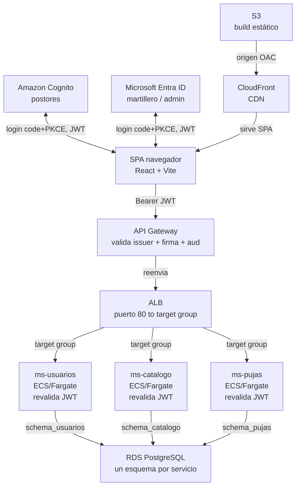

# Despliegue de SubastaLive en AWS — guía paso a paso

Esta guía levanta, desde cero y en una sola cuenta de AWS Academy, toda la infraestructura de la **Etapa 1**:
base de datos, cómputo en contenedores, balanceo de carga, identidad federada, puerta de entrada con
validación de JWT, y el frontend como sitio estático.

## Por qué cada uno despliega todo

Es tentador dividir el trabajo así: "yo hago el backend, tú el front, alguien más sube todo a AWS al final".
Ese reparto deja a dos de cada tres personas del equipo sin haber tocado nunca una consola de AWS — y en la
presentación de la pauta, cualquiera puede tener que explicar por qué el API Gateway valida el JWT antes de
llegar al ALB, o por qué RDS tiene un esquema por servicio.

Por eso esta guía asume que **una sola persona** despliega la arquitectura completa en su propia cuenta —
pero está pensada para que las tres personas del equipo la sigan, cada una en su propio laboratorio de
Canvas, usando una imagen de contenedor de práctica mientras los microservicios reales todavía se están
construyendo. Al final, los tres han creado una RDS, un cluster ECS, un ALB, un API Gateway con autorizador
JWT y un User Pool de Cognito con sus propias manos — no solo lo vieron en un diagrama.

## Antes de empezar

Instala esto en tu máquina antes de arrancar el laboratorio:

- **AWS CLI v2** — `aws --version` debe responder.
- **Docker Desktop** — para construir y probar la imagen de práctica.
- **psql** (cliente de PostgreSQL) — para aplicar los scripts de esquema contra RDS.
- **Node.js 20+** — para el build del frontend.
- El repositorio de SubastaLive clonado localmente.

> **Específico de AWS Academy Learner Lab.** No puedes crear roles ni políticas IAM — la cuenta ya trae uno
> preparado llamado `LabRole`, y es el que vas a usar en todos los lugares donde ECS/RDS/Lambda pidan un rol.
> Intentar `aws iam create-role` falla con `AccessDenied`: es esperado, no un error tuyo.
>
> La sesión del laboratorio dura unas horas y las credenciales (access key, secret key y **session token**)
> expiran con ella. Si un comando empieza a fallar con errores de autenticación a mitad de la guía, lo
> primero que hay que revisar es si el laboratorio se venció.

## El mapa completo

Este es el camino que recorre una petición real una vez que todo esté desplegado. Cada sección de esta guía
construye una de estas piezas, en este orden.



El navegador carga el SPA desde CloudFront/S3, se autentica contra Cognito o Entra ID según el rol, y cada
llamada a la API lleva el JWT que primero valida el API Gateway (firma, issuer, audiencia) y luego cada
microservicio otra vez, antes de tocar su propio esquema en RDS.

## 1. Arrancar el laboratorio y la CLI

En Canvas, entra al laboratorio (AWS Academy Learner Lab) y ábrelo. Cuando el círculo se ponga verde, haz
clic en **AWS Details** y copia las credenciales a `~/.aws/credentials`:

```ini
[default]
aws_access_key_id = ASIA...
aws_secret_access_key = ...
aws_session_token = ...
```

Verifica que la CLI quedó autenticada y anota tu Account ID y región:

```bash
aws sts get-caller-identity
export AWS_REGION=us-east-1
export ACCOUNT_ID=$(aws sts get-caller-identity --query Account --output text)
echo $ACCOUNT_ID
```

Vas a reutilizar `$ACCOUNT_ID` y `$AWS_REGION` en casi todos los comandos siguientes de esta guía.

## 2. Base de datos — Amazon RDS

Todo lo demás depende de que esto exista primero. Crea la instancia:

```bash
aws rds create-db-instance \
  --db-instance-identifier subastalive-db \
  --db-instance-class db.t3.micro \
  --engine postgres \
  --engine-version 16.4 \
  --master-username subastalive \
  --master-user-password 'CambiaEstaClave123' \
  --allocated-storage 20 \
  --storage-type gp3 \
  --publicly-accessible \
  --backup-retention-period 0

aws rds wait db-instance-available --db-instance-identifier subastalive-db

export DB_ENDPOINT=$(aws rds describe-db-instances \
  --db-instance-identifier subastalive-db \
  --query "DBInstances[0].Endpoint.Address" --output text)
echo $DB_ENDPOINT
```

El `--publicly-accessible` es una simplificación de laboratorio: te deja aplicar los scripts de esquema desde
tu laptop sin una VPN ni un bastión. Ábrele el puerto 5432 solo a tu IP, no al mundo:

```bash
export MY_IP=$(curl -s https://checkip.amazonaws.com)
export DEFAULT_SG=$(aws ec2 describe-security-groups \
  --filters Name=group-name,Values=default \
  --query "SecurityGroups[0].GroupId" --output text)

aws ec2 authorize-security-group-ingress \
  --group-id $DEFAULT_SG --protocol tcp --port 5432 \
  --cidr ${MY_IP}/32
```

Con el endpoint listo, aplica los tres esquemas del repo (`db/schema_usuarios`, `db/schema_catalogo`,
`db/schema_pujas` — ver [`db/README.md`](../db/README.md)):

```bash
export PGPASSWORD='CambiaEstaClave123'
for f in db/schema_usuarios/V1__init.sql db/schema_catalogo/V1__init.sql db/schema_pujas/V1__init.sql; do
  psql "host=$DB_ENDPOINT port=5432 dbname=postgres user=subastalive sslmode=require" -f "$f"
done
```

**Verificación:** `psql "host=$DB_ENDPOINT ..." -c "\dn"` debe listar los tres esquemas.

## 3. Una imagen para practicar el pipeline

Como `ms-usuarios`, `ms-catalogo` y `ms-pujas` todavía no tienen código, arma una imagen de práctica
("ms-demo") solo para aprender el camino **ECR → ECS → ALB → API Gateway** de punta a punta. La reemplazas
por el servicio real más adelante — la mecánica es idéntica.

```dockerfile
# Dockerfile
FROM python:3.12-alpine
WORKDIR /app
COPY index.html .
EXPOSE 8080
CMD ["python3", "-m", "http.server", "8080"]
```

```html
<!-- index.html -->
<h1>ms-demo OK</h1>
```

Pruébala en local antes de subirla a ningún lado:

```bash
docker build -t ms-demo .
docker run --rm -p 8080:8080 ms-demo
curl http://localhost:8080
```

## 4. Registro de imágenes — Amazon ECR

```bash
aws ecr create-repository --repository-name subastalive/ms-demo

aws ecr get-login-password --region $AWS_REGION | docker login \
  --username AWS --password-stdin $ACCOUNT_ID.dkr.ecr.$AWS_REGION.amazonaws.com

docker tag ms-demo:latest \
  $ACCOUNT_ID.dkr.ecr.$AWS_REGION.amazonaws.com/subastalive/ms-demo:latest

docker push $ACCOUNT_ID.dkr.ecr.$AWS_REGION.amazonaws.com/subastalive/ms-demo:latest
```

Esta secuencia — build, tag, push — es exactamente lo que hace el workflow `deploy-ms-pujas.yml` por ti más
adelante.

## 5. Cómputo — ECS con Fargate

Cluster y red primero:

```bash
aws ecs create-cluster --cluster-name subastalive-cluster

export VPC_ID=$(aws ec2 describe-vpcs --filters Name=isDefault,Values=true \
  --query "Vpcs[0].VpcId" --output text)
export SUBNETS=$(aws ec2 describe-subnets --filters Name=vpc-id,Values=$VPC_ID \
  --query "Subnets[].SubnetId" --output text | tr '\t' ',')
echo $VPC_ID $SUBNETS
```

Dos security groups: uno para el ALB (público) y otro para las tareas de ECS (solo desde el ALB):

```bash
export ALB_SG=$(aws ec2 create-security-group --group-name subastalive-alb-sg \
  --description "ALB SubastaLive" --vpc-id $VPC_ID --query GroupId --output text)
export ECS_SG=$(aws ec2 create-security-group --group-name subastalive-ecs-sg \
  --description "ECS tasks SubastaLive" --vpc-id $VPC_ID --query GroupId --output text)

aws ec2 authorize-security-group-ingress --group-id $ALB_SG \
  --protocol tcp --port 80 --cidr 0.0.0.0/0
aws ec2 authorize-security-group-ingress --group-id $ECS_SG \
  --protocol tcp --port 8080 --source-group $ALB_SG

# y deja que las tareas de ECS también lleguen a la base de datos
aws ec2 authorize-security-group-ingress --group-id $DEFAULT_SG \
  --protocol tcp --port 5432 --source-group $ECS_SG
```

> **Rol de ejecución: usa LabRole.** No crees un rol nuevo — no tienes permiso. Usa el que ya existe:
>
> ```bash
> export LAB_ROLE_ARN=$(aws iam get-role --role-name LabRole --query Role.Arn --output text)
> ```

Ahora la task definition:

```json
// task-def-ms-demo.json
{
  "family": "subastalive-ms-demo",
  "networkMode": "awsvpc",
  "requiresCompatibilities": ["FARGATE"],
  "cpu": "256",
  "memory": "512",
  "executionRoleArn": "<LAB_ROLE_ARN>",
  "taskRoleArn": "<LAB_ROLE_ARN>",
  "containerDefinitions": [{
    "name": "ms-demo",
    "image": "<ACCOUNT_ID>.dkr.ecr.<AWS_REGION>.amazonaws.com/subastalive/ms-demo:latest",
    "portMappings": [{ "containerPort": 8080, "protocol": "tcp" }],
    "logConfiguration": {
      "logDriver": "awslogs",
      "options": {
        "awslogs-group": "/ecs/subastalive-ms-demo",
        "awslogs-region": "<AWS_REGION>",
        "awslogs-stream-prefix": "ecs",
        "awslogs-create-group": "true"
      }
    }
  }]
}
```

`"awslogs-create-group": "true"` deja que ECS cree el log group solo — sin esto, la tarea puede fallar en
silencio si el grupo no existe todavía.

```bash
aws ecs register-task-definition --cli-input-json file://task-def-ms-demo.json
```

## 6. Balanceador — Application Load Balancer

```bash
export ALB_ARN=$(aws elbv2 create-load-balancer --name subastalive-alb \
  --subnets $(echo $SUBNETS | tr ',' ' ') --security-groups $ALB_SG \
  --scheme internet-facing --type application \
  --query "LoadBalancers[0].LoadBalancerArn" --output text)

export TG_ARN=$(aws elbv2 create-target-group --name subastalive-tg-demo \
  --protocol HTTP --port 8080 --vpc-id $VPC_ID --target-type ip \
  --health-check-path / \
  --query "TargetGroups[0].TargetGroupArn" --output text)

aws elbv2 create-listener --load-balancer-arn $ALB_ARN \
  --protocol HTTP --port 80 \
  --default-actions Type=forward,TargetGroupArn=$TG_ARN
```

Ahora sí, el ECS Service que conecta la task definition con el target group:

```bash
aws ecs create-service \
  --cluster subastalive-cluster \
  --service-name ms-demo \
  --task-definition subastalive-ms-demo \
  --desired-count 1 \
  --launch-type FARGATE \
  --network-configuration "awsvpcConfiguration={subnets=[$SUBNETS],securityGroups=[$ECS_SG],assignPublicIp=ENABLED}" \
  --load-balancers "targetGroupArn=$TG_ARN,containerName=ms-demo,containerPort=8080"
```

> **Sin NAT gateway, sin imagen.** Los laboratorios de Academy normalmente no traen un NAT Gateway. Sin
> `assignPublicIp=ENABLED`, la tarea no tiene salida a internet para descargar la imagen de ECR y falla con
> `CannotPullContainerError`.

Espera un par de minutos y prueba directo contra el ALB, sin pasar todavía por el API Gateway:

```bash
export ALB_DNS=$(aws elbv2 describe-load-balancers --load-balancer-arns $ALB_ARN \
  --query "LoadBalancers[0].DNSName" --output text)
curl http://$ALB_DNS
```

## 7. Identidad — Cognito y Entra ID

### Amazon Cognito (postores)

```bash
export POOL_ID=$(aws cognito-idp create-user-pool --pool-name subastalive-postores \
  --auto-verified-attributes email --query "UserPool.Id" --output text)

export CLIENT_ID=$(aws cognito-idp create-user-pool-client --user-pool-id $POOL_ID \
  --client-name subastalive-frontend --no-generate-secret \
  --explicit-auth-flows ALLOW_ADMIN_USER_PASSWORD_AUTH ALLOW_REFRESH_TOKEN_AUTH \
  --allowed-o-auth-flows code --allowed-o-auth-scopes openid profile email \
  --allowed-o-auth-flows-user-pool-client \
  --callback-urls "http://localhost:5173/auth/callback/postor" \
  --logout-urls "http://localhost:5173" \
  --supported-identity-providers COGNITO \
  --query "UserPoolClient.ClientId" --output text)

aws cognito-idp create-user-pool-domain --domain subastalive-$ACCOUNT_ID --user-pool-id $POOL_ID
```

Crea un usuario de prueba y ponle contraseña permanente:

```bash
aws cognito-idp admin-create-user --user-pool-id $POOL_ID \
  --username postor.prueba@example.com \
  --user-attributes Name=email,Value=postor.prueba@example.com Name=email_verified,Value=true \
  --message-action SUPPRESS --temporary-password 'Temp1234!'

aws cognito-idp admin-set-user-password --user-pool-id $POOL_ID \
  --username postor.prueba@example.com --password 'Real1234!' --permanent
```

Para probar sin construir el flujo completo del navegador, pide el token directo por CLI:

```bash
aws cognito-idp admin-initiate-auth --user-pool-id $POOL_ID --client-id $CLIENT_ID \
  --auth-flow ADMIN_USER_PASSWORD_AUTH \
  --auth-parameters USERNAME=postor.prueba@example.com,PASSWORD='Real1234!'
```

La respuesta trae `IdToken` y `AccessToken` — vas a usar el `IdToken` en el paso 8 para probar el API
Gateway con `curl`.

### Microsoft Entra ID (martillero / administrador)

Esto es Azure, no AWS — vía [portal.azure.com](https://portal.azure.com):

1. **Microsoft Entra ID → App registrations → New registration.** Tipo de cuenta: solo tu tenant.
2. **Redirect URI**, tipo SPA: `http://localhost:5173/auth/callback/staff`.
3. **App roles → Create app role:** crea `MARTILLERO` y `ADMINISTRADOR`.
4. **Enterprise applications** → tu app → **Users and groups** → asigna un usuario de prueba a cada rol.
5. Anota **Application (client) ID** y **Directory (tenant) ID** — la authority es
   `https://login.microsoftonline.com/<TENANT_ID>/v2.0`.

## 8. Puerta de entrada — API Gateway

```bash
export API_ID=$(aws apigatewayv2 create-api --name subastalive-api \
  --protocol-type HTTP --target "http://$ALB_DNS" --query ApiId --output text)

export AUTHORIZER_ID=$(aws apigatewayv2 create-authorizer --api-id $API_ID \
  --authorizer-type JWT --identity-source '$request.header.Authorization' \
  --name cognito-postores \
  --jwt-configuration Audience=$CLIENT_ID,Issuer=https://cognito-idp.$AWS_REGION.amazonaws.com/$POOL_ID \
  --query AuthorizerId --output text)

export ROUTE_ID=$(aws apigatewayv2 get-routes --api-id $API_ID \
  --query "Items[0].RouteId" --output text)

aws apigatewayv2 update-route --api-id $API_ID --route-id $ROUTE_ID \
  --authorization-type JWT --authorizer-id $AUTHORIZER_ID
```

Sin token, rechaza. Con el `IdToken` del paso 7, pasa:

```bash
export API_URL=$(aws apigatewayv2 get-api --api-id $API_ID --query ApiEndpoint --output text)

curl -i $API_URL/                                          # 401 — sin token
curl -H "Authorization: Bearer <ID_TOKEN>" $API_URL/        # 200 — con token
```

> **Un solo issuer por autorizador.** Un autorizador JWT nativo de API Gateway valida contra **un** issuer.
> Para aceptar Cognito *y* Entra ID en la misma ruta (como pide el contrato), la salida real es un
> autorizador Lambda que pruebe ambos issuers, o dos autorizadores en rutas separadas. Esta guía prueba el
> mecanismo con uno solo — la decisión de cuál camino tomar queda documentada en
> [`ms-catalogo/README.md`](../ms-catalogo/README.md), sección 5.6 del plan.

## 9. Frontend — S3 + CloudFront

```bash
aws s3 mb s3://subastalive-frontend-$ACCOUNT_ID
aws s3api put-public-access-block --bucket subastalive-frontend-$ACCOUNT_ID \
  --public-access-block-configuration BlockPublicAcls=true,IgnorePublicAcls=true,BlockPublicPolicy=true,RestrictPublicBuckets=true

cd frontend
npm run build
aws s3 sync ./dist s3://subastalive-frontend-$ACCOUNT_ID --delete
cd ..
```

La distribución de CloudFront con Origin Access Control es más rápida por consola que por CLI (el JSON de
configuración es largo). En **CloudFront → Create distribution**:

- **Origin:** el bucket S3 — elige "Origin access control settings (recommended)" y deja que CloudFront
  actualice la policy del bucket automáticamente.
- **Viewer protocol policy:** Redirect HTTP to HTTPS.
- **Default root object:** `index.html`.
- **Error pages** (pestaña de la distribución ya creada): agrega una respuesta personalizada para `403` y
  otra para `404`, ambas apuntando a `/index.html` con código de respuesta `200` — sin esto, refrescar la
  página en una ruta interna del SPA (ej. `/subastas/123`) rompe.

## 10. Conectar GitHub Actions

Con la infraestructura arriba, carga en GitHub (**Settings → Secrets and variables → Actions**) los valores
de la tabla del [README principal](../README.md#secrets-y-variables-que-hay-que-configurar-en-github) —
Secrets para las credenciales del laboratorio, Variables para nombres de recursos. A partir de ahí, un
`git push` a cada carpeta dispara su propio pipeline.

- `AWS_ACCESS_KEY_ID`, `AWS_SECRET_ACCESS_KEY`, `AWS_SESSION_TOKEN` (Secrets)
- `AWS_REGION`, `ECR_REPOSITORY_*`, `ECS_CLUSTER`, `ECS_SERVICE_*` (Variables)
- `S3_BUCKET_FRONTEND`, `CLOUDFRONT_DISTRIBUTION_ID` (Variables)

## 11. Repetirlo con los tres microservicios reales

Todo lo de los pasos 3 a 6 se repite igual por cada microservicio real, cambiando el nombre. Una diferencia
real de `ms-catalogo` que vale la pena anotar ahora: su contrato expone **dos** familias de rutas
(`/subastas/*` y `/lotes/*`), así que su target group necesita dos reglas de listener en el ALB apuntando al
mismo target group — no una sola, como en el ejemplo de `ms-demo`.

## 12. Costos y limpieza

AWS Academy Learner Lab tiene un tope de gasto y de tiempo por sesión. Si no vas a seguir trabajando, apaga
en este orden (el inverso al que construiste):

```bash
aws ecs update-service --cluster subastalive-cluster --service ms-demo --desired-count 0
aws ecs delete-service --cluster subastalive-cluster --service ms-demo
aws ecs delete-cluster --cluster subastalive-cluster
aws elbv2 delete-load-balancer --load-balancer-arn $ALB_ARN
aws elbv2 delete-target-group --target-group-arn $TG_ARN
aws apigatewayv2 delete-api --api-id $API_ID
aws rds delete-db-instance --db-instance-identifier subastalive-db --skip-final-snapshot
aws cognito-idp delete-user-pool --user-pool-id $POOL_ID
```

**CloudFront primero se deshabilita.** No se puede borrar una distribución activa: hay que deshabilitarla,
esperar a que despliegue el cambio, y recién ahí borrarla (por consola es más simple que por CLI para este
paso).

## Checklist final

- [ ] RDS arriba, con los tres esquemas creados y verificados con `\dn`
- [ ] Imagen `ms-demo` construida, en ECR, corriendo en ECS
- [ ] `curl` al ALB responde `ms-demo OK`
- [ ] API Gateway rechaza sin token (401) y acepta con el `IdToken` de Cognito (200)
- [ ] Usuario de prueba creado en Cognito; app registrada y roles creados en Entra ID
- [ ] Frontend compilado y sincronizado a S3; CloudFront sirve la app y sobrevive un refresh en ruta interna
- [ ] Secrets y Variables cargados en GitHub; un push dispara el workflow correspondiente
- [ ] Sabes en qué orden apagar todo cuando termines
