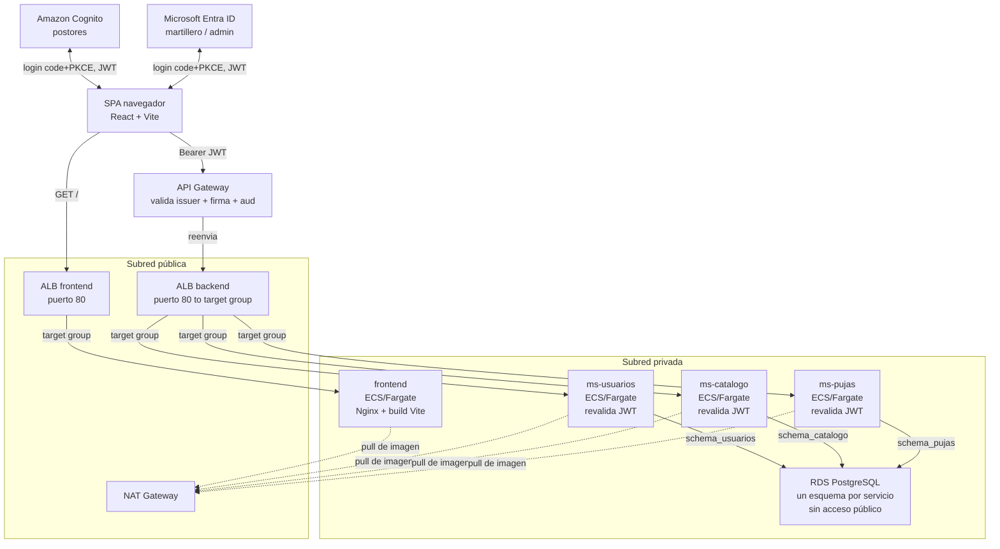

# Despliegue de SubastaLive en AWS — guía paso a paso (consola web)

Esta guía levanta, desde cero y en una sola cuenta de AWS Academy, toda la infraestructura de la **Etapa 1**:
red (con subredes privadas de verdad), base de datos, cómputo en contenedores, balanceo de carga, identidad
federada, puerta de entrada con validación de JWT, y el frontend — que se despliega **como otro contenedor
más en ECS**, con el mismo patrón que los tres microservicios (no como sitio estático en S3+CloudFront, ver
la nota en la sección 10).

**Todo se configura en el portal web de AWS (y el portal de Azure para Entra ID) — no se usa la CLI de AWS en
ningún paso.** Los únicos comandos de terminal que vas a necesitar son los normales de Docker (construir
imágenes) y de npm (compilar el frontend). Ningún `aws ec2 ...`/`aws ecs ...` — esos los ejecuta **GitHub
Actions por ti** una vez que dejes cargados los Secrets. RDS queda en una subred privada, pero no hace falta
conectarse a ella a mano: cada microservicio crea y actualiza su propio esquema solo, con Flyway, al
arrancar (ver sección 3).

> **¿Ya hiciste esto una vez a mano y quieres repetirlo con menos clics?** Hay una plantilla de
> Terraform en [`../infra-terraform/`](../infra-terraform/README.md) que crea la misma infraestructura
> (salvo Entra ID, que vive en Azure) con un solo `terraform apply` — escrita a partir de esta misma
> guía, con cada gotcha real ya resuelto en el código. Para la primera vez, de todas formas conviene
> seguir esta guía a mano — entender cada pieza ayuda a defenderla después.

## Por qué cada uno despliega todo

Es tentador dividir el trabajo así: "yo hago el backend, tú el front, alguien más sube todo a AWS al final".
Ese reparto deja a dos de cada tres personas del equipo sin haber tocado nunca la consola de AWS — y en la
presentación de la pauta, cualquiera puede tener que explicar por qué el API Gateway valida el JWT antes de
llegar al ALB, o por qué RDS vive en una subred privada.

Por eso esta guía asume que **una sola persona** despliega la arquitectura completa en su propia cuenta —
pero está pensada para que las tres personas del equipo la sigan, cada una en su propio laboratorio de
Canvas, usando una imagen de contenedor de práctica mientras los microservicios reales todavía se están
construyendo. Al final, los tres han creado una VPC con subredes privadas, un NAT Gateway, una RDS, un
cluster ECS, un ALB, un API Gateway con autorizador JWT y un User Pool de Cognito con sus propias manos — no
solo lo vieron en un diagrama.

## Antes de empezar

Instala esto en tu máquina:

- **Docker Desktop** — para construir la imagen de práctica (esto sí abre una terminal, es inevitable).
- **Postman** (o Insomnia) — para probar el API Gateway con un token, sin usar `curl`.
- **Node.js 20+** — para el build del frontend (`npm run build`).
- **OpenSSL** — para generar el certificado autofirmado del ALB del frontend (sección 8); viene incluido con
  Git Bash en Windows, y ya instalado por defecto en macOS/Linux.
- El repositorio de SubastaLive clonado localmente.

> **Específico de AWS Academy Learner Lab.** No puedes crear roles ni políticas IAM — la cuenta ya trae uno
> preparado llamado `LabRole`, y es el que vas a elegir en todos los menús desplegables donde ECS pida un
> rol. Si un asistente te deja escribir un nombre de rol nuevo y falla con "not authorized", es porque
> intentaste crear uno — busca `LabRole` en la lista en vez de escribir uno.
>
> La sesión del laboratorio dura unas horas y las credenciales que le vas a pasar a GitHub expiran con ella.
> Si un despliegue automático empieza a fallar de un día para otro, lo primero que hay que revisar es si el
> laboratorio se venció (hay que volver a Canvas, reiniciarlo, y actualizar los Secrets en GitHub).
>
> **El NAT Gateway cobra por hora + por dato**, incluso parado no existe "pausarlo" — o está creado (cobrando)
> o está borrado. Si te preocupa el gasto de créditos del laboratorio, bórralo cuando termines de trabajar
> (sección 13) y créalo de nuevo la próxima sesión — es rápido (unos minutos), pero cualquier deploy que se
> dispare mientras no exista va a fallar con `CannotPullContainerError` hasta que vuelva a estar arriba.

## El mapa completo

Este es el camino que recorre una petición real una vez que todo esté desplegado, mostrando qué vive en
subred **pública** y qué en subred **privada**. Cada sección de esta guía construye una de estas piezas, en
este orden.



Dos ALB separados: uno solo lo usa el navegador para cargar el frontend, el otro solo lo usa el API Gateway
para llegar a los microservicios — así no hay que mezclar reglas de listener por path en uno solo. Las tareas
de ECS y RDS no tienen IP pública ni son alcanzables desde internet: las tareas salen a buscar su imagen a
través del NAT Gateway, y a RDS no se entra desde afuera del todo — cada microservicio gestiona su propio
esquema al arrancar (Flyway, ver sección 3), sin que nadie necesite conectarse a mano.

## 1. Entrar a la consola de AWS

En Canvas, abre el laboratorio (AWS Academy Learner Lab). Cuando el círculo se ponga verde, haz clic en el
botón **AWS** (no en "AWS Details" todavía) — te abre la consola web de AWS ya autenticada, sin pedirte
usuario ni contraseña. Todo lo que sigue ocurre ahí, en el navegador.

Anota, mirando la esquina superior derecha de la consola:

- La **región** activa (normalmente `us-east-1` — si no es esa, elígela ahí para todo lo que sigue).
- Tu **Account ID**, haciendo clic en el nombre de la cuenta en esa misma esquina.

Vas a necesitar ambos datos más adelante para las URLs de ECR y de los issuers de Cognito.

## 2. Red — VPC, subredes propias y NAT Gateway

Todo lo demás vive dentro de esta red, así que va antes que la base de datos.

### VPC default: borrar sus subredes y crear las 4 propias

El VPC default trae subredes públicas ya creadas (una por AZ), pero para tener control total de los rangos
se borran y se crean 4 propias desde cero: 2 públicas y 2 privadas.

1. **VPC → Your VPCs** → entra al que dice `Default VPC` → anota su **CIDR** (normalmente `172.31.0.0/16`).
2. **VPC → Subnets**, filtra por ese VPC → selecciona todas las subredes existentes → **Actions → Delete
   subnet** → confirma. (No se toca el Internet Gateway, sigue attacheado al VPC.)
3. **Create subnet**, VPC: el default. En el mismo asistente, con "Add new subnet" se agregan las 4 de una:

   | Nombre | Availability Zone | IPv4 CIDR |
   |---|---|---|
   | `subastalive-public-1a` | AZ 1 — **elígela explícitamente**, ej. `us-east-1f` | `172.31.0.0/20` |
   | `subastalive-private-1a` | **la misma AZ que `public-1a`** (ej. `us-east-1f`) | `172.31.32.0/20` |
   | `subastalive-public-1b` | AZ 2 — **elígela explícitamente, distinta a la AZ 1** (ej. `us-east-1a`) | `172.31.16.0/20` |
   | `subastalive-private-1b` | **la misma AZ que `public-1b`** (ej. `us-east-1a`) | `172.31.48.0/20` |

   Un `/16` partido en bloques `/20` da bloques de 4096 IPs cada uno, y cada bloque debe empezar en un
   múltiplo de 16 en el tercer octeto (`.0`, `.16`, `.32`, `.48`...) para no solaparse — por eso las CIDR de
   la tabla van de 16 en 16, no de 1 en 1.

   > **No dejes "Sin preferencia" en Availability Zone.** Si lo haces en varias subredes seguidas, AWS no
   > garantiza repartirlas — pueden terminar **todas en la misma AZ** (nos pasó probando esto: las 4
   > terminaron en `us-east-1f`). El ALB necesita sus 2 subredes públicas en AZs distintas, y el DB Subnet
   > Group de RDS necesita sus 2 subredes privadas en AZs distintas — si eliges la AZ a mano para cada una,
   > como en la tabla de arriba, no hay ambigüedad.

4. **Create subnet**.
5. Selecciona `subastalive-public-1a` → **Actions → Edit subnet settings** → activa **"Enable auto-assign
   public IPv4 address"** → **Save**. Repite con `subastalive-public-1b`. Las 2 privadas se quedan como están
   (esa casilla apagada, por defecto).

Las 4 subredes nuevas quedan asociadas automáticamente a la tabla de rutas **principal** del VPC (que ya
tiene `0.0.0.0/0 → Internet Gateway`) — por eso, apenas activado el auto-assign, las dos `public-*` ya son
funcionalmente públicas sin nada más que hacer. Las privadas se cambian de tabla de rutas más abajo.

### NAT Gateway

6. **VPC → NAT Gateways → Create NAT gateway**.
7. Name: `subastalive-nat`.
8. **Modo de disponibilidad:** **Zonal** (no "Regional" — esa es una opción nueva de la consola pensada para
   alta disponibilidad automática en varias AZ, con más costo; acá se usa un solo NAT Gateway en una subred
   específica, que es justo lo que "Zonal" permite elegir).
9. **Subnet** (aparece al elegir Zonal): `subastalive-public-1a` (el NAT vive en una pública, presta salida
   a las privadas).
10. **Tipo de conectividad:** `Pública`.
11. **Método de asignación de IP elástica (EIP):** **Automático** — deja que AWS cree y gestione la IP sola.
12. **Create NAT gateway**. Tarda unos minutos en pasar a **Available** — no sigas hasta que lo esté.

### Tabla de rutas para las subredes privadas

13. **VPC → Route Tables → Create route table**. Name: `subastalive-private-rt`. VPC: el default.
14. Entra a la tabla creada → pestaña **Routes → Edit routes → Add route**: Destination `0.0.0.0/0`, Target
    **NAT Gateway** → selecciona `subastalive-nat` → **Save changes**.
15. Pestaña **Subnet associations → Edit subnet associations** → marca `subastalive-private-1a` y
    `subastalive-private-1b` → **Save associations**.

> **Si más adelante borras y recreas alguna subred privada** (por ejemplo corrigiendo una AZ mal elegida, ver
> el recuadro de arriba), esa subred nueva **no hereda** la asociación a `subastalive-private-rt` — vuelve a
> quedar en la tabla principal por defecto. Hay que repetir el paso 15 a mano cada vez. Si se te olvida, el
> síntoma no aparece de inmediato en la creación de la subred, sino mucho después, al intentar correr una
> tarea de ECS ahí: la tarea queda "Pendiente" y el servicio termina fallando con algo como
> `ResourceInitializationError: unable to pull secrets or registry auth ... dial tcp ...: i/o timeout` — la
> tarea no tiene ruta de salida a internet para llegar a ECR. Antes de crear el Service de ECS (sección 6),
> confirma en **VPC → Route Tables → `subastalive-private-rt` → pestaña Routes** que sigue existiendo la ruta
> `0.0.0.0/0 → subastalive-nat` (no solo la `local`) — si falta, agrégala de nuevo (paso 14) y el problema se
> resuelve sin tener que tocar nada más.

### Verificación — así deben quedar las 4 subredes

Antes de seguir, confirma en **VPC → Subnets** (columnas: Availability Zone y Route table) que quedó así —
si algo no calza, corrígelo ahora, porque el ALB y el DB Subnet Group de RDS fallan si no:

| Subred | AZ | CIDR | Tabla de rutas | Auto-assign IPv4 pública |
|---|---|---|---|---|
| `subastalive-public-1a` | AZ 1 (ej. `us-east-1f`) | `172.31.0.0/20` | la **principal** del VPC (tiene ruta al Internet Gateway) | Sí |
| `subastalive-private-1a` | **misma AZ 1** | `172.31.32.0/20` | `subastalive-private-rt` | No |
| `subastalive-public-1b` | AZ 2, distinta (ej. `us-east-1a`) | `172.31.16.0/20` | la **principal** del VPC | Sí |
| `subastalive-private-1b` | **misma AZ 2** | `172.31.48.0/20` | `subastalive-private-rt` | No |

Es decir: cada AZ tiene una pública y una privada; las dos públicas están en la tabla principal (con salida
directa a internet); las dos privadas están en `subastalive-private-rt` (con salida solo por el NAT Gateway).

## 3. Base de datos — Amazon RDS (privada)

### Grupo de subredes privado

1. **RDS → Subnet groups → Create DB subnet group**.
2. Name: `subastalive-private-subnet-group`. VPC: el default.
3. Availability Zones: las 2 que usaste para las subredes privadas. Subnets: selecciona
   `subastalive-private-1a` y `subastalive-private-1b` (no las públicas).
4. **Create**.

### La instancia

5. **RDS → Create database → Standard create**.
6. Motor: **PostgreSQL**, versión 16.x (la más reciente que ofrezca).
7. Templates: **Free tier** (si aparece disponible) o **Dev/Test**.
8. Settings: DB instance identifier `subastalive-db`; Master username `subastalive`; define una master
   password y anótala.
9. Instance configuration: la clase más pequeña disponible, `db.t3.micro`.
10. Storage: 20 GiB, tipo gp3.
11. Connectivity: "Don't connect to an EC2 compute resource"; VPC: la default; **DB subnet group**:
    `subastalive-private-subnet-group`; **Public access: No**; VPC security group: **Create new**, nómbralo
    `subastalive-rds-sg`.
12. Additional configuration → Initial database name: `subastalive` (anótalo, lo necesitas al conectarte).
13. **Create database**. Espera a que el estado pase a **Available** (5–10 minutos).
14. Entra a la instancia → pestaña **Connectivity & security** → copia el **Endpoint**.

### Security group: sin acceso desde afuera todavía

15. `subastalive-rds-sg` nace sin reglas de entrada — así se queda por ahora. Más adelante (sección 6) le
    agregas la única regla que va a tener: acceso desde `subastalive-ecs-sg`, para que las tareas de ECS
    puedan conectarse. No hay ninguna otra vía de entrada, y no hace falta ninguna.

### No hace falta aplicar los esquemas a mano

RDS queda arriba, privada, y **vacía** — y así se queda hasta que el primer microservicio con código se
despliegue. Cada microservicio trae Flyway (ver [`../db/README.md`](../db/README.md), sección "Migraciones
automáticas") y, al arrancar por primera vez, crea su propio esquema y tablas solo, usando el mismo
`V1__init.sql` que ya está en este repo. No hay ningún paso manual de base de datos en esta guía — ni ahora
ni en deploys futuros.

Si en algún momento necesitas mirar datos a mano (debugging puntual), no hay una vía permanente para eso en
esta arquitectura — tocaría levantar un acceso temporal (por ejemplo, una EC2 chica solo para esa sesión) y
volver a borrarlo después. No es parte del flujo normal.

## 4. Una imagen para practicar el pipeline (opcional)

Si ninguno de tus microservicios tiene código todavía, arma una imagen de práctica ("ms-demo") solo para
aprender el camino **ECR → ECS → ALB → API Gateway** de punta a punta, y reemplázala por el servicio real
más adelante — la mecánica es idéntica.

```dockerfile
# Dockerfile
FROM python:3.12-alpine
WORKDIR /app
COPY index.html .
EXPOSE 8080
CMD ["python3", "-m", "http.server", "8080"]
```

```html
<!-- index.html -->
<h1>ms-demo OK</h1>
```

**En este proyecto ya no hace falta**: `ms-pujas` está implementado de verdad (Spring Boot + Postgres +
Flyway) y ya probado localmente con Docker Compose, así que las secciones siguientes lo usan directo a él
como primer servicio desplegado — sin placeholder. Si algún día partes de cero con un servicio nuevo, usa
esta sección como referencia.

## 5. Registro de imágenes — Amazon ECR

1. Consola → **ECR → Create repository**. Nombre: `subastalive/ms-pujas` → **Create repository**.
2. Entra al repositorio recién creado y haz clic en **View push commands** (arriba a la derecha).
3. Copia las 4 líneas (login, build, tag, push) — ya vienen armadas con tu Account ID y región correctos.
4. En tu terminal, muévete a la carpeta del servicio antes de pegarlas: `cd ms-pujas`.

> **Si usas PowerShell y la primera línea es `(Get-ECRLoginCommand).Password | docker login ...`, va a
> fallar** con `El término 'Get-ECRLoginCommand' no se reconoce...` — es un cmdlet de un módulo de AWS para
> PowerShell (`AWS.Tools.ECR`) que normalmente no está instalado. Usa el equivalente con la CLI de AWS en su
> lugar:
>
> ```powershell
> # Credenciales del laboratorio (panel "AWS Details" en Canvas) para esta ventana de PowerShell:
> $env:AWS_ACCESS_KEY_ID = "..."
> $env:AWS_SECRET_ACCESS_KEY = "..."
> $env:AWS_SESSION_TOKEN = "..."
> $env:AWS_DEFAULT_REGION = "us-east-1"
>
> aws ecr get-login-password --region us-east-1 | docker login --username AWS --password-stdin <ACCOUNT_ID>.dkr.ecr.us-east-1.amazonaws.com
> ```
>
> Esto sí requiere tener la CLI de AWS instalada localmente (`aws --version`) — es la única excepción real a
> "todo por consola web": no existe una forma de autenticar Docker contra ECR solo con clics. Las variables
> `$env:...` se pierden al cerrar la ventana, y el login expira a las ~12 horas — hay que repetirlo si pasa
> alguna de las dos cosas, o si el laboratorio se reinicia con credenciales nuevas.

## 6. Cómputo — ECS con Fargate

### Cluster

1. Consola → **ECS → Clusters → Create cluster**.
2. Nombre: `subastalive-cluster`. Infraestructura: **AWS Fargate (serverless)** → **Create**.

> **Si sale el error "Unable to assume the service linked role. Please verify that the ECS service linked
> role exists."** — pasa la primera vez que se usa ECS en una cuenta nueva; el rol
> `AWSServiceRoleForECS` a veces tarda en crearse solo. Simplemente **reintenta** crear el cluster con los
> mismos datos. Si vuelve a fallar: **IAM → Roles → Create role → AWS service** → busca "Elastic Container
> Service" → **Next → Create role** (esto crea específicamente ese rol vinculado al servicio, no un rol
> custom, así que debería estar permitido aunque el laboratorio bloquee IAM en general) → reintenta el cluster.

### Security groups

Antes de la task definition, crea dos grupos de seguridad (**EC2 → Security Groups → Create security
group** — la consola exige una **Description**, no la dejes vacía):

- `subastalive-alb-sg` — Description: `ALB publico de SubastaLive - recibe trafico HTTP desde internet y lo reenvia hacia las tareas de ECS`. Sin reglas de entrada todavía (se las agregas en el paso del ALB).
- `subastalive-ecs-sg` — Description: `Tareas de ECS de SubastaLive (microservicios) - solo acepta trafico desde el ALB`. Sin reglas todavía (se las agregas después de crear `subastalive-alb-sg`, porque la regla apunta *a ese* security group como origen).

Vuelve a `subastalive-ecs-sg` → **Inbound rules → Add rule**: Type Custom TCP, Port `8083` (el puerto de
`ms-pujas`), Source: elige **Custom** y busca `subastalive-alb-sg` en el desplegable → **Save**.

Edita también `subastalive-rds-sg` (el de la sección 3) → **Add rule**: Type PostgreSQL, Source:
`subastalive-ecs-sg` → **Save** — así las tareas de ECS pueden llegar a la base de datos.

> **Dos errores fáciles de cometer acá, revisa antes de seguir:**
> - Si el asistente de creación de RDS (sección 3) te ofreció agregar tu IP actual como regla de entrada y
>   aceptaste, te queda una regla `PostgreSQL / tu-IP/32` en `subastalive-rds-sg` — es un resto de un enfoque
>   que ya no usamos (nadie se conecta a mano a RDS, ver sección 3). Bórrala si aparece.
> - Al buscar el origen de la regla nueva, es fácil escribir "subastalive-rds" y seleccionar por error
>   `subastalive-rds-sg` **a sí mismo** en vez de `subastalive-ecs-sg`. Verifica en **Inbound rules** que
>   quede exactamente **una** regla, `PostgreSQL / 5432 / Source: subastalive-ecs-sg`.

### Task definition

1. **ECS → Task definitions → Create new task definition**.
2. Family: `subastalive-ms-pujas`. Launch type: **AWS Fargate**.
3. CPU: `.25 vCPU`, Memory: `0.5 GB`.
4. Task role y Task execution role: busca y selecciona **LabRole** en ambos desplegables — no escribas un
   nombre nuevo.
5. Container details: Name `ms-pujas`. Image: usa el selector de la consola (**Select image from Amazon
   ECR**) → elige el repo `subastalive/ms-pujas` → selecciona por **"Etiqueta de imagen" = `latest`**, no
   por el SHA256/digest — si fijas el digest, la Task Definition queda pegada a esa imagen para siempre y
   los despliegues futuros de GitHub Actions (que sí actualizan el tag `latest`) no se van a reflejar nunca.
6. Port mappings: Container port `8083`, Protocol TCP.

   > **La consola precarga este campo en `80` — cámbialo, no lo dejes así.** Si lo dejas en 80 (el puerto
   > `ms-pujas` no escucha ahí, escucha en `8083`), la Task Definition queda mal y esto se arrastra hasta el
   > Service y el Target Group sin dar ningún error en el momento: la tarea arranca y queda "Running", pero el
   > ALB no puede completar el health check contra el puerto real de la app. El síntoma aparece recién al
   > final, en la sección 7: el Target Group muestra el target en estado **Unhealthy** con motivo
   > **"Request timed out"**, y `http://<DNS-del-ALB>/health` responde **504 Gateway Timeout** en el
   > navegador (no 503 — el ALB sí encuentra un target, pero nadie responde en ese puerto). Si ya te pasó:
   > **ECS → Task definitions → `subastalive-ms-pujas` → Create new revision** → corrige el Container port a
   > `8083` → **Create** → luego **ECS → Services → `ms-pujas` → Update service** → elige la revisión nueva →
   > en **Load balancing**, confirma que el campo **Contenedor** ahora dice `ms-pujas 8083:8083` (lo toma solo
   > de la revisión nueva) → **Update**. El **Listener** del ALB se queda en `HTTP:80` sin tocarlo — ese es el
   > puerto público de entrada, no tiene relación con el puerto del contenedor.
   >
   > Después de **Update service**, el Target Group pasa por un estado transitorio normal: los targets viejos
   > (los del puerto `80`) quedan en **`Draining`** ("Target deregistration is in progress") mientras la tarea
   > nueva (puerto `8083`) termina de arrancar y de pasar su propio health check. No es un error — solo espera
   > 1-2 minutos y refresca; cuando el target viejo desaparece y el nuevo queda en **`Healthy`**, recién ahí
   > `http://<DNS-del-ALB>/health` empieza a responder.
7. Environment variables:

   | Key | Value |
   |---|---|
   | `SPRING_PROFILES_ACTIVE` | `local` |
   | `DB_HOST` | el Endpoint de RDS (sección 3) |
   | `DB_PORT` | `5432` |
   | `DB_NAME` | `subastalive` |
   | `DB_USERNAME` | `subastalive` |
   | `DB_PASSWORD` | la master password que definiste |
   | `DB_POOL_MAX_SIZE` | `5` |
   | `MS_CATALOGO_BASE_URL` | `http://localhost:8082` (placeholder — se ajusta cuando exista `ms-catalogo` desplegado) |
   | `SERVER_PORT` | `8083` |

   `SPRING_PROFILES_ACTIVE=local` es intencional: activa el mismo modo de autenticación simplificada
   (`local:<sub>:<ROL>`) que se probó en Docker Compose, para poder desplegar y probar `ms-pujas` en AWS
   antes de que Cognito/Entra ID existan (sección 8). **Es temporal** — una vez que exista Cognito (sección
   8) y conectes el API Gateway (sección 9), hay que crear una nueva revisión quitando esta variable y
   agregando `JWT_ISSUER_URI_COGNITO` (ver la nota al final de la sección 9), para que `ms-pujas` valide JWT
   reales en vez del token simplificado. Estos valores quedan en texto plano en la Task
   Definition — es una simplificación deliberada para un laboratorio temporal, no un descuido; la
   alternativa más segura es AWS Secrets Manager con `valueFrom` en vez de `value`, fuera del alcance de
   esta guía.
8. En la sección de logging, deja marcada la casilla que auto-configura CloudWatch Logs (según la versión de
   consola puede decir "Use log collection" o similar) — así no falla por falta de un log group que no
   existe todavía.
9. **Create**.

## 7. Balanceador — Application Load Balancer

1. **EC2 → Load Balancers → Create load balancer → Application Load Balancer**.
2. Name: `subastalive-alb`. Scheme: **Internet-facing**.
3. VPC: la default. Mappings: selecciona `subastalive-public-1a` y `subastalive-public-1b` (el ALB va en
   público, distinto de las tareas).
4. Security groups: `subastalive-alb-sg` (quita el "default" si aparece preseleccionado).
5. Listeners: HTTP puerto 80 → Default action: **Create target group**.
   - Target type: **IP**. Name: `subastalive-tg-pujas`. Protocol HTTP, Port `8083`. VPC: la default.
   - Health check path: `/health` (el endpoint que expone `ms-pujas`).
   - **Next → Create target group**, y de vuelta en el asistente del ALB, selecciónalo como destino del
     listener.
6. Vuelve a `subastalive-alb-sg` → **Inbound rules → Add rule**: Type HTTP (puerto 80), Source **Anywhere**
   (`0.0.0.0/0`) → **Save**.
7. **Create load balancer**. Cuando el estado sea **Active**, copia su **DNS name** (pestaña Description) —
   se usa en la sección 9 (API Gateway).

### Service de ECS

1. **ECS → Clusters → subastalive-cluster → Service → Create**.
2. Launch type: **Fargate**. Task definition: `subastalive-ms-pujas`. Service name: `ms-pujas`. Desired tasks: `1`.
3. Networking: VPC default, subredes **privadas** (`subastalive-private-1a`, `subastalive-private-1b`),
   Security group: `subastalive-ecs-sg`.
4. **Public IP: Turned OFF** — ya no lo necesita, sale a internet por el NAT Gateway de la sección 2.
5. Load balancing: **Application Load Balancer** → selecciona `subastalive-alb`, listener 80, target group
   `subastalive-tg-pujas`.
6. **Health check grace period**: `240` segundos. Un Spring Boot típico (con JPA/Hibernate + pool de
   conexiones a RDS + Flyway) tarda 85-95 segundos en arrancar; sin este valor (por defecto es `0`), el ALB
   empieza a marcar fallos de health check desde el segundo 1, antes de que la app esté lista para responder,
   y ECS puede interpretar eso como un despliegue fallido — ver el recuadro de abajo para el cálculo completo.
7. En el Target Group `subastalive-tg-pujas` (sección anterior) → **Comprobaciones de estado → Editar** →
   baja el **Umbral en buen estado** de `5` (el valor por defecto) a `2` (igual que el umbral no saludable).
   Con 5, el ALB exige 5 chequeos exitosos **seguidos** cada 30s — 150 segundos completos sin un solo fallo —
   antes de marcar el target como `Healthy`; con 2 alcanza con 60 segundos, y es tiempo de sobra para
   confirmar que la app responde de forma estable.
8. **Create**.

> **Consideraciones — fallos reales encontrados desplegando `ms-pujas`, en el orden en que aparecen:**
>
> - **`CannotPullContainerError`** — el NAT Gateway no estaba `Available` todavía (o su subred perdió la
>   asociación a `subastalive-private-rt`, ver la nota de la sección 2). Sin salida a internet, la tarea no
>   puede llegar a ECR. Confirma `Available` en VPC → NAT Gateways antes de crear el service, y que
>   `subastalive-private-rt` tenga la ruta `0.0.0.0/0 → subastalive-nat`.
> - **Target `Unhealthy` con "Request timed out"**, y `/health` responde **504** en el navegador — el
>   Container port de la Task Definition quedó en `80` (el valor que precarga la consola) en vez de `8083`.
>   El ALB no encuentra nada escuchando en el puerto que registró. Se corrige con una nueva revisión de la
>   Task Definition (ver la nota en la sección de Task definition, más arriba) — no alcanza con editar el
>   service solo.
> - **El target de la revisión corregida queda `Unhealthy` un rato y luego ECS revierte solo a la revisión
>   anterior** (reaparece un target en el puerto viejo) — esto pasa si el **Health check grace period** quedó
>   en `0`, o quedó **demasiado corto**. Ojo con esto último: `150` segundos suena razonable (Spring Boot
>   tarda ~90s en arrancar) pero **no alcanza**, porque el umbral saludable *por defecto* del Target Group
>   pide 5 chequeos exitosos seguidos cada 30s = 150 segundos **adicionales** después de que la app ya está
>   lista — total real, ~240 segundos desde que arranca la tarea. Con un grace period de 150s, el reloj de
>   ECS se agota antes de que el ALB llegue a marcar `Healthy`, y ECS lo interpreta como despliegue fallido:
>   mata la tarea y hace rollback, una y otra vez, en un ciclo que no se corta solo (se ve en los logs de
>   CloudWatch: la app arranca bien cada vez, corre ~3 minutos, y aparece `Shutdown initiated` sin que nadie
>   la haya tocado). La solución real combina dos cosas — no alcanza con solo una:
>   1. Baja el **Umbral en buen estado** del Target Group de `5` a `2` (paso 7 de la creación del service,
>      arriba) — reduce lo que el ALB necesita ver para marcar `Healthy`, de 150s a solo 60s.
>   2. Sube el **Health check grace period** del service a `240` segundos.
>
>   Si el ciclo ya empezó: **Update service** → revisión correcta de la Task Definition (la del puerto 8083)
>   + grace period `240` — y de paso corrige el umbral del Target Group, que no depende del service y queda
>   corregido para cualquier despliegue futuro sin tener que tocarlo de nuevo.
>
> Ninguno de estos tres se nota antes de crear el service — todos aparecen recién en el Target Group o en el
> historial de despliegue, minutos después. Si ves cualquiera de estos síntomas, no hace falta borrar nada:
> **Update service** con la corrección correspondiente resuelve los tres.

**Camino feliz** (con el umbral saludable del Target Group en `2`, el grace period del service en `240`
segundos, y el container port en `8083` desde la primera revisión de la Task Definition): la tarea pasa a
**Running** en 1-2 minutos, el target en `subastalive-tg-pujas` pasa de `Initial` a `Healthy` en un solo
ciclo, sin pasar por `Unhealthy` ni por ningún rollback, y `http://<DNS-del-ALB>/health` responde
`ms-pujas up` apenas se cumplen esos ~150 segundos totales — sin necesidad de ningún `Update service`
posterior.

## 8. Identidad — Cognito y Entra ID

### Amazon Cognito (postores)

La consola de Cognito cambió a un asistente simplificado — ya no muestra los pasos clásicos
"Configure sign-in experience / security requirements / ..." por separado, es un único flujo:

> **Sobre el teléfono como atributo (no como método de verificación):** el pool pide `phone_number`
> como atributo requerido del perfil, pero **no** se agrega a los atributos auto-verificados. Si se
> auto-verificara, Cognito exigiría mandar un código por SMS antes de dejar completar el registro, lo
> que necesita un origination number de SNS configurado — no siempre disponible en un laboratorio de
> AWS Academy, y fuera del alcance de este proyecto. Al dejarlo solo como atributo requerido, el
> formulario de registro pide el teléfono y lo guarda, pero nadie lo verifica.

1. Consola → **Cognito → User pools → Create user pool**.
2. **Tipo de aplicación**: **Aplicación de una sola página (SPA)** (el frontend es React).
3. **Nombre de la aplicación**: cámbialo del valor random que trae por defecto a `subastalive-frontend`.
4. **Opciones para los identificadores de inicio de sesión**: marca solo **Correo electrónico**.
5. **¿Login social/SAML/OIDC?**: no, déjalo en blanco.
6. **Autorregistro**: activa **"Habilitar el registro automático"**.
7. **Atributos necesarios para el inicio de sesión**: marca **email** y **phone_number**.
8. **URL de retorno**: `http://localhost:5173/auth/callback/postor` (agregamos la URL real de AWS más
   adelante en esta misma sección, una vez que exista).
9. Continúa y crea. Al terminar, la consola te muestra una guía rápida con código de ejemplo
   (`react-oidc-context`) — puedes saltártela, el proyecto ya trae su propia integración OIDC
   (`frontend/src/auth/`). De ese código de ejemplo igual sirve para copiar el **User pool ID** y el
   **Client ID** que quedaron generados.

Ajustes que este asistente no te deja tocar y hay que revisar después de crear el pool:

10. Arriba de todo, botón **"Renombrar"** → cambia el nombre del pool (queda con uno random tipo
    "User pool - xxxxx") a `subastalive-postores`.
11. Menú izquierdo → **"Creación de marca" → "Dominio"** — normalmente ya viene un dominio Cognito creado
    solo (`https://<algo>.auth.<región>.amazoncognito.com`), producto del asistente rápido. Anótalo
    completo, con `https://` — se necesita más abajo para el logout real.
12. Menú izquierdo → **"Aplicaciones" → "Clientes de aplicación"** → entra al cliente
    `subastalive-frontend` → pestaña **"Páginas de inicio de sesión" → Editar**. Ahí (no en la pantalla
    principal del cliente) viven las callback URLs, sign-out URLs, grant types y scopes:
    - **Client secret**: confirma que diga **"Client secret not generated"** (o `-`) — así debe ser para
      una SPA pública.
    - **URL de devolución de llamadas permitidas**: debería estar ya `http://localhost:5173/auth/callback/postor`.
    - **URL de cierre de sesión permitidas**: agrégala si está vacía → `http://localhost:5173`.
    - **Tipos de concesión de OAuth**: marca **Authorization code grant**.
    - **Ámbitos de OpenID Connect**: `openid`, `email`, `profile`, `phone` — este último es necesario para
      que el `id_token` incluya el claim `phone_number`; sin él, aunque el usuario tenga el atributo
      cargado, `ms-usuarios` nunca lo recibe.
13. Anota el **User pool ID** (en "Descripción general" del pool) y el **Client ID** (en el cliente de
    aplicación) — los necesitas en la sección 11 (Secrets/Variables de GitHub) y en `frontend/.env.local`
    si quieres probar en local.

Crea un usuario de prueba:

14. Menú izquierdo → **"Administración de usuarios" → "Usuarios" → Create user**. Email:
    `postor.prueba@example.com`. Marca **"Marque la dirección de email como verificada"**. En
    **Phone number**, escribe uno en formato E.164 (ej. `+56912345678`) — es obligatorio porque quedó como
    atributo requerido, aunque nadie lo verifique. Deja **"No enviar una invitación"**. En la contraseña,
    elige **"Establecer una contraseña"** y escribe una que cumpla la política (mínimo 8 caracteres,
    mayúscula, minúscula, número y símbolo — ej. `Contra_12345`).

    > **Cuidado con espacios invisibles en el email al crear el usuario** — si lo pegas desde otro lado,
    > es fácil arrastrar un espacio al principio o al final. Eso produce un `InvalidParameterException`
    > genérico al crear el usuario, sin decir explícitamente cuál campo falló. Borra el campo completo y
    > escribe el email a mano si te pasa.
    >
    > **No hay casilla de "contraseña permanente" en este formulario de creación** (versiones anteriores
    > de la consola sí la tenían). El usuario queda en estado "Force change password" — es normal, no un
    > error: la primera vez que inicies sesión por el Hosted UI, Cognito te va a pedir definir una
    > contraseña nueva ahí mismo, como parte del flujo. Si quieres evitarte ese paso, puedes ir a
    > **Users → tu usuario → Actions → Set password** y ahí sí marcarla como permanente.

### Probar el login de Cognito en local, antes de tocar nada en AWS

Antes de meterte con HTTPS y el ALB, prueba que Cognito funciona de punta a punta corriendo el frontend
en tu máquina — es mucho más rápido de iterar que redeployando a cada rato:

15. Crea `frontend/.env.local` (no se sube al repo) con:
    ```
    VITE_AUTH_MODE=oidc
    VITE_USE_MOCKS=true
    VITE_COGNITO_AUTHORITY=https://cognito-idp.<región>.amazonaws.com/<User-pool-ID>
    VITE_COGNITO_CLIENT_ID=<Client-ID>
    VITE_COGNITO_DOMAIN=<dominio-de-Cognito-con-https>
    ```
16. `cd frontend && npm run dev` → abre `http://localhost:5173` → **Ingresar → Ingresar como postor** →
    debe redirigirte al Hosted UI real de Cognito (no al login mock instantáneo). Inicia sesión con el
    usuario de prueba — te va a pedir cambiar la contraseña la primera vez, es esperado. Deberías volver
    a la app ya autenticado, viendo tu nombre y rol POSTOR en el navbar.

Si esto funciona, el User Pool y el app client están bien configurados — lo que sigue (HTTPS en AWS) es
pura infraestructura, no configuración de Cognito.

### HTTPS en el ALB del frontend — necesario para probar Cognito en AWS de verdad

Cognito exige que toda callback URL que no sea `localhost`/`127.0.0.1`/`::1` use **HTTPS** — y esto lo
valida de verdad, no es solo cosmético. El ALB del frontend (sección 10) solo tiene un listener HTTP.
Sin resolver esto, el frontend desplegado en AWS puede mostrar la app, pero el botón de login falla con
`Crypto.subtle is available only in secure contexts` (el navegador desactiva la Web Crypto API — que
`oidc-client-ts` necesita para el PKCE challenge — fuera de un contexto seguro).

**CloudFront no es una opción en este laboratorio.** Ya sabíamos que `cloudfront:CreateOriginAccessControl`
está bloqueado (nota de la sección 10, para S3), pero intentamos usar CloudFront con el ALB del frontend
como origen (un origen ELB no necesita OAC, esa restricción es solo para S3) y de todas formas falla:

```
User: ...assumed-role/voclabs/... is not authorized to perform: cloudfront:CreateDistribution
```

Es decir, CloudFront está bloqueado por completo en la cuenta, no solo la parte de OAC. Sin un dominio
propio (para pedir un certificado público válido en ACM) y sin CloudFront (para tener HTTPS gratis con
`*.cloudfront.net`), la alternativa que queda es un **certificado autofirmado** en el ALB — el navegador
va a mostrar una advertencia de "conexión no privada" que hay que aceptar una vez, pero el flujo de
Cognito (que sí exige `https://` en la URL, no que el certificado sea de una CA pública) funciona
completo después de eso.

1. En tu máquina, genera el certificado (en Git Bash / PowerShell con OpenSSL instalado; en Windows con
   Git Bash, antepone `MSYS_NO_PATHCONV=1` porque si no MSYS confunde el `/CN=...` con una ruta de
   archivo):
   ```bash
   MSYS_NO_PATHCONV=1 openssl req -x509 -newkey rsa:2048 -keyout key.pem -out cert.pem -days 825 -nodes \
     -subj "/CN=<DNS-del-ALB-del-frontend>"
   ```
2. Consola → **Certificate Manager (ACM) → Import a certificate** → pega el contenido de `cert.pem` en
   **Certificate body** y el de `key.pem` en **Private key** (con las líneas `-----BEGIN/END-----`
   incluidas). **Certificate chain**: vacío, es autofirmado. **Import**.
3. **EC2 → Load Balancers → `subastalive-frontend-alb` → Listeners → Add listener**: Protocol **HTTPS**,
   Port `443`, Default action → Forward to `subastalive-tg-frontend`, **Default SSL/TLS certificate**:
   **From ACM** → el que acabas de importar.
4. **EC2 → Security Groups → `subastalive-frontend-alb-sg` → Inbound rules → Add rule**: Type **HTTPS**,
   puerto 443, Source **Anywhere (0.0.0.0/0)**.

   > **No edites la regla de HTTP existente para "convertirla" en la de HTTPS — agrega una regla nueva.**
   > Pasó exactamente eso en la práctica: al agregar la regla de 443 se terminó reemplazando sin querer
   > la de puerto 80, dejando el ALB con **una sola regla** (443) en vez de dos. Sin la regla de 80, el
   > tráfico HTTP se cuelga en timeout (no da error de conexión rechazada — esa es la pista: un
   > security group bloqueando silenciosamente se ve como timeout, no como "connection refused"). El
   > grupo de seguridad debe terminar con **2 reglas**: HTTP/80 y HTTPS/443, ambas `0.0.0.0/0`.
5. Vuelve a **Cognito → tu user pool → Clientes de aplicación → subastalive-frontend → Páginas de inicio
   de sesión → Editar** y agrega, sin borrar las de localhost:
   - Callback: `https://<DNS-del-ALB-del-frontend>/auth/callback/postor`
   - Sign-out: `https://<DNS-del-ALB-del-frontend>`
6. Actualiza las Variables de GitHub (`VITE_AUTH_MODE=oidc`, `VITE_COGNITO_AUTHORITY`,
   `VITE_COGNITO_CLIENT_ID`, `VITE_COGNITO_DOMAIN` — ver la tabla completa en la sección 11) y dispara
   **Actions → Deploy frontend → Run workflow**.
7. Prueba en el navegador con `https://` (no `http://`), aceptando la advertencia del certificado.

> **Por qué el logout necesita `VITE_COGNITO_DOMAIN`.** El Hosted UI de Cognito no implementa el
> `end_session_endpoint` estándar de OIDC — mantiene su propia sesión de SSO en su dominio, separada de
> la del navegador con la app. `frontend/src/auth/AuthContext.jsx` ya resuelve esto (redirige a
> `<dominio>/logout?client_id=...&logout_uri=...` y limpia la sesión local de `oidc-client-ts` *antes* de
> redirigir — si no se limpia antes, al volver de Cognito la app encuentra el usuario todavía guardado en
> el storage local con el access token vigente, y lo sigue mostrando como autenticado aunque Cognito ya
> haya cerrado la sesión del lado servidor). Esto ya viene resuelto en el código del repo — solo hace
> falta cargar la Variable `VITE_COGNITO_DOMAIN` en GitHub para que quede incrustada en el build.

### Microsoft Entra ID (martillero / administrador)

Esto es Azure, no AWS — vía [portal.azure.com](https://portal.azure.com):

1. **Microsoft Entra ID → App registrations → New registration.** Tipo de cuenta: solo tu tenant.
2. **Redirect URI**, tipo SPA: `http://localhost:5173/auth/callback/staff`.
3. **App roles → Create app role:** crea `MARTILLERO` y `ADMINISTRADOR`.
4. **Enterprise applications** → tu app → **Users and groups** → asigna un usuario de prueba a cada rol.
5. Anota **Application (client) ID** y **Directory (tenant) ID** — la authority es
   `https://login.microsoftonline.com/<TENANT_ID>/v2.0`.

**Opcional — exponer el teléfono del martillero/administrador en el token** (mismo campo `telefono` que ya
guarda `ms-usuarios` para los postores vía Cognito):

6. **App registrations → tu app → Token configuration → Add optional claim** → Token type **ID** → marca
   `phone_number` → **Add**. Si el portal ofrece activar un permiso de Microsoft Graph para ese claim,
   acéptalo.
7. El claim solo se llena si el usuario tiene un **método de autenticación por teléfono** cargado (no
   alcanza con que tenga un teléfono en su ficha de Microsoft 365): **Microsoft Entra ID → Users → tu
   usuario de prueba → Authentication methods → Add authentication method → Phone** y carga un número en
   formato E.164.
8. Esto depende de la política de métodos de autenticación del tenant, y puede no estar disponible en todos
   los tenants de AWS Academy/Microsoft 365 educativos. Si el claim no aparece en el token pese a estos
   pasos, no es un bug de `ms-usuarios` — es una limitación del tenant, y el campo simplemente queda `null`
   para ese usuario (`ms-usuarios/src/security/jwt.js`, `extraerTelefono()`, no falla si el claim falta).

## 9. Puerta de entrada — API Gateway

1. Consola → **API Gateway → Create API → HTTP API → Build**. Nombre: `subastalive-api`.
2. **Add integration**: Integration type **HTTP**; Method **ANY**; Integration URL:
   `http://<DNS-del-ALB>/{proxy}` (el que copiaste en la sección 7).
3. **Configure routes**: método **ANY**, path `/{proxy+}`, apuntando a esa integración.
4. **Configure stages**: deja el stage `$default` con auto-deploy activado.
5. **Create**. En el resumen de la API, copia la **Invoke URL**.

> **No olvides el `/{proxy}` al final de la Integration URL.** Sin él, la integración HTTP ignora la ruta
> real que pediste y reenvía *todo* a la raíz del ALB, sin importar qué path hayas pedido — el síntoma es
> que `/health` y cualquier otra ruta inventada devuelven exactamente la misma respuesta. Con `{proxy}` al
> final, el segmento capturado por `/{proxy+}` en la ruta se sustituye ahí, y cada path llega a donde debe.

### Autorizador JWT

6. Menú izquierdo de tu API → **Authorizers → Create**.
7. Tipo: **JWT**. Name: `cognito-postores`. Identity source: `$request.header.Authorization`.
8. Issuer URL: `https://cognito-idp.<tu-región>.amazonaws.com/<User-pool-ID>`.
9. Audience: el **Client ID** de Cognito que anotaste antes.
10. **Create**.
11. Ve a **Routes**, selecciona la ruta `ANY /{proxy+}` → **Attach authorizer** → elige `cognito-postores` →
    **Save**.

### Probar sin terminal

- **Sin token:** pega la Invoke URL en el navegador. Abre las DevTools (F12) → pestaña **Network**, recarga
  → verás la petición con status **401** y el cuerpo del error.
- **Con token, usando el propio frontend:** si ya configuraste `frontend/.env.local` en la sección 8 para
  probar Cognito, reusa ese mismo archivo — no hace falta tocarlo de nuevo. `cd frontend && npm run dev`,
  entra como postor con el usuario de prueba. Una vez logueado, abre DevTools → pestaña **Application** →
  **Session Storage** → `http://localhost:5173` → busca la clave que empieza con `oidc.user:` y copia el
  valor de `id_token` de adentro.
- Abre **Postman → New Request → GET**, pega la Invoke URL, pestaña **Headers** → agrega
  `Authorization: Bearer <el id_token copiado>` → **Send**. Debe responder **200**.

> **Un solo issuer por autorizador — y un solo autorizador por ruta.** Un autorizador JWT nativo de API
> Gateway valida contra **un** issuer, y cada ruta HTTP API admite **un solo autorizador** asociado (no una
> lista). Como las rutas del contrato (`/subastas`, `/lotes`, etc.) son compartidas entre postor (Cognito) y
> martillero/administrador (Entra ID), no alcanza con crear un segundo autorizador nativo y colgarlo en la
> misma ruta — hay que reemplazar el autorizador de Cognito por un **autorizador Lambda** que, por dentro,
> decida contra cuál de los dos proveedores validar según el claim `iss` del token. Ya está implementado en
> [`../lambda-authorizer/`](../lambda-authorizer/README.md) — ver ese README para el código y los pasos
> exactos de despliegue. La decisión de diseño completa está en la sección 5.6 del plan.

> **El frontend manda el `id_token`, no el `access_token`, como Bearer hacia el backend** — y no es una
> elección arbitraria, los `access_token` de los dos proveedores son inutilizables acá. El de Cognito no
> lleva el claim `aud` (lleva `client_id` en su lugar, así que cualquier chequeo de audiencia lo rechaza). El
> de Entra ID queda emitido para Microsoft Graph si la app nunca pidió un scope de API propio — y por lo
> tanto **ni siquiera trae el claim `roles`** (los app roles solo aparecen en tokens cuya audiencia es tu
> propia aplicación). El `id_token` de ambos proveedores sí trae la audiencia correcta y, en Entra ID, el
> rol — ver `frontend/src/auth/AuthContext.jsx`, función `sessionFromOidcUser`.

> **Cognito no manda ningún claim de rol — hay que asumirlo por el proveedor.** A diferencia de Entra ID
> (que sí expone `roles` vía app roles), un token de Cognito no trae `custom:rol`/`role`/`roles` a menos que
> configures un custom attribute a mano y lo pobles por usuario. Como en este proyecto Cognito **solo** se
> usa para postores, la solución más simple es asumir el rol por el emisor: si `extraerRol()` no encuentra
> ningún claim de rol y el `iss` del token es el de Cognito, el rol es `POSTOR`. Sin esto, cualquier endpoint
> que exija rol (como `POST /pujas`) rechaza a un postor real con "Solo un postor puede emitir pujas",
> aunque el login haya sido exitoso — el frontend ya asumía esto mismo del lado de la UI
> (`AuthContext.jsx`, `sessionFromOidcUser(cognitoUser, "POSTOR")`); el backend (`SecurityConfig` de
> `ms-pujas` y `ms-catalogo`) tenía que aplicar el mismo criterio.

> **`ms-pujas` necesita salir del perfil `local` para validar JWT reales.** Si el Task Definition sigue con
> `SPRING_PROFILES_ACTIVE=local` (como en el primer deploy, cuando Cognito todavía no existía), el
> microservicio usa `LocalTokenAuthFilter` y rechaza cualquier JWT real con `401 NO_AUTENTICADO` — no
> importa que el autorizador de API Gateway lo haya validado correctamente, la validación de `ms-pujas` es
> independiente (defensa en profundidad). Hay que crear una nueva revisión de la Task Definition: quita
> `SPRING_PROFILES_ACTIVE` (o cámbialo a algo distinto de `local`) y agrega `JWT_ISSUER_URI_COGNITO` con el
> Issuer URL del user pool — la variable la lee `app.security.issuer-uri-cognito` en `application.yml`.
>
> **Durante el rollout, vas a ver fallos intermitentes que no son un bug de verdad.** Justo después de hacer
> `Update service` con la nueva revisión, el ALB reparte tráfico entre la tarea vieja (todavía con
> `local` activo) y la nueva (ya con JWT real) mientras la vieja termina de drenar — un mismo token real
> puede dar 401 en un intento y 200 en el siguiente, según a cuál tarea caiga la petición. Antes de
> sospechar del API Gateway o de la validación JWT, revisa **ECS → Services → Deployments** y confirma que
> solo quede la revisión nueva corriendo (0 tareas de la revisión anterior) antes de repetir la prueba.

### CORS: el preflight `OPTIONS` necesita su propia ruta, y la app también necesita saber de CORS

Configurar el CORS de la API (Access-Control-Allow-Origin/Methods/Headers, en **CORS** dentro de tu API) no
alcanza por sí solo. Esto pasa porque la única ruta que existe es `ANY /{proxy+}` — y "ANY" en HTTP API
**incluye** el método OPTIONS. API Gateway solo responde el preflight automáticamente (sin autorizador, sin
tocar el backend) cuando *ninguna* ruta tuya cubre OPTIONS explícitamente; como "ANY" técnicamente sí lo
cubre, el preflight sigue el camino normal — pasa por el autorizador, que lo rechaza con 401 porque un
preflight nunca lleva `Authorization`.

La solución tiene dos partes:

1. **En el Gateway:** crear una ruta explícita `OPTIONS /{proxy+}`, con la misma integración que `ANY
   /{proxy+}` pero **sin autorizador** (Autorización → None). Con eso el preflight ya no cae en la ruta
   protegida.
2. **En cada microservicio** (`ms-catalogo`, `ms-pujas`): como HTTP API no tiene integración tipo "Mock", el
   `OPTIONS` de todas formas se reenvía hasta el backend. Ahí hacen falta dos cosas en `SecurityConfig`:
   - `.requestMatchers(HttpMethod.OPTIONS, "/**").permitAll()` para que Spring Security no le exija JWT.
   - Un bean `CorsConfigurationSource` real, wireado con `.cors(...)`. Sin esto, aunque Spring Security ya
     no bloquee el OPTIONS, **Spring MVC lo rechaza igual** con `403 Invalid CORS request` al llegar al
     `DispatcherServlet` — porque la app nunca tuvo una `CorsConfiguration` propia, dependía enteramente de
     que el Gateway pusiera los headers. El origen permitido se lee de la variable `ALLOWED_ORIGIN`
     (default `*`, ya que no se usan cookies).

En local no se nota nada de esto porque `local-gateway` (nginx) corta el `OPTIONS` con un `return 204` antes
de que llegue a la app — el problema es específico de pasar por API Gateway en AWS.

## 10. Frontend — mismo patrón, su propio ALB

> **Por qué no S3 + CloudFront.** Es lo que proponía el plan original (sección 6.3), pero este laboratorio de
> AWS Academy no otorga permiso para crear Origin Access Control
> (`cloudfront:CreateOriginAccessControl` → `AccessDenied`) — es un límite real de la cuenta, no algo que se
> pueda resolver desde la consola. Como ECR/ECS/ALB sí funcionan sin problema (ya lo probaste con `ms-pujas`),
> el frontend se despliega igual que un microservicio más: un contenedor Nginx sirviendo el build de Vite.

Igual que `ms-pujas`, el frontend de este repo **ya tiene su `Dockerfile`**
(`frontend/Dockerfile` + `frontend/nginx.conf`) — no hace falta inventar nada, y tampoco hace falta construir
la imagen a mano: la sube GitHub Actions la primera vez que hagas push. Lo único que armas acá es la
infraestructura que la va a recibir.

### ECR

1. Consola → **ECR → Create repository**. Nombre: `subastalive/frontend` → **Create repository**.

### Security groups y ALB propio

El frontend necesita su **propio** ALB — el que ya tienes (`subastalive-alb`) es el que usa el API Gateway
para llegar a los microservicios, y no queremos mezclar reglas de listener por path a esta altura.

2. **EC2 → Security Groups → Create security group**: `subastalive-frontend-alb-sg`, sin reglas de entrada
   todavía.
3. Crea otro: `subastalive-frontend-ecs-sg`, tampoco con reglas todavía.
4. Vuelve a `subastalive-frontend-ecs-sg` → **Inbound rules → Add rule**: Type Custom TCP, Port `80`, Source
   **Custom** → busca `subastalive-frontend-alb-sg` → **Save**.
5. Vuelve a `subastalive-frontend-alb-sg` → **Add rule**: Type HTTP (puerto 80), Source **Anywhere**
   (`0.0.0.0/0`) → **Save**.
6. **EC2 → Load Balancers → Create load balancer → Application Load Balancer**.
   - Name: `subastalive-frontend-alb`. Scheme: **Internet-facing**.
   - VPC: la default, subredes `subastalive-public-1a` y `subastalive-public-1b` (mismas que `subastalive-alb`).
   - Security group: `subastalive-frontend-alb-sg`.
   - Listener HTTP puerto 80 → **Create target group**: Target type **IP**, Name `subastalive-tg-frontend`,
     Protocol HTTP, Port `80`, Health check path `/`.
   - **Create load balancer**. Copia su **DNS name** cuando quede **Active** — esa va a ser la URL pública
     del frontend.

### Task definition

7. **ECS → Task definitions → Create new task definition**.
8. Family: `subastalive-frontend`. Launch type: **AWS Fargate**. CPU `.25 vCPU`, Memory `0.5 GB`.
9. Task role y Task execution role: **LabRole** en ambos.
10. Container: Name `frontend`; Image URI: `<ACCOUNT_ID>.dkr.ecr.<región>.amazonaws.com/subastalive/frontend:latest`
    (con tu Account ID y región — la imagen todavía no existe, es la que va a subir GitHub Actions en el
    siguiente paso; ECS recién la va a poder descargar después de eso).
11. Port mappings: Container port `80`.
12. Logging: deja marcada la casilla que auto-configura CloudWatch Logs.
13. **Create**.

### Service de ECS

14. **ECS → Clusters → subastalive-cluster → Service → Create**.
15. Launch type **Fargate**. Task definition `subastalive-frontend`. Service name `frontend`. Desired tasks `1`.
16. Networking: subredes **privadas** (`subastalive-private-1a`, `subastalive-private-1b`), Security group
    `subastalive-frontend-ecs-sg`, **Public IP: Turned OFF**.
17. Load balancing: marca **"Usar un equilibrio de carga"** (no lo dejes en blanco/None) → Tipo: **Application
    Load Balancer** → **Usar un balanceador de carga existente** → `subastalive-frontend-alb` → **Usar un
    agente de escucha existente** → `HTTP:80` → **Usar un grupo de destino existente** → `subastalive-tg-frontend`.
18. **Health check grace period**: `60` segundos.
19. Revisa que **Public IP** haya quedado en **Desactivado/OFF** — la consola a veces lo deja en "Activado"
    por defecto en este asistente, distinto al de `ms-pujas`. Si se te pasa, no rompe nada de inmediato, pero
    contradice el diseño (la tarea no debería tener IP pública).
20. **Create**.

> **Si el Service queda creado pero el Target Group nunca registra ningún destino** (la tarea llega a
> `Running` sin problema, pero `subastalive-tg-frontend` se queda en `0 Destinos totales` para siempre) —
> revisa **ECS → Services → frontend → Configuration and networking → Load balancing**. Si aparece vacío
> ("Sin equilibradores de carga"), es porque el paso 17 no se guardó al crear el service — pasa si el radio
> button quedó sin marcar o se marcó "Crear nuevo agente de escucha" en vez de "Usar uno existente" (esto
> último tira un error explícito, "el puerto ya existe", que sí se nota; la primera falla en cambio es
> silenciosa). **No se puede agregar un load balancer a un service que ya existe sin uno** — la única
> solución es **Delete service** y **Create** de nuevo, esta vez confirmando que el bloque de "Equilibrio de
> carga" quede completo antes de crear.

La tarea va a quedar fallando al intentar descargar la imagen (`subastalive/frontend:latest` todavía no
existe en ECR) — es esperado, se resuelve en el paso siguiente.

### Disparar el primer build desde GitHub

19. Configura los Secrets y Variables de GitHub (siguiente sección, incluyendo `ECR_REPOSITORY_FRONTEND` y
    `ECS_SERVICE_FRONTEND`).
20. Dispara el workflow: un `git push` que toque algo en `frontend/`, o **Actions → Deploy frontend → Run
    workflow** manualmente. Esto construye la imagen, la sube a ECR, y fuerza a ECS a re-desplegar.
21. Espera un par de minutos — la tarea de ECS debería pasar a **Running** y el target en
    `subastalive-tg-frontend` a **healthy**. Abre `http://<DNS-del-ALB-frontend>` en el navegador — debe
    cargar SubastaLive.

> **Dos bugs reales de frontend, ya corregidos en el repo, que vale la pena entender por qué existen:**
> - **`nginx.conf` sirve `index.html` sin `Cache-Control` explícito.** Sin eso, el navegador puede quedarse
>   con una copia vieja de `index.html` — que apunta a un archivo JS con un hash que ya no existe después
>   de un nuevo deploy (el hash cambia si el contenido del bundle cambia, por ejemplo al pasar
>   `VITE_AUTH_MODE` de `mock` a `oidc`). Eso produce exactamente este error en consola: `Failed to load
>   module script... MIME type text/html` (nginx cae a `index.html` porque el `.js` pedido no existe). La
>   corrección: `index.html` se sirve con `no-cache, no-store, must-revalidate`, y los archivos bajo
>   `/assets/` (que sí tienen hash en el nombre) con cache agresivo de un año.
> - **`main.jsx` dejaba la app en blanco si el Service Worker de MSW fallaba al registrarse.** El arranque
>   encadenaba `habilitarMocksSiCorresponde().then(() => render(...))` sin `catch` — si `worker.start()`
>   rechazaba la promesa (nos pasó en la práctica: el certificado autofirmado del ALB, sección 8, hace que
>   el navegador bloquee el registro del Service Worker con un error de SSL), la app nunca llegaba a
>   renderizar, sin ningún mensaje visible más que un error en consola. Ahora el fallo se captura y se
>   loguea, pero la app sigue renderizando con o sin mocks disponibles.

## 11. Conectar GitHub Actions

Con toda la infraestructura arriba, ve al repositorio en GitHub → **Settings → Secrets and variables →
Actions**. Ahí hay dos pestañas separadas — **Secrets** y **Variables** — cada una con su propio botón "New
repository secret" / "New repository variable". No confundirlas: si un valor sensible (las credenciales AWS)
se carga como Variable en vez de Secret, queda visible en los logs del workflow.

### Pestaña "Secrets" — 3 valores, credenciales del laboratorio

En Canvas, dentro del laboratorio (AWS Academy Learner Lab), haz clic en **"AWS Details"** (al lado del botón
"AWS" que abre la consola) → se despliega un panel con un bloque **"AWS CLI"** que trae las tres líneas
`aws_access_key_id`, `aws_secret_access_key` y `aws_session_token` ya armadas — copia el valor de cada una
(sin la comilla ni el nombre de la variable, solo el valor después del `=`).

| Nombre del Secret | Valor |
|---|---|
| `AWS_ACCESS_KEY_ID` | el valor de `aws_access_key_id` en el panel AWS Details |
| `AWS_SECRET_ACCESS_KEY` | el valor de `aws_secret_access_key` en el panel AWS Details |
| `AWS_SESSION_TOKEN` | el valor de `aws_session_token` en el panel AWS Details |

> Estas credenciales expiran junto con la sesión del laboratorio (dura unas horas). Cuando un workflow que
> antes funcionaba empiece a fallar en el paso "Configurar credenciales AWS" con un error de autenticación,
> lo primero es volver a Canvas, reiniciar el laboratorio si hace falta, y repetir estos 3 valores acá — se
> sobrescriben con el mismo nombre, no hay que borrarlos primero.

### Pestaña "Variables" — nombres e IDs que ya generaste en la consola

| Nombre de la Variable | Valor | De dónde sale exactamente |
|---|---|---|
| `AWS_REGION` | `us-east-1` | Esquina superior derecha de la consola de AWS |
| `ECR_REPOSITORY_PUJAS` | `subastalive/ms-pujas` | El nombre que le pusiste al repo en **ECR** (sección 5) |
| `ECR_REPOSITORY_CATALOGO` | `subastalive/ms-catalogo` | Igual, cuando crees ese repo (sección 12) |
| `ECR_REPOSITORY_USUARIOS` | `subastalive/ms-usuarios` | Igual, cuando crees ese repo (sección 12) |
| `ECS_CLUSTER` | `subastalive-cluster` | Nombre del cluster (sección 6) |
| `ECS_SERVICE_PUJAS` | `ms-pujas` | Nombre exacto del Service en **ECS → Clusters → subastalive-cluster → Services** |
| `ECS_SERVICE_CATALOGO` / `ECS_SERVICE_USUARIOS` | `ms-catalogo` / `ms-usuarios` | Igual, cuando existan (sección 12) |
| `ECR_REPOSITORY_FRONTEND` | `subastalive/frontend` | El repo de ECR del frontend (sección 10) |
| `ECS_SERVICE_FRONTEND` | `frontend` | Nombre del Service de ECS del frontend (sección 10) |
| `VITE_AUTH_MODE` | `mock` (por ahora) | Ver nota abajo — cambia a `oidc` recién en la sección 8/9 |
| `VITE_USE_MOCKS` | `true` (por ahora) | Ver nota abajo |
| `VITE_API_BASE_URL` | vacío (por ahora) | La **Invoke URL** que te da API Gateway al crearlo (sección 9) — hasta entonces no hay nada que poner |
| `VITE_COGNITO_AUTHORITY` | (pendiente) | `https://cognito-idp.<región>.amazonaws.com/<User-pool-ID>` — el User pool ID sale de **Cognito → tu user pool → User pool overview** (sección 8) |
| `VITE_COGNITO_CLIENT_ID` | (pendiente) | **Cognito → tu user pool → App integration → tu app client → Client ID** (sección 8) |
| `VITE_COGNITO_DOMAIN` | (pendiente) | **Cognito → tu user pool → App integration → Domain** — la URL completa con `https://`, ej. `https://subastalive-xxxx.auth.us-east-1.amazoncognito.com`. Necesaria para poder cerrar sesión de verdad (ver nota abajo) |
| `VITE_ENTRA_AUTHORITY` | (pendiente) | `https://login.microsoftonline.com/<TENANT_ID>/v2.0` — el Tenant ID sale del portal de Azure, **Entra ID → App registrations → tu app → Directory (tenant) ID** (sección 8) |
| `VITE_ENTRA_CLIENT_ID` | (pendiente) | **Entra ID → App registrations → tu app → Application (client) ID** (sección 8) |

> **Por qué `mock`/`true`/vacío por ahora:** el primer despliegue del frontend (para probar que ECR → ECS →
> ALB funciona de punta a punta) se hace *antes* de tener Cognito, Entra ID o API Gateway listos — no hay
> nada real contra qué autenticar todavía. Con `VITE_AUTH_MODE=mock` el login es instantáneo (sin redirigir a
> ningún IdP) y con `VITE_USE_MOCKS=true` las llamadas a la API las responde MSW en el propio navegador, así
> que el frontend funciona standalone. Cuando termines las secciones 8 y 9, vuelve acá, cambia
> `VITE_AUTH_MODE` a `oidc`, `VITE_USE_MOCKS` a `false`, completa `VITE_API_BASE_URL` y las 4 variables de
> Cognito/Entra ID, y vuelve a disparar **Actions → Deploy frontend → Run workflow** para que reconstruya la
> imagen con los valores reales (son variables de build de Vite — quedan incrustadas en el bundle, cambiar
> solo la Variable en GitHub no alcanza, hay que volver a construir).

A partir de acá, un `git push` a cada carpeta dispara su propio pipeline — ver la sección "CI/CD" del
[README principal](../README.md#cicd--despliegue-automático-a-aws-github-actions).

## 12. Repetirlo con ms-catalogo y ms-usuarios

### Decisión: un solo ALB compartido para los tres microservicios, no uno por cada uno

Las secciones 5 a 7 crearon un ALB propio (`subastalive-alb`) para `ms-pujas`. Para `ms-catalogo` y
`ms-usuarios`, **no se repite ese paso** — se reutiliza el mismo `subastalive-alb`, agregando un target
group y una regla de listener por path para cada uno. La razón: ninguno de los tres microservicios lo
alcanza el navegador directamente (siempre pasan por el API Gateway, o por llamadas internas
servicio-a-servicio), así que no hay ningún motivo real para pagar por 3 ALBs separados corriendo todo el
tiempo — un ALB nuevo por microservicio sí tendría sentido si alguno necesitara su propio dominio, su propio
certificado, o reglas de listener que chocaran entre sí (como pasa con el frontend, que sí tiene su propio
ALB por eso).

1. **ECR**: crea igual un repo por servicio — `subastalive/ms-catalogo`, `subastalive/ms-usuarios` (sección 5).
2. **Security group**: no crees uno nuevo — agrégale a `subastalive-ecs-sg` una regla más por cada puerto
   nuevo (Custom TCP, puerto `8082` para `ms-catalogo` y `8081` para `ms-usuarios`, Source
   `subastalive-alb-sg` en ambas). Debe terminar con 3 reglas en total (8083, 8082, 8081).
3. **Target groups**: crea uno por servicio (`subastalive-tg-catalogo` puerto 8082, `subastalive-tg-usuarios`
   puerto 8081), Target type IP, health check `/health`, **umbral en buen estado 2** (la lección de la
   sección 6-7 — no lo dejes en el 5 por defecto).
4. **Reglas de listener en `subastalive-alb` → HTTP:80**: **EC2 → Load Balancers → subastalive-alb →
   Listeners → HTTP:80 → Manage rules → Add rule** por cada servicio:
   - `ruta-catalogo`: condición Path = `/subastas*` **o** `/lotes*` (dos valores en la misma condición — el
     contrato de `ms-catalogo` expone ambas familias de rutas) → Forward to `subastalive-tg-catalogo`.
   - `ruta-usuarios`: condición Path = `/usuarios*` → Forward to `subastalive-tg-usuarios`.
   - La consola pide una **prioridad** numérica única por regla (no puede repetirse). La regla **por
     defecto** (sin condición, la que ya reenvía a `subastalive-tg-pujas`) se evalúa siempre al final, sin
     importar el número — no hace falta tocarla, sigue capturando todo lo que no matchee las rutas nuevas.
5. **Task Definition** por servicio (sección 6, sin el ALB — eso ya quedó resuelto en el paso 4): Family
   `subastalive-ms-catalogo`/`subastalive-ms-usuarios`, LabRole, imagen escrita a mano (`:latest`, todavía no
   existe la primera vez), puerto del contenedor `8082`/`8081`, variables `SERVER_PORT` y
   `MS_PUJAS_BASE_URL=http://<DNS-de-subastalive-alb>` (las llamadas internas a `ms-pujas` también pasan por
   el mismo ALB, sin necesitar Service Discovery aparte).
6. **Service de ECS** por servicio: subredes privadas, `subastalive-ecs-sg`, Public IP OFF, Load balancing →
   **usar un ALB existente** → `subastalive-alb` → **usar un listener existente** → `HTTP:80` → **usar un
   target group existente** → el que corresponda. Grace period `60` segundos (Node/Express arranca rápido).

### Probar el enrutamiento por path

`GET /health` **no sirve** para probar esto — no matchea ninguna regla de path nueva, así que siempre cae en
la regla por defecto y llega a `ms-pujas`, sin importar de qué servicio se trate (el health check de cada
Target Group sí funciona bien, porque no pasa por las reglas del listener — pega directo al contenedor). Para
confirmar el enrutamiento real, usa una ruta propia de cada contrato:

```bash
curl http://<DNS-de-subastalive-alb>/subastas    # -> ms-catalogo
curl http://<DNS-de-subastalive-alb>/usuarios/me # -> ms-usuarios
curl http://<DNS-de-subastalive-alb>/pujas       # -> ms-pujas (regla por defecto)
```

### API Gateway — no hace falta tocar nada

A diferencia de lo que se podría pensar, **el `/{proxy+}` único de la sección 9 ya sirve para los tres
microservicios, sin agregar rutas ni integraciones nuevas.** La razón es la misma decisión de la sección
anterior: como el ALB compartido hace el enrutamiento por path él mismo, el API Gateway solo necesita
autenticar la petición y reenviarla tal cual a `subastalive-alb` — el ALB decide a qué microservicio va,
usando las reglas de listener que ya creaste. Probado en la práctica:

```bash
curl https://<Invoke-URL>/subastas    -H "Authorization: Bearer <token>"  # -> ms-catalogo, 200
curl https://<Invoke-URL>/pujas       -H "Authorization: Bearer <token>"  # -> ms-pujas, 200
curl https://<Invoke-URL>/usuarios/me -H "Authorization: Bearer <token>"  # -> ms-usuarios
```

Si en algún momento futuro alguno de los tres necesitara su **propio** ALB (por ejemplo, si necesita reglas
de listener que choquen con las de los otros, o quedar en una red separada), ahí sí habría que agregar una
integración y una ruta por prefijo apuntando a ese ALB nuevo — pero mientras compartan `subastalive-alb`, no
hace falta.

### Actualizar `MS_CATALOGO_BASE_URL` / `MS_PUJAS_BASE_URL` cuando el stub se reemplaza por el real

Mientras `ms-catalogo` era un stub sin desplegar, `ms-pujas` tenía `MS_CATALOGO_BASE_URL=http://localhost:8082`
como placeholder (no había nada real contra qué apuntar todavía). Una vez que `ms-catalogo` quedó
implementado y desplegado de verdad, hay que **crear una nueva revisión de la Task Definition de `ms-pujas`**
y cambiar esa variable a `http://<DNS-de-subastalive-alb>` — el mismo ALB compartido, igual que
`MS_PUJAS_BASE_URL` en `ms-catalogo`. Sin este cambio, `ms-pujas` sigue intentando llamarse a sí mismo en el
puerto 8082 (dentro de su propio contenedor no hay nada escuchando ahí), y cualquier puja falla con un error
del tipo "No se pudo validar la subasta ... contra ms-catalogo" — el síntoma aparece recién al pujar
(`POST /pujas`), no al listar ni ver el detalle de una subasta, porque esas rutas no necesitan la llamada
interna de vuelta hacia `ms-catalogo`.

## 13. Costos y limpieza

AWS Academy Learner Lab tiene un tope de gasto y de tiempo por sesión. El **NAT Gateway es el recurso que más
corre esta cuenta silenciosamente** (cobra por hora existiendo, no solo por uso) — si no vas a seguir
trabajando, apaga en este orden (el inverso al que construiste), todo desde la consola:

1. **ECS** → cada Service (`ms-pujas`, `ms-catalogo`, `ms-usuarios`, `frontend`) → **Update service** →
   Desired tasks `0` → guarda, espera, luego **Delete service**. Después, **Delete cluster**.
2. **EC2 → Load Balancers** → borra `subastalive-alb` (el compartido de los 3 backends) y
   `subastalive-frontend-alb` — solo 2 ALBs en total, no uno por microservicio (ver sección 12). Borrar el
   ALB elimina sus listeners y reglas de path solo; los **Target Groups** hay que borrarlos aparte:
   `subastalive-tg-pujas`, `subastalive-tg-catalogo`, `subastalive-tg-usuarios`, `subastalive-tg-frontend`.
3. **API Gateway** → selecciona la API → **Delete** (una sola API sirve a los 3 microservicios, no hay que
   borrar nada más ahí).
4. **RDS** → selecciona `subastalive-db` → **Actions → Delete** → desmarca "Create final snapshot" →
   confirma escribiendo `delete me`.
5. **Cognito** → selecciona el user pool → **Delete user pool**.
6. **Entra ID** (Azure, no AWS) — opcional: **App registrations → subastalive-staff → Delete**, si quieres
   dejar también el tenant de Azure limpio. No tiene costo por hora como los recursos de AWS, así que no es
   urgente.
7. **VPC → NAT Gateways** → selecciona `subastalive-nat` → **Delete** (tarda unos minutos).
8. **VPC → Elastic IPs** → **Release** la que se usó para el NAT (una vez borrado, ya no está asociada, pero
   sigue existiendo — y las IPs elásticas sin usar también tienen costo).
9. **VPC → Route Tables** → borra `subastalive-private-rt`.
10. **VPC → Subnets** → borra `subastalive-private-1a` y `subastalive-private-1b`.
11. **EC2 → Security Groups** → borra todos los `subastalive-*-sg` (una vez que nada los use) —
    `subastalive-ecs-sg` es compartido por los 3 backends, bórralo solo cuando los 3 Services ya no existan.
12. **ECR** — opcional: borra los repositorios si no los vas a seguir usando.
13. **Certificate Manager (ACM)** — opcional: borra el certificado autofirmado del frontend.
14. **GitHub** — no hace falta borrar los Secrets/Variables del repositorio; quedan listos para la próxima
    vez (las credenciales del laboratorio las vas a tener que actualizar igual, porque expiran).

La próxima vez que retomes, repites la sección 2 (subredes + NAT) y la sección 3 sin volver a aplicar nada
manualmente — si borraste RDS, la próxima vez que despliegues cada microservicio, Flyway vuelve a crear su
esquema solo. Cognito y Entra ID si los borraste hay que rehacerlos desde cero (nuevo User Pool ID / Client
ID / Tenant), lo que significa volver a actualizar las Variables de GitHub y `frontend/.env.local` con los
valores nuevos.

## Checklist final

**Red y base de datos:**
- [x] VPC con 2 subredes privadas y NAT Gateway `Available`
- [x] `subastalive-private-rt` con ruta `0.0.0.0/0 → subastalive-nat` — revisar de nuevo si se recreó alguna subred (se pierde la asociación)
- [x] RDS sin acceso público, sin ninguna regla de entrada abierta salvo la de `subastalive-ecs-sg`

**`ms-pujas` (el primer microservicio, real desde el día uno):**
- [x] Imagen construida, en ECR, corriendo en ECS en subred privada (sin IP pública)
- [x] Port mapping de la Task Definition en `8083` (no en el `80` que precarga la consola por defecto)
- [x] Target del Target Group en estado **healthy**, con umbral en buen estado `2` y grace period `240` (Spring Boot tarda ~90s en arrancar)
- [x] `http://<DNS-del-ALB>/health` responde `ms-pujas up`
- [x] Cambiado del perfil `local` a `JWT_ISSUER_URI_COGNITO` una vez que Cognito existió — valida JWT reales, no el token simplificado

**`ms-catalogo` (real, mismo patrón que `ms-pujas`) y `ms-usuarios` (todavía stub):**
- [x] Repos en ECR, Task Definitions con `SERVER_PORT` y las variables `MS_PUJAS_BASE_URL`/`MS_CATALOGO_BASE_URL` apuntando al ALB compartido en **ambos** sentidos — no solo la del que se despliega, también la del que lo llama a él (`MS_CATALOGO_BASE_URL` de `ms-pujas` quedó en `localhost` mucho después de que `ms-catalogo` ya estaba real, y solo se notaba al pujar)
- [x] `ms-catalogo` con `JWT_ISSUER_URI_COGNITO`, `JWT_ISSUER_URI_ENTRA`, `DB_*` y sin `SPRING_PROFILES_ACTIVE=local` — mismo patrón que `ms-pujas`
- [x] Comparten `subastalive-ecs-sg` (3 reglas: 8083/8082/8081, todas desde `subastalive-alb-sg`) — no se creó un security group por servicio
- [x] Comparten `subastalive-alb` — no un ALB por microservicio — con reglas de listener por path (`/subastas*`+`/lotes*` → `ms-catalogo`, `/usuarios*` → `ms-usuarios`, todo lo demás → `ms-pujas` por defecto)
- [x] Enrutamiento por path probado con curl contra cada ruta real (no contra `/health`, que siempre cae en la regla por defecto)

**API Gateway:**
- [x] La Invoke URL da 401 sin token (visto en DevTools/curl) y 200 con el `id_token` de Cognito
- [x] El mismo `/{proxy+}` sirve a los 3 microservicios sin rutas ni integraciones adicionales, gracias al ALB compartido
- [x] Ruta `OPTIONS /{proxy+}` sin autorizador (además de `ANY /{proxy+}`) — sin ella, el preflight del navegador muere en el autorizador antes de llegar al backend
- [x] Autorizador nativo de Cognito reemplazado por el Lambda multi-issuer (`lambda-authorizer/`), que acepta Cognito **y** Entra ID en la misma ruta — probado con un token de martillero real creando un lote de punta a punta

**Identidad — Cognito (postores):**
- [x] Usuario de prueba creado; login **y logout** probados de punta a punta, en local y en AWS (el logout debe pedir credenciales de nuevo, no re-entrar solo)
- [x] `VITE_COGNITO_DOMAIN` configurado — sin él, el logout redirige a una URL rota

**Identidad — Entra ID (martillero/administrador):**
- [x] App registration con 2 app roles (`MARTILLERO`, `ADMINISTRADOR`); usuarios de prueba asignados a cada uno
- [x] `extraQueryParams: { prompt: "select_account" }` en la config de Entra — sin esto, el navegador reingresa solo con la sesión de Azure ya activa (típico si usas la misma cuenta para administrar el tenant y para probar el login)
- [x] Logout real con `signoutRedirect()` (Entra sí expone el `end_session_endpoint` estándar de OIDC, a diferencia de Cognito) — probado de punta a punta, en local y en AWS

**Frontend:**
- [x] Corriendo en ECS detrás de su propio ALB (distinto del compartido de los backends), con **HTTPS** vía certificado autofirmado importado a ACM — Cognito y Entra ID exigen `https://` en el callback para cualquier dominio que no sea `localhost`
- [x] Security group del ALB del frontend con **2 reglas**: HTTP/80 y HTTPS/443 (fácil perder la de 80 sin querer al agregar la de 443 editando en vez de agregar)
- [x] `nginx.conf` sirve `index.html` con `Cache-Control: no-cache` — sin esto, el navegador puede quedar con una versión vieja que referencia un bundle JS que ya no existe tras un redeploy
- [x] `main.jsx` no bloquea el render de la app si el Service Worker de MSW falla al registrarse (pasa con el certificado autofirmado)
- [x] `VITE_API_BASE_URL` apuntando al API Gateway real (no al placeholder `localhost:8080`) y `VITE_USE_MOCKS=false` — probado desde el navegador, no solo con curl
- [x] Manda el `id_token` como Bearer hacia el backend, no el `access_token` (ver nota de la sección 9) — necesario para que Entra ID lleve el rol y para que Cognito pase el chequeo de audiencia

**CI/CD:**
- [x] Secrets y Variables cargados en GitHub para los 4 workflows (incluyendo `VITE_COGNITO_DOMAIN`, `VITE_ENTRA_AUTHORITY`, `VITE_ENTRA_CLIENT_ID`); cada push a su carpeta dispara el workflow correspondiente
- [x] Sabes en qué orden apagar todo cuando termines (empezando por el NAT Gateway)

**Pendiente, fuera del alcance de esta guía de infraestructura:**
- [ ] `ms-usuarios` sigue siendo un stub sin persistencia real ni validación JWT — reemplazarlo no debería requerir tocar nada de lo de arriba (mismo patrón que ya se siguió con `ms-catalogo`)
- [ ] Rama `feature/ms-usuarios` de un compañero con una implementación real parcial, pendiente de rehacer con historia de git correcta antes de integrar
