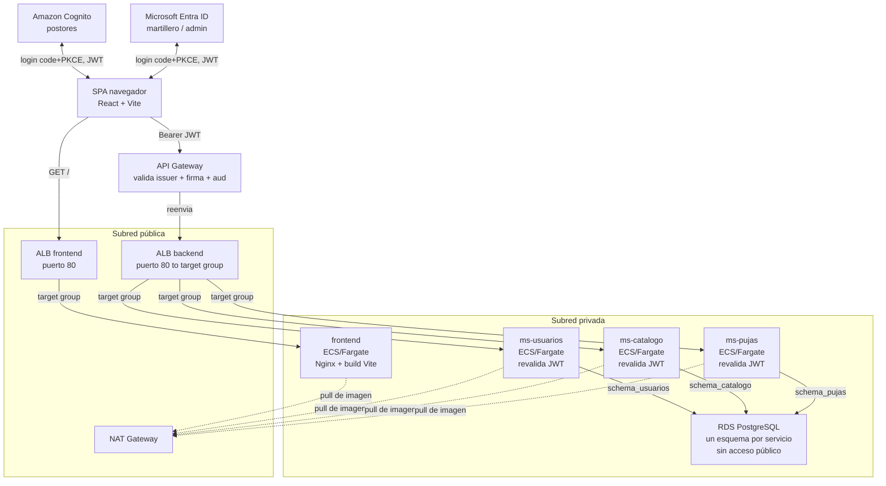

# Despliegue de SubastaLive en AWS — guía paso a paso (consola web)

Esta guía levanta, desde cero y en una sola cuenta de AWS Academy, toda la infraestructura de la **Etapa 1**:
red (con subredes privadas de verdad), base de datos, cómputo en contenedores, balanceo de carga, identidad
federada, puerta de entrada con validación de JWT, y el frontend — que se despliega **como otro contenedor
más en ECS**, con el mismo patrón que los tres microservicios (no como sitio estático en S3+CloudFront, ver
la nota en la sección 10).

**Todo se configura en el portal web de AWS (y el portal de Azure para Entra ID) — no se usa la CLI de AWS en
ningún paso.** Los únicos comandos de terminal que vas a necesitar son los normales de Docker (construir
imágenes) y de npm (compilar el frontend). Ningún `aws ec2 ...`/`aws ecs ...` — esos los ejecuta **GitHub
Actions por ti** una vez que dejes cargados los Secrets. RDS queda en una subred privada, pero no hace falta
conectarse a ella a mano: cada microservicio crea y actualiza su propio esquema solo, con Flyway, al
arrancar (ver sección 3).

## Por qué cada uno despliega todo

Es tentador dividir el trabajo así: "yo hago el backend, tú el front, alguien más sube todo a AWS al final".
Ese reparto deja a dos de cada tres personas del equipo sin haber tocado nunca la consola de AWS — y en la
presentación de la pauta, cualquiera puede tener que explicar por qué el API Gateway valida el JWT antes de
llegar al ALB, o por qué RDS vive en una subred privada.

Por eso esta guía asume que **una sola persona** despliega la arquitectura completa en su propia cuenta —
pero está pensada para que las tres personas del equipo la sigan, cada una en su propio laboratorio de
Canvas, usando una imagen de contenedor de práctica mientras los microservicios reales todavía se están
construyendo. Al final, los tres han creado una VPC con subredes privadas, un NAT Gateway, una RDS, un
cluster ECS, un ALB, un API Gateway con autorizador JWT y un User Pool de Cognito con sus propias manos — no
solo lo vieron en un diagrama.

## Antes de empezar

Instala esto en tu máquina:

- **Docker Desktop** — para construir la imagen de práctica (esto sí abre una terminal, es inevitable).
- **Postman** (o Insomnia) — para probar el API Gateway con un token, sin usar `curl`.
- **Node.js 20+** — para el build del frontend (`npm run build`).
- El repositorio de SubastaLive clonado localmente.

> **Específico de AWS Academy Learner Lab.** No puedes crear roles ni políticas IAM — la cuenta ya trae uno
> preparado llamado `LabRole`, y es el que vas a elegir en todos los menús desplegables donde ECS pida un
> rol. Si un asistente te deja escribir un nombre de rol nuevo y falla con "not authorized", es porque
> intentaste crear uno — busca `LabRole` en la lista en vez de escribir uno.
>
> La sesión del laboratorio dura unas horas y las credenciales que le vas a pasar a GitHub expiran con ella.
> Si un despliegue automático empieza a fallar de un día para otro, lo primero que hay que revisar es si el
> laboratorio se venció (hay que volver a Canvas, reiniciarlo, y actualizar los Secrets en GitHub).
>
> **El NAT Gateway cobra por hora + por dato**, incluso parado no existe "pausarlo" — o está creado (cobrando)
> o está borrado. Si te preocupa el gasto de créditos del laboratorio, bórralo cuando termines de trabajar
> (sección 13) y créalo de nuevo la próxima sesión — es rápido (unos minutos), pero cualquier deploy que se
> dispare mientras no exista va a fallar con `CannotPullContainerError` hasta que vuelva a estar arriba.

## El mapa completo

Este es el camino que recorre una petición real una vez que todo esté desplegado, mostrando qué vive en
subred **pública** y qué en subred **privada**. Cada sección de esta guía construye una de estas piezas, en
este orden.



Dos ALB separados: uno solo lo usa el navegador para cargar el frontend, el otro solo lo usa el API Gateway
para llegar a los microservicios — así no hay que mezclar reglas de listener por path en uno solo. Las tareas
de ECS y RDS no tienen IP pública ni son alcanzables desde internet: las tareas salen a buscar su imagen a
través del NAT Gateway, y a RDS no se entra desde afuera del todo — cada microservicio gestiona su propio
esquema al arrancar (Flyway, ver sección 3), sin que nadie necesite conectarse a mano.

## 1. Entrar a la consola de AWS

En Canvas, abre el laboratorio (AWS Academy Learner Lab). Cuando el círculo se ponga verde, haz clic en el
botón **AWS** (no en "AWS Details" todavía) — te abre la consola web de AWS ya autenticada, sin pedirte
usuario ni contraseña. Todo lo que sigue ocurre ahí, en el navegador.

Anota, mirando la esquina superior derecha de la consola:

- La **región** activa (normalmente `us-east-1` — si no es esa, elígela ahí para todo lo que sigue).
- Tu **Account ID**, haciendo clic en el nombre de la cuenta en esa misma esquina.

Vas a necesitar ambos datos más adelante para las URLs de ECR y de los issuers de Cognito.

## 2. Red — VPC, subredes privadas y NAT Gateway

Todo lo demás vive dentro de esta red, así que va antes que la base de datos.

### Revisar el VPC default

1. **VPC → Your VPCs** → entra al que dice `Default VPC` → anota su **CIDR** (algo como `172.31.0.0/16`).
2. **VPC → Subnets**, filtra por ese VPC → anota, de cada subred existente, su **CIDR** y su **Availability
   Zone**. Todas estas son públicas (tienen ruta a un Internet Gateway) — son las que ya venías usando.

### Crear 2 subredes privadas

3. **VPC → Subnets → Create subnet**. VPC: el default.
4. Subnet 1: name `subastalive-private-1a`, Availability Zone: una cualquiera (ej. `us-east-1a`), IPv4 CIDR:
   un bloque del mismo tamaño que las públicas (normalmente `/20`) que **no se solape** con ninguna subred
   existente — usa las que anotaste en el paso 2 para elegir uno libre dentro del CIDR del VPC.
5. **Add new subnet** → Subnet 2: name `subastalive-private-1b`, en **otra** AZ, otro bloque libre.
6. **Create subnet**. Estas dos quedan sin "Auto-assign public IPv4" — así deben quedar (por defecto, una
   subred nueva no lo trae activado).

### NAT Gateway

7. **VPC → NAT Gateways → Create NAT gateway**.
8. Name: `subastalive-nat`. Subnet: elige una de las **públicas** existentes (el NAT vive en la pública,
   presta salida a las privadas). Connectivity type: **Public**.
9. Elastic IP allocation ID: **Allocate Elastic IP** (botón que crea una nueva ahí mismo).
10. **Create NAT gateway**. Tarda unos minutos en pasar a **Available** — no sigas hasta que lo esté.

### Tabla de rutas para las subredes privadas

11. **VPC → Route Tables → Create route table**. Name: `subastalive-private-rt`. VPC: el default.
12. Entra a la tabla creada → pestaña **Routes → Edit routes → Add route**: Destination `0.0.0.0/0`, Target
    **NAT Gateway** → selecciona `subastalive-nat` → **Save changes**.
13. Pestaña **Subnet associations → Edit subnet associations** → marca `subastalive-private-1a` y
    `subastalive-private-1b` → **Save associations**.

## 3. Base de datos — Amazon RDS (privada)

### Grupo de subredes privado

1. **RDS → Subnet groups → Create DB subnet group**.
2. Name: `subastalive-private-subnet-group`. VPC: el default.
3. Availability Zones: las 2 que usaste para las subredes privadas. Subnets: selecciona
   `subastalive-private-1a` y `subastalive-private-1b` (no las públicas).
4. **Create**.

### La instancia

5. **RDS → Create database → Standard create**.
6. Motor: **PostgreSQL**, versión 16.x (la más reciente que ofrezca).
7. Templates: **Free tier** (si aparece disponible) o **Dev/Test**.
8. Settings: DB instance identifier `subastalive-db`; Master username `subastalive`; define una master
   password y anótala.
9. Instance configuration: la clase más pequeña disponible, `db.t3.micro`.
10. Storage: 20 GiB, tipo gp3.
11. Connectivity: "Don't connect to an EC2 compute resource"; VPC: la default; **DB subnet group**:
    `subastalive-private-subnet-group`; **Public access: No**; VPC security group: **Create new**, nómbralo
    `subastalive-rds-sg`.
12. Additional configuration → Initial database name: `subastalive` (anótalo, lo necesitas al conectarte).
13. **Create database**. Espera a que el estado pase a **Available** (5–10 minutos).
14. Entra a la instancia → pestaña **Connectivity & security** → copia el **Endpoint**.

### Security group: sin acceso desde afuera todavía

15. `subastalive-rds-sg` nace sin reglas de entrada — así se queda por ahora. Más adelante (sección 6) le
    agregas la única regla que va a tener: acceso desde `subastalive-ecs-sg`, para que las tareas de ECS
    puedan conectarse. No hay ninguna otra vía de entrada, y no hace falta ninguna.

### No hace falta aplicar los esquemas a mano

RDS queda arriba, privada, y **vacía** — y así se queda hasta que el primer microservicio con código se
despliegue. Cada microservicio trae Flyway (ver [`../db/README.md`](../db/README.md), sección "Migraciones
automáticas") y, al arrancar por primera vez, crea su propio esquema y tablas solo, usando el mismo
`V1__init.sql` que ya está en este repo. No hay ningún paso manual de base de datos en esta guía — ni ahora
ni en deploys futuros.

Si en algún momento necesitas mirar datos a mano (debugging puntual), no hay una vía permanente para eso en
esta arquitectura — tocaría levantar un acceso temporal (por ejemplo, una EC2 chica solo para esa sesión) y
volver a borrarlo después. No es parte del flujo normal.

## 4. Una imagen para practicar el pipeline

Como `ms-usuarios`, `ms-catalogo` y `ms-pujas` todavía no tienen código, arma una imagen de práctica
("ms-demo") solo para aprender el camino **ECR → ECS → ALB → API Gateway** de punta a punta. La reemplazas
por el servicio real más adelante — la mecánica es idéntica.

```dockerfile
# Dockerfile
FROM python:3.12-alpine
WORKDIR /app
COPY index.html .
EXPOSE 8080
CMD ["python3", "-m", "http.server", "8080"]
```

```html
<!-- index.html -->
<h1>ms-demo OK</h1>
```

Pruébala en local antes de subirla a ningún lado:

```bash
docker build -t ms-demo .
docker run --rm -p 8080:8080 ms-demo
```

Abre `http://localhost:8080` en el navegador — debe mostrar "ms-demo OK".

## 5. Registro de imágenes — Amazon ECR

1. Consola → **ECR → Create repository**. Nombre: `subastalive/ms-demo` → **Create repository**.
2. Entra al repositorio recién creado y haz clic en **View push commands** (arriba a la derecha).
3. AWS te muestra 4 líneas ya armadas con tu Account ID y región correctos — cópialas y pégalas en tu
   terminal, en orden: login a ECR, build, tag, push.

No hace falta escribir esos comandos a mano ni recordar la URL del registro — la consola los arma por ti.

## 6. Cómputo — ECS con Fargate

### Cluster

1. Consola → **ECS → Clusters → Create cluster**.
2. Nombre: `subastalive-cluster`. Infraestructura: **AWS Fargate (serverless)** → **Create**.

### Security groups

Antes de la task definition, crea dos grupos de seguridad (**EC2 → Security Groups → Create security
group**):

- `subastalive-alb-sg`: sin reglas de entrada todavía (se las agregas en el paso del ALB).
- `subastalive-ecs-sg`: sin reglas de entrada todavía (se las agregas después de crear `subastalive-alb-sg`,
  porque la regla apunta *a ese* security group como origen).

Vuelve a `subastalive-ecs-sg` → **Inbound rules → Add rule**: Type Custom TCP, Port `8080`, Source: elige
**Custom** y busca `subastalive-alb-sg` en el desplegable → **Save**.

Edita también `subastalive-rds-sg` (el de la sección 3) → **Add rule**: Type PostgreSQL, Source:
`subastalive-ecs-sg` → **Save** — así las tareas de ECS pueden llegar a la base de datos.

### Task definition

1. **ECS → Task definitions → Create new task definition**.
2. Family: `subastalive-ms-demo`. Launch type: **AWS Fargate**.
3. CPU: `.25 vCPU`, Memory: `0.5 GB`.
4. Task role y Task execution role: busca y selecciona **LabRole** en ambos desplegables — no escribas un
   nombre nuevo.
5. Container details: Name `ms-demo`; Image URI: pégala desde ECR (en el repo, botón **Copy URI**, agrégale
   `:latest` al final).
6. Port mappings: Container port `8080`, Protocol TCP.
7. En la sección de logging, deja marcada la casilla que auto-configura CloudWatch Logs (según la versión de
   consola puede decir "Use log collection" o similar) — así no falla por falta de un log group que no
   existe todavía.
8. **Create**.

## 7. Balanceador — Application Load Balancer

1. **EC2 → Load Balancers → Create load balancer → Application Load Balancer**.
2. Name: `subastalive-alb`. Scheme: **Internet-facing**.
3. VPC: la default. Mappings: selecciona al menos 2 zonas de disponibilidad, con sus subredes **públicas**
   (el ALB va en público, distinto de las tareas).
4. Security groups: `subastalive-alb-sg` (quita el "default" si aparece preseleccionado).
5. Listeners: HTTP puerto 80 → Default action: **Create target group**.
   - Target type: **IP**. Name: `subastalive-tg-demo`. Protocol HTTP, Port `8080`. VPC: la default.
   - Health check path: `/`.
   - **Next → Create target group**, y de vuelta en el asistente del ALB, selecciónalo como destino del
     listener.
6. Vuelve a `subastalive-alb-sg` → **Inbound rules → Add rule**: Type HTTP (puerto 80), Source **Anywhere**
   (`0.0.0.0/0`) → **Save**.
7. **Create load balancer**. Cuando el estado sea **Active**, copia su **DNS name** (pestaña Description).

### Service de ECS

1. **ECS → Clusters → subastalive-cluster → Service → Create**.
2. Launch type: **Fargate**. Task definition: `subastalive-ms-demo`. Service name: `ms-demo`. Desired tasks: `1`.
3. Networking: VPC default, subredes **privadas** (`subastalive-private-1a`, `subastalive-private-1b`),
   Security group: `subastalive-ecs-sg`.
4. **Public IP: Turned OFF** — ya no lo necesita, sale a internet por el NAT Gateway de la sección 2.
5. Load balancing: **Application Load Balancer** → selecciona `subastalive-alb`, listener 80, target group
   `subastalive-tg-demo`.
6. **Create**.

> **Si el NAT Gateway no está `Available` todavía, esto falla.** La tarea no puede descargar la imagen de ECR
> sin salida a internet, y sin NAT Gateway activo esa salida no existe — falla con
> `CannotPullContainerError`. Confirma en VPC → NAT Gateways que el estado sea `Available` antes de crear el
> service.

Espera un par de minutos (el estado de la tarea debe llegar a **Running**, y el target en el target group a
**healthy**) y abre `http://<DNS-del-ALB>` en el navegador — debe mostrar "ms-demo OK".

## 8. Identidad — Cognito y Entra ID

### Amazon Cognito (postores)

1. Consola → **Cognito → User pools → Create user pool**.
2. Configure sign-in experience: método de inicio de sesión **Email**.
3. Configure security requirements: política de contraseña por defecto está bien; MFA: **No MFA** (para el
   laboratorio).
4. Configure sign-up experience: activa **self-registration**; atributos requeridos: `email`.
5. Configure message delivery: deja **Send email with Cognito** (suficiente para pruebas).
6. Integrate your app:
   - User pool name: `subastalive-postores`.
   - Hosted authentication pages: **Use the Cognito Hosted UI**. Dominio: `subastalive-<algo-único>`.
   - Initial app client: público, nombre `subastalive-frontend`. **No generes client secret** (queda
     desmarcado — es una SPA pública).
   - Allowed callback URLs: `http://localhost:5173/auth/callback/postor`.
   - Allowed sign-out URLs: `http://localhost:5173`.
   - Identity providers: Cognito user pool.
   - OAuth grant types: **Authorization code grant**.
   - OpenID Connect scopes: `openid`, `email`, `profile`.
7. **Review and create → Create user pool**.
8. Entra al user pool creado → pestaña **App integration** → anota el **Client ID** y el **dominio de Cognito**
   completo. En **User pool overview**, anota el **User pool ID**.

Crea un usuario de prueba:

9. **Users → Create user**. Username/email: `postor.prueba@example.com`. Marca "Mark email as verified".
   Define una contraseña permanente (evita la temporal, para no tener que cambiarla en el primer login).

### Microsoft Entra ID (martillero / administrador)

Esto es Azure, no AWS — vía [portal.azure.com](https://portal.azure.com):

1. **Microsoft Entra ID → App registrations → New registration.** Tipo de cuenta: solo tu tenant.
2. **Redirect URI**, tipo SPA: `http://localhost:5173/auth/callback/staff`.
3. **App roles → Create app role:** crea `MARTILLERO` y `ADMINISTRADOR`.
4. **Enterprise applications** → tu app → **Users and groups** → asigna un usuario de prueba a cada rol.
5. Anota **Application (client) ID** y **Directory (tenant) ID** — la authority es
   `https://login.microsoftonline.com/<TENANT_ID>/v2.0`.

## 9. Puerta de entrada — API Gateway

1. Consola → **API Gateway → Create API → HTTP API → Build**.
2. **Add integration**: Integration type **HTTP**; Method **ANY**; Integration URL:
   `http://<DNS-del-ALB>` (el que copiaste en la sección 7).
3. **Configure routes**: método **ANY**, path `/{proxy+}`, apuntando a esa integración.
4. **Configure stages**: deja el stage `$default` con auto-deploy activado.
5. **Create**. En el resumen de la API, copia la **Invoke URL**.

### Autorizador JWT

6. Menú izquierdo de tu API → **Authorizers → Create**.
7. Tipo: **JWT**. Name: `cognito-postores`. Identity source: `$request.header.Authorization`.
8. Issuer URL: `https://cognito-idp.<tu-región>.amazonaws.com/<User-pool-ID>`.
9. Audience: el **Client ID** de Cognito que anotaste antes.
10. **Create**.
11. Ve a **Routes**, selecciona la ruta `ANY /{proxy+}` → **Attach authorizer** → elige `cognito-postores` →
    **Save**.

### Probar sin terminal

- **Sin token:** pega la Invoke URL en el navegador. Abre las DevTools (F12) → pestaña **Network**, recarga
  → verás la petición con status **401** y el cuerpo del error.
- **Con token, usando el propio frontend:** en `frontend/.env.local`, pon `VITE_AUTH_MODE=oidc` y completa
  `VITE_COGNITO_AUTHORITY` (`https://cognito-idp.<región>.amazonaws.com/<User-pool-ID>`) y
  `VITE_COGNITO_CLIENT_ID`. Corre `npm run dev`, entra como postor de verdad con el usuario de prueba que
  creaste. Una vez logueado, abre DevTools → pestaña **Application** → **Session Storage** →
  `http://localhost:5173` → busca la clave que empieza con `oidc.user:` y copia el valor de `id_token` de
  adentro.
- Abre **Postman → New Request → GET**, pega la Invoke URL, pestaña **Headers** → agrega
  `Authorization: Bearer <el id_token copiado>` → **Send**. Debe responder **200**.

> **Un solo issuer por autorizador.** Un autorizador JWT nativo de API Gateway valida contra **un** issuer.
> Para aceptar Cognito *y* Entra ID en la misma ruta (como pide el contrato), la salida real es un
> autorizador Lambda que pruebe ambos issuers, o dos autorizadores en rutas separadas. Esta guía prueba el
> mecanismo con uno solo — la decisión de cuál camino tomar queda documentada en
> [`ms-catalogo/README.md`](../ms-catalogo/README.md), sección 5.6 del plan.

## 10. Frontend — mismo patrón, su propio ALB

> **Por qué no S3 + CloudFront.** Es lo que proponía el plan original (sección 6.3), pero este laboratorio de
> AWS Academy no otorga permiso para crear Origin Access Control
> (`cloudfront:CreateOriginAccessControl` → `AccessDenied`) — es un límite real de la cuenta, no algo que se
> pueda resolver desde la consola. Como ECR/ECS/ALB sí funcionan sin problema (ya lo probaste con `ms-demo`),
> el frontend se despliega igual que un microservicio más: un contenedor Nginx sirviendo el build de Vite.

A diferencia de `ms-demo`, el frontend de este repo **ya tiene su `Dockerfile`**
(`frontend/Dockerfile` + `frontend/nginx.conf`) — no hace falta inventar nada, y tampoco hace falta construir
la imagen a mano: la sube GitHub Actions la primera vez que hagas push. Lo único que armas acá es la
infraestructura que la va a recibir.

### ECR

1. Consola → **ECR → Create repository**. Nombre: `subastalive/frontend` → **Create repository**.

### Security groups y ALB propio

El frontend necesita su **propio** ALB — el que ya tienes (`subastalive-alb`) es el que usa el API Gateway
para llegar a los microservicios, y no queremos mezclar reglas de listener por path a esta altura.

2. **EC2 → Security Groups → Create security group**: `subastalive-frontend-alb-sg`, sin reglas de entrada
   todavía.
3. Crea otro: `subastalive-frontend-ecs-sg`, tampoco con reglas todavía.
4. Vuelve a `subastalive-frontend-ecs-sg` → **Inbound rules → Add rule**: Type Custom TCP, Port `80`, Source
   **Custom** → busca `subastalive-frontend-alb-sg` → **Save**.
5. Vuelve a `subastalive-frontend-alb-sg` → **Add rule**: Type HTTP (puerto 80), Source **Anywhere**
   (`0.0.0.0/0`) → **Save**.
6. **EC2 → Load Balancers → Create load balancer → Application Load Balancer**.
   - Name: `subastalive-frontend-alb`. Scheme: **Internet-facing**.
   - VPC: la default, subredes **públicas** (mismo criterio que `subastalive-alb`).
   - Security group: `subastalive-frontend-alb-sg`.
   - Listener HTTP puerto 80 → **Create target group**: Target type **IP**, Name `subastalive-tg-frontend`,
     Protocol HTTP, Port `80`, Health check path `/`.
   - **Create load balancer**. Copia su **DNS name** cuando quede **Active** — esa va a ser la URL pública
     del frontend.

### Task definition

7. **ECS → Task definitions → Create new task definition**.
8. Family: `subastalive-frontend`. Launch type: **AWS Fargate**. CPU `.25 vCPU`, Memory `0.5 GB`.
9. Task role y Task execution role: **LabRole** en ambos.
10. Container: Name `frontend`; Image URI: `<ACCOUNT_ID>.dkr.ecr.<región>.amazonaws.com/subastalive/frontend:latest`
    (con tu Account ID y región — la imagen todavía no existe, es la que va a subir GitHub Actions en el
    siguiente paso; ECS recién la va a poder descargar después de eso).
11. Port mappings: Container port `80`.
12. Logging: deja marcada la casilla que auto-configura CloudWatch Logs.
13. **Create**.

### Service de ECS

14. **ECS → Clusters → subastalive-cluster → Service → Create**.
15. Launch type **Fargate**. Task definition `subastalive-frontend`. Service name `frontend`. Desired tasks `1`.
16. Networking: subredes **privadas** (`subastalive-private-1a`, `subastalive-private-1b`), Security group
    `subastalive-frontend-ecs-sg`, **Public IP: Turned OFF**.
17. Load balancing: **Application Load Balancer** → `subastalive-frontend-alb`, listener 80, target group
    `subastalive-tg-frontend`.
18. **Create**.

La tarea va a quedar fallando al intentar descargar la imagen (`subastalive/frontend:latest` todavía no
existe en ECR) — es esperado, se resuelve en el paso siguiente.

### Disparar el primer build desde GitHub

19. Configura los Secrets y Variables de GitHub (siguiente sección, incluyendo `ECR_REPOSITORY_FRONTEND` y
    `ECS_SERVICE_FRONTEND`).
20. Dispara el workflow: un `git push` que toque algo en `frontend/`, o **Actions → Deploy frontend → Run
    workflow** manualmente. Esto construye la imagen, la sube a ECR, y fuerza a ECS a re-desplegar.
21. Espera un par de minutos — la tarea de ECS debería pasar a **Running** y el target en
    `subastalive-tg-frontend` a **healthy**. Abre `http://<DNS-del-ALB-frontend>` en el navegador — debe
    cargar SubastaLive.

## 11. Conectar GitHub Actions

Con toda la infraestructura arriba, ve al repositorio en GitHub → **Settings → Secrets and variables →
Actions**, y carga lo siguiente (los valores salen todos de lo que ya configuraste en la consola, no hay que
inventar nada nuevo):

| Nombre | Tipo | De dónde sale |
|---|---|---|
| `AWS_ACCESS_KEY_ID` | Secret | Panel **AWS Details** del laboratorio en Canvas |
| `AWS_SECRET_ACCESS_KEY` | Secret | Panel **AWS Details** del laboratorio en Canvas |
| `AWS_SESSION_TOKEN` | Secret | Panel **AWS Details** del laboratorio en Canvas |
| `AWS_REGION` | Variable | La región que ves arriba a la derecha en la consola (ej. `us-east-1`) |
| `ECR_REPOSITORY_USUARIOS/CATALOGO/PUJAS` | Variable | El nombre que le pusiste al repo en ECR (sección 5) |
| `ECS_CLUSTER` | Variable | `subastalive-cluster` (sección 6) |
| `ECS_SERVICE_USUARIOS/CATALOGO/PUJAS` | Variable | El nombre del service de ECS (sección 7) |
| `ECR_REPOSITORY_FRONTEND` | Variable | `subastalive/frontend` (sección 10) |
| `ECS_SERVICE_FRONTEND` | Variable | `frontend` (sección 10) |
| `VITE_AUTH_MODE` | Variable | `mock` para probar sin IdPs reales, `oidc` una vez que Cognito/Entra ID estén listos |
| `VITE_USE_MOCKS` | Variable | `true` mientras los microservicios reales no existan |
| `VITE_API_BASE_URL` | Variable | La Invoke URL del API Gateway (sección 9) — solo importa si `VITE_USE_MOCKS=false` |
| `VITE_COGNITO_AUTHORITY`, `VITE_COGNITO_CLIENT_ID` | Variable | Del user pool de Cognito (sección 8) — solo si `VITE_AUTH_MODE=oidc` |
| `VITE_ENTRA_AUTHORITY`, `VITE_ENTRA_CLIENT_ID` | Variable | De la app de Entra ID (sección 8) — solo si `VITE_AUTH_MODE=oidc` |

A partir de acá, un `git push` a cada carpeta dispara su propio pipeline — ver la sección "CI/CD" del
[README principal](../README.md#cicd--despliegue-automático-a-aws-github-actions).

## 12. Repetirlo con los tres microservicios reales

Todo lo de las secciones 5 a 7 se repite igual por cada microservicio real, cambiando el nombre. Una
diferencia real de `ms-catalogo` que vale la pena anotar ahora: su contrato expone **dos** familias de rutas
(`/subastas/*` y `/lotes/*`), así que en el paso de API Gateway necesitas dos rutas apuntando al mismo target
group — no una sola, como en el ejemplo de `ms-demo`.

## 13. Costos y limpieza

AWS Academy Learner Lab tiene un tope de gasto y de tiempo por sesión. El **NAT Gateway es el recurso que más
corre esta cuenta silenciosamente** (cobra por hora existiendo, no solo por uso) — si no vas a seguir
trabajando, apaga en este orden (el inverso al que construiste), todo desde la consola:

1. **ECS** → cada Service (`ms-demo`, `frontend`, y los reales que hayas creado) → **Update service** →
   Desired tasks `0` → guarda, espera, luego **Delete service**. Después, **Delete cluster**.
2. **EC2 → Load Balancers** → borra `subastalive-alb` y `subastalive-frontend-alb`. Luego **Target Groups**
   → borra `subastalive-tg-demo` y `subastalive-tg-frontend` (y los de los microservicios reales).
3. **API Gateway** → selecciona la API → **Delete**.
4. **RDS** → selecciona `subastalive-db` → **Actions → Delete** → desmarca "Create final snapshot" →
   confirma escribiendo `delete me`.
5. **Cognito** → selecciona el user pool → **Delete user pool**.
6. **VPC → NAT Gateways** → selecciona `subastalive-nat` → **Delete** (tarda unos minutos).
7. **VPC → Elastic IPs** → **Release** la que se usó para el NAT (una vez borrado, ya no está asociada, pero
   sigue existiendo — y las IPs elásticas sin usar también tienen costo).
8. **VPC → Route Tables** → borra `subastalive-private-rt`.
9. **VPC → Subnets** → borra `subastalive-private-1a` y `subastalive-private-1b`.
10. **EC2 → Security Groups** → borra todos los `subastalive-*-sg` (una vez que nada los use).
11. **ECR** — opcional: borra los repositorios si no los vas a seguir usando.

La próxima vez que retomes, repites la sección 2 (subredes + NAT) y la sección 3 sin volver a aplicar nada
manualmente — si borraste RDS, la próxima vez que despliegues cada microservicio, Flyway vuelve a crear su
esquema solo.

## Checklist final

- [ ] VPC con 2 subredes privadas y NAT Gateway `Available`
- [ ] RDS sin acceso público, sin ninguna regla de entrada abierta salvo la de `subastalive-ecs-sg`
- [ ] Imagen `ms-demo` construida, en ECR, corriendo en ECS en subred privada (sin IP pública)
- [ ] El DNS del ALB responde `ms-demo OK` en el navegador
- [ ] La Invoke URL del API Gateway da 401 sin token (visto en DevTools) y 200 con el `id_token` de Cognito (visto en Postman)
- [ ] Usuario de prueba creado en Cognito; app registrada y roles creados en Entra ID
- [ ] Frontend corriendo en ECS detrás de su propio ALB; abre en el navegador y sobrevive un refresh en ruta interna
- [ ] Secrets y Variables cargados en GitHub; un push dispara el workflow correspondiente
- [ ] Sabes en qué orden apagar todo cuando termines (empezando por el NAT Gateway)
