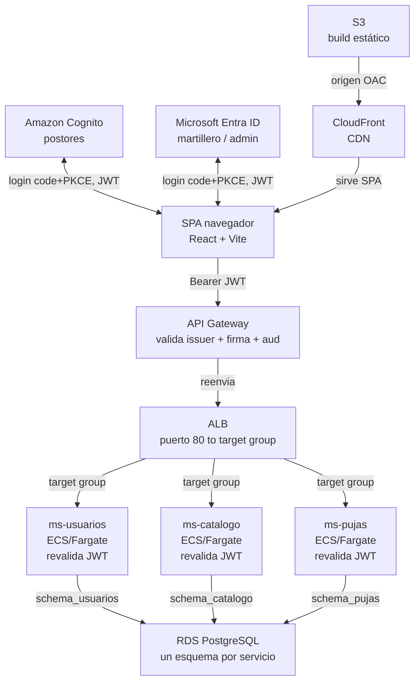

# Despliegue de SubastaLive en AWS — guía paso a paso (consola web)

Esta guía levanta, desde cero y en una sola cuenta de AWS Academy, toda la infraestructura de la **Etapa 1**:
base de datos, cómputo en contenedores, balanceo de carga, identidad federada, puerta de entrada con
validación de JWT, y el frontend como sitio estático.

**Todo se configura en el portal web de AWS (y el portal de Azure para Entra ID) — no se usa la CLI de AWS
en ningún paso.** Los únicos comandos de terminal que vas a necesitar son los normales de Docker (para
construir la imagen) y de npm (para compilar el frontend); nada de `aws ec2 ...`, `aws ecs ...`, etc. Esos
comandos sí existen, pero los ejecuta **GitHub Actions por ti** una vez que dejes cargados los Secrets —
tú no los escribes.

## Por qué cada uno despliega todo

Es tentador dividir el trabajo así: "yo hago el backend, tú el front, alguien más sube todo a AWS al final".
Ese reparto deja a dos de cada tres personas del equipo sin haber tocado nunca la consola de AWS — y en la
presentación de la pauta, cualquiera puede tener que explicar por qué el API Gateway valida el JWT antes de
llegar al ALB, o por qué RDS tiene un esquema por servicio.

Por eso esta guía asume que **una sola persona** despliega la arquitectura completa en su propia cuenta —
pero está pensada para que las tres personas del equipo la sigan, cada una en su propio laboratorio de
Canvas, usando una imagen de contenedor de práctica mientras los microservicios reales todavía se están
construyendo. Al final, los tres han creado una RDS, un cluster ECS, un ALB, un API Gateway con autorizador
JWT y un User Pool de Cognito con sus propias manos — no solo lo vieron en un diagrama.

## Antes de empezar

Instala esto en tu máquina:

- **Docker Desktop** — para construir la imagen de práctica (esto sí abre una terminal, es inevitable).
- **pgAdmin** o **DBeaver** (cliente de base de datos con interfaz gráfica) — para aplicar los scripts de
  esquema contra RDS sin usar la línea de comandos.
- **Postman** (o Insomnia) — para probar el API Gateway con un token, sin usar `curl`.
- **Node.js 20+** — para el build del frontend (`npm run build`).
- El repositorio de SubastaLive clonado localmente.

> **Específico de AWS Academy Learner Lab.** No puedes crear roles ni políticas IAM — la cuenta ya trae uno
> preparado llamado `LabRole`, y es el que vas a elegir en todos los menús desplegables donde ECS pida un
> rol. Si un asistente te deja escribir un nombre de rol nuevo y falla con "not authorized", es porque
> intentaste crear uno — busca `LabRole` en la lista en vez de escribir uno.
>
> La sesión del laboratorio dura unas horas y las credenciales que le vas a pasar a GitHub expiran con ella.
> Si un despliegue automático empieza a fallar de un día para otro, lo primero que hay que revisar es si el
> laboratorio se venció (hay que volver a Canvas, reiniciarlo, y actualizar los Secrets en GitHub).

## El mapa completo

Este es el camino que recorre una petición real una vez que todo esté desplegado. Cada sección de esta guía
construye una de estas piezas, en este orden.



## 1. Entrar a la consola de AWS

En Canvas, abre el laboratorio (AWS Academy Learner Lab). Cuando el círculo se ponga verde, haz clic en el
botón **AWS** (no en "AWS Details" todavía) — te abre la consola web de AWS ya autenticada, sin pedirte
usuario ni contraseña. Todo lo que sigue ocurre ahí, en el navegador.

Anota, mirando la esquina superior derecha de la consola:

- La **región** activa (normalmente `us-east-1` — si no es esa, elígela ahí para todo lo que sigue).
- Tu **Account ID**, haciendo clic en el nombre de la cuenta en esa misma esquina.

Vas a necesitar ambos datos más adelante para las URLs de ECR y de los issuers de Cognito.

## 2. Base de datos — Amazon RDS

Todo lo demás depende de que esto exista primero.

1. En la barra de búsqueda de la consola, ve a **RDS → Create database**.
2. Método de creación: **Standard create**.
3. Motor: **PostgreSQL**, versión 16.x (la más reciente que ofrezca).
4. Templates: **Free tier** (si aparece disponible) o **Dev/Test**.
5. Settings: DB instance identifier `subastalive-db`; Master username `subastalive`; define una master
   password y anótala (o deja que RDS la genere y la copias al final desde "View credential details").
6. Instance configuration: la clase más pequeña disponible, `db.t3.micro`.
7. Storage: 20 GiB, tipo gp3.
8. Connectivity: "Don't connect to an EC2 compute resource"; VPC: la default; **Public access: Yes**; VPC
   security group: **Create new**, nómbralo `subastalive-rds-sg`.
9. Additional configuration → Initial database name: `subastalive` (anota el nombre que elijas, lo vas a
   necesitar al conectarte).
10. **Create database**. Espera a que el estado pase a **Available** (5–10 minutos).
11. Entra a la instancia → pestaña **Connectivity & security** → copia el **Endpoint**.

Ábrele el puerto solo a tu propia IP, no al mundo:

12. Ve a **EC2 → Security Groups**, busca `subastalive-rds-sg`.
13. Pestaña **Inbound rules → Edit inbound rules → Add rule**: Type `PostgreSQL`, Source: **My IP** → **Save
    rules**.

### Aplicar los esquemas con pgAdmin (sin línea de comandos)

14. Abre pgAdmin → clic derecho en **Servers → Register → Server**.
15. Pestaña **General**: nombre `subastalive`. Pestaña **Connection**: Host = el Endpoint copiado, Port
    `5432`, Maintenance database = el nombre que elegiste (o `postgres`), Username `subastalive`, Password la
    que definiste → **Save**.
16. Con el servidor conectado, abre el **Query Tool** (ícono de rayo, o clic derecho → Query Tool).
17. Abre en tu editor de texto `db/schema_usuarios/V1__init.sql`, copia todo su contenido, pégalo en el Query
    Tool y ejecútalo (▶ o F5).
18. Repite con `db/schema_catalogo/V1__init.sql` y `db/schema_pujas/V1__init.sql`.
19. En el panel izquierdo de pgAdmin, expande **Databases → (tu base) → Schemas** — deben aparecer
    `schema_usuarios`, `schema_catalogo` y `schema_pujas`.

## 3. Una imagen para practicar el pipeline

Como `ms-usuarios`, `ms-catalogo` y `ms-pujas` todavía no tienen código, arma una imagen de práctica
("ms-demo") solo para aprender el camino **ECR → ECS → ALB → API Gateway** de punta a punta. La reemplazas
por el servicio real más adelante — la mecánica es idéntica.

```dockerfile
# Dockerfile
FROM python:3.12-alpine
WORKDIR /app
COPY index.html .
EXPOSE 8080
CMD ["python3", "-m", "http.server", "8080"]
```

```html
<!-- index.html -->
<h1>ms-demo OK</h1>
```

Pruébala en local antes de subirla a ningún lado:

```bash
docker build -t ms-demo .
docker run --rm -p 8080:8080 ms-demo
```

Abre `http://localhost:8080` en el navegador — debe mostrar "ms-demo OK".

## 4. Registro de imágenes — Amazon ECR

1. Consola → **ECR → Create repository**. Nombre: `subastalive/ms-demo` → **Create repository**.
2. Entra al repositorio recién creado y haz clic en **View push commands** (arriba a la derecha).
3. AWS te muestra 4 líneas ya armadas con tu Account ID y región correctos — cópialas y pégalas en tu
   terminal, en orden: login a ECR, build, tag, push.

No hace falta escribir esos comandos a mano ni recordar la URL del registro — la consola los arma por ti.

## 5. Cómputo — ECS con Fargate

### Cluster

1. Consola → **ECS → Clusters → Create cluster**.
2. Nombre: `subastalive-cluster`. Infraestructura: **AWS Fargate (serverless)** → **Create**.

### Security groups

Antes de la task definition, crea dos grupos de seguridad (**EC2 → Security Groups → Create security
group**):

- `subastalive-alb-sg`: sin reglas de entrada todavía (se las agregas en el paso del ALB).
- `subastalive-ecs-sg`: sin reglas de entrada todavía (se las agregas después de crear `subastalive-alb-sg`,
  porque la regla apunta *a ese* security group como origen).

Vuelve a `subastalive-ecs-sg` → **Inbound rules → Add rule**: Type Custom TCP, Port `8080`, Source: elige
**Custom** y busca `subastalive-alb-sg` en el desplegable → **Save**.

Edita también `subastalive-rds-sg` (el que creó RDS) → **Add rule**: Type PostgreSQL, Source: `subastalive-ecs-sg` → **Save** — así las tareas de ECS pueden llegar a la base de datos.

### Task definition

1. **ECS → Task definitions → Create new task definition**.
2. Family: `subastalive-ms-demo`. Launch type: **AWS Fargate**.
3. CPU: `.25 vCPU`, Memory: `0.5 GB`.
4. Task role y Task execution role: busca y selecciona **LabRole** en ambos desplegables — no escribas un
   nombre nuevo.
5. Container details: Name `ms-demo`; Image URI: pégala desde ECR (en el repo, botón **Copy URI**, agrégale
   `:latest` al final).
6. Port mappings: Container port `8080`, Protocol TCP.
7. En la sección de logging, deja marcada la casilla que auto-configura CloudWatch Logs (según la versión de
   consola puede decir "Use log collection" o similar) — así no falla por falta de un log group que no
   existe todavía.
8. **Create**.

## 6. Balanceador — Application Load Balancer

1. **EC2 → Load Balancers → Create load balancer → Application Load Balancer**.
2. Name: `subastalive-alb`. Scheme: **Internet-facing**.
3. VPC: la default. Mappings: selecciona al menos 2 zonas de disponibilidad con su subred.
4. Security groups: `subastalive-alb-sg` (quita el "default" si aparece preseleccionado).
5. Listeners: HTTP puerto 80 → Default action: **Create target group**.
   - Target type: **IP**. Name: `subastalive-tg-demo`. Protocol HTTP, Port `8080`. VPC: la default.
   - Health check path: `/`.
   - **Next → Create target group**, y de vuelta en el asistente del ALB, selecciónalo como destino del
     listener.
6. Vuelve a `subastalive-alb-sg` → **Inbound rules → Add rule**: Type HTTP (puerto 80), Source **Anywhere**
   (`0.0.0.0/0`) → **Save**.
7. **Create load balancer**. Cuando el estado sea **Active**, copia su **DNS name** (pestaña Description).

### Service de ECS

1. **ECS → Clusters → subastalive-cluster → Service → Create**.
2. Launch type: **Fargate**. Task definition: `subastalive-ms-demo`. Service name: `ms-demo`. Desired tasks: `1`.
3. Networking: VPC default, mismas subredes que el ALB, Security group: `subastalive-ecs-sg`.
4. **Public IP: Turned ON.**
5. Load balancing: **Application Load Balancer** → selecciona `subastalive-alb`, listener 80, target group
   `subastalive-tg-demo`.
6. **Create**.

> **Sin esto, la tarea no arranca.** Los laboratorios de Academy normalmente no traen un NAT Gateway. Si el
> "Public IP" queda apagado, la tarea no tiene salida a internet para descargar la imagen desde ECR y falla
> con `CannotPullContainerError` — este es el error más común al seguir esta guía.

Espera un par de minutos (el estado de la tarea debe llegar a **Running**, y el target en el target group a
**healthy**) y abre `http://<DNS-del-ALB>` en el navegador — debe mostrar "ms-demo OK".

## 7. Identidad — Cognito y Entra ID

### Amazon Cognito (postores)

1. Consola → **Cognito → User pools → Create user pool**.
2. Configure sign-in experience: método de inicio de sesión **Email**.
3. Configure security requirements: política de contraseña por defecto está bien; MFA: **No MFA** (para el
   laboratorio).
4. Configure sign-up experience: activa **self-registration**; atributos requeridos: `email`.
5. Configure message delivery: deja **Send email with Cognito** (suficiente para pruebas).
6. Integrate your app:
   - User pool name: `subastalive-postores`.
   - Hosted authentication pages: **Use the Cognito Hosted UI**. Dominio: `subastalive-<algo-único>`.
   - Initial app client: público, nombre `subastalive-frontend`. **No generes client secret** (queda
     desmarcado — es una SPA pública).
   - Allowed callback URLs: `http://localhost:5173/auth/callback/postor`.
   - Allowed sign-out URLs: `http://localhost:5173`.
   - Identity providers: Cognito user pool.
   - OAuth grant types: **Authorization code grant**.
   - OpenID Connect scopes: `openid`, `email`, `profile`.
7. **Review and create → Create user pool**.
8. Entra al user pool creado → pestaña **App integration** → anota el **Client ID** y el **dominio de Cognito**
   completo. En **User pool overview**, anota el **User pool ID**.

Crea un usuario de prueba:

9. **Users → Create user**. Username/email: `postor.prueba@example.com`. Marca "Mark email as verified".
   Define una contraseña permanente (evita la temporal, para no tener que cambiarla en el primer login).

### Microsoft Entra ID (martillero / administrador)

Esto es Azure, no AWS — vía [portal.azure.com](https://portal.azure.com):

1. **Microsoft Entra ID → App registrations → New registration.** Tipo de cuenta: solo tu tenant.
2. **Redirect URI**, tipo SPA: `http://localhost:5173/auth/callback/staff`.
3. **App roles → Create app role:** crea `MARTILLERO` y `ADMINISTRADOR`.
4. **Enterprise applications** → tu app → **Users and groups** → asigna un usuario de prueba a cada rol.
5. Anota **Application (client) ID** y **Directory (tenant) ID** — la authority es
   `https://login.microsoftonline.com/<TENANT_ID>/v2.0`.

## 8. Puerta de entrada — API Gateway

1. Consola → **API Gateway → Create API → HTTP API → Build**.
2. **Add integration**: Integration type **HTTP**; Method **ANY**; Integration URL:
   `http://<DNS-del-ALB>` (el que copiaste en el paso 6).
3. **Configure routes**: método **ANY**, path `/{proxy+}`, apuntando a esa integración.
4. **Configure stages**: deja el stage `$default` con auto-deploy activado.
5. **Create**. En el resumen de la API, copia la **Invoke URL**.

### Autorizador JWT

6. Menú izquierdo de tu API → **Authorizers → Create**.
7. Tipo: **JWT**. Name: `cognito-postores`. Identity source: `$request.header.Authorization`.
8. Issuer URL: `https://cognito-idp.<tu-región>.amazonaws.com/<User-pool-ID>`.
9. Audience: el **Client ID** de Cognito que anotaste antes.
10. **Create**.
11. Ve a **Routes**, selecciona la ruta `ANY /{proxy+}` → **Attach authorizer** → elige `cognito-postores` →
    **Save**.

### Probar sin terminal

- **Sin token:** pega la Invoke URL en el navegador. Abre las DevTools (F12) → pestaña **Network**, recarga
  → verás la petición con status **401** y el cuerpo del error.
- **Con token, usando el propio frontend:** en `frontend/.env.local`, pon `VITE_AUTH_MODE=oidc` y completa
  `VITE_COGNITO_AUTHORITY` (`https://cognito-idp.<región>.amazonaws.com/<User-pool-ID>`) y
  `VITE_COGNITO_CLIENT_ID`. Corre `npm run dev`, entra como postor de verdad con el usuario de prueba que
  creaste. Una vez logueado, abre DevTools → pestaña **Application** → **Session Storage** →
  `http://localhost:5173` → busca la clave que empieza con `oidc.user:` y copia el valor de `id_token` de
  adentro.
- Abre **Postman → New Request → GET**, pega la Invoke URL, pestaña **Headers** → agrega
  `Authorization: Bearer <el id_token copiado>` → **Send**. Debe responder **200**.

> **Un solo issuer por autorizador.** Un autorizador JWT nativo de API Gateway valida contra **un** issuer.
> Para aceptar Cognito *y* Entra ID en la misma ruta (como pide el contrato), la salida real es un
> autorizador Lambda que pruebe ambos issuers, o dos autorizadores en rutas separadas. Esta guía prueba el
> mecanismo con uno solo — la decisión de cuál camino tomar queda documentada en
> [`ms-catalogo/README.md`](../ms-catalogo/README.md), sección 5.6 del plan.

## 9. Frontend — S3 + CloudFront

### Bucket S3

1. Consola → **S3 → Create bucket**. Nombre único, ej. `subastalive-frontend-<tu-account-id>`.
2. Deja **Block all public access** activado (el bucket queda privado; lo expone CloudFront, no el bucket).
3. **Create bucket**.

### Subir el build

```bash
cd frontend
npm run build
```

4. En la consola de S3, entra al bucket → **Upload → Add folder**, selecciona la carpeta `frontend/dist`
   completa (o arrastra su contenido) → **Upload**.

### Distribución de CloudFront

5. Consola → **CloudFront → Create distribution**.
6. Origin domain: selecciona tu bucket S3 de la lista.
7. Origin access: **Origin access control settings (recommended)** → **Create new OAC** → Create.
8. Viewer protocol policy: **Redirect HTTP to HTTPS**.
9. Default root object: `index.html`.
10. **Create distribution**. Aparece un aviso para **actualizar la política del bucket** — haz clic en
    **Copy policy**, ve a tu bucket S3 → **Permissions → Bucket policy → Edit**, pega la política copiada →
    **Save changes**. Sin este paso, CloudFront no puede leer del bucket (403).
11. Con la distribución ya creada, entra a ella → pestaña **Error pages → Create custom error response**:
    - HTTP error code `403` → Response page path `/index.html` → HTTP response code `200`.
    - Repite lo mismo para `404`.

    Sin esto, refrescar la página en una ruta interna del SPA (ej. `/subastas/123`) rompe.
12. Copia el **Distribution domain name** y ábrelo en el navegador — debe cargar SubastaLive.

## 10. Conectar GitHub Actions

Con toda la infraestructura arriba, ve al repositorio en GitHub → **Settings → Secrets and variables →
Actions**, y carga lo siguiente (los valores salen todos de lo que ya configuraste en la consola, no hay que
inventar nada nuevo):

| Nombre | Tipo | De dónde sale |
|---|---|---|
| `AWS_ACCESS_KEY_ID` | Secret | Panel **AWS Details** del laboratorio en Canvas |
| `AWS_SECRET_ACCESS_KEY` | Secret | Panel **AWS Details** del laboratorio en Canvas |
| `AWS_SESSION_TOKEN` | Secret | Panel **AWS Details** del laboratorio en Canvas |
| `AWS_REGION` | Variable | La región que ves arriba a la derecha en la consola (ej. `us-east-1`) |
| `ECR_REPOSITORY_USUARIOS/CATALOGO/PUJAS` | Variable | El nombre que le pusiste al repo en ECR (paso 4) |
| `ECS_CLUSTER` | Variable | `subastalive-cluster` (paso 5) |
| `ECS_SERVICE_USUARIOS/CATALOGO/PUJAS` | Variable | El nombre del service de ECS (paso 6) |
| `S3_BUCKET_FRONTEND` | Variable | El nombre del bucket (paso 9) |
| `CLOUDFRONT_DISTRIBUTION_ID` | Variable | Pestaña General de la distribución (paso 9) |

A partir de acá, un `git push` a cada carpeta dispara su propio pipeline — ver la sección "CI/CD" del
[README principal](../README.md#cicd--despliegue-automático-a-aws-github-actions).

## 11. Repetirlo con los tres microservicios reales

Todo lo de los pasos 4 a 6 se repite igual por cada microservicio real, cambiando el nombre. Una diferencia
real de `ms-catalogo` que vale la pena anotar ahora: su contrato expone **dos** familias de rutas
(`/subastas/*` y `/lotes/*`), así que en el paso de API Gateway necesitas dos rutas apuntando al mismo target
group — no una sola, como en el ejemplo de `ms-demo`.

## 12. Costos y limpieza

AWS Academy Learner Lab tiene un tope de gasto y de tiempo por sesión. Si no vas a seguir trabajando, apaga
en este orden (el inverso al que construiste), todo desde la consola:

1. **ECS** → Service `ms-demo` → **Update service** → Desired tasks `0` → guarda, espera, luego
   **Delete service**. Después, **Delete cluster**.
2. **EC2 → Load Balancers** → selecciona `subastalive-alb` → **Delete**. Luego **Target Groups** →
   `subastalive-tg-demo` → **Delete**.
3. **CloudFront** → selecciona la distribución → **Disable** → espera a que despliegue (unos minutos) →
   recién ahí **Delete**. No se puede borrar una distribución activa.
4. **S3** → vacía el bucket (**Empty**) → luego **Delete bucket**.
5. **API Gateway** → selecciona la API → **Delete**.
6. **RDS** → selecciona `subastalive-db` → **Actions → Delete** → desmarca "Create final snapshot" →
   confirma escribiendo `delete me`.
7. **Cognito** → selecciona el user pool → **Delete user pool**.
8. **EC2 → Security Groups** → borra `subastalive-alb-sg` y `subastalive-ecs-sg` (una vez que nada los use).
9. **ECR** — opcional: borra los repositorios si no los vas a seguir usando.

## Checklist final

- [ ] RDS arriba, con los tres esquemas creados y verificados en pgAdmin
- [ ] Imagen `ms-demo` construida, en ECR, corriendo en ECS
- [ ] El DNS del ALB responde `ms-demo OK` en el navegador
- [ ] La Invoke URL del API Gateway da 401 sin token (visto en DevTools) y 200 con el `id_token` de Cognito (visto en Postman)
- [ ] Usuario de prueba creado en Cognito; app registrada y roles creados en Entra ID
- [ ] Frontend compilado y subido a S3; CloudFront lo sirve y sobrevive un refresh en ruta interna
- [ ] Secrets y Variables cargados en GitHub; un push dispara el workflow correspondiente
- [ ] Sabes en qué orden apagar todo cuando termines
