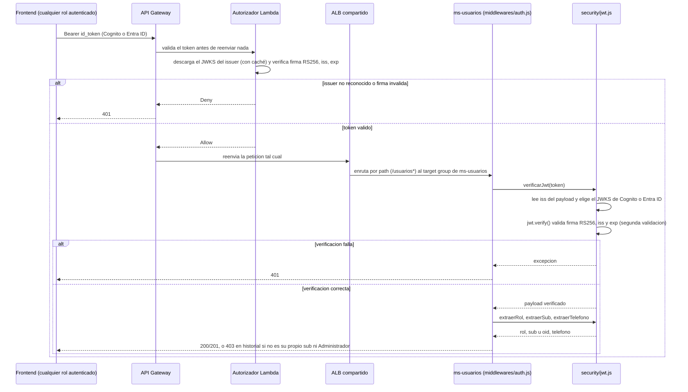
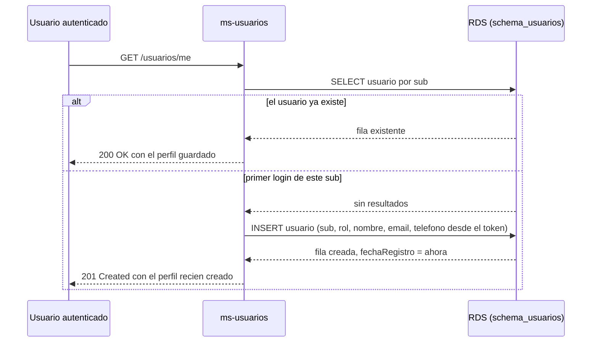

# ms-usuarios

> Implementación real en **Node/Express + PostgreSQL** (`src/server.js`), con el mismo esquema compartido
> que usan `ms-pujas` y `ms-catalogo`. No usa Flyway (no existe un equivalente estándar en Node): en su lugar,
> `src/db.js` aplica `src/db/V1__init.sql` (copia del `V1__init.sql` real en
> [`../db/schema_usuarios`](../db/schema_usuarios)) a mano en cada arranque — es seguro de repetir porque usa
> `CREATE SCHEMA/TABLE IF NOT EXISTS`. Ver el plan completo en
> [`../docs/SubastaLive_Plan_de_Proyecto_v4.pdf`](../docs/SubastaLive_Plan_de_Proyecto_v4.pdf) (secciones 5.6, 6.2, 6.3).
>
> Convenciones generales (formato de error, tipos de dato, roles, header de auth) están centralizadas en el
> [README principal](../README.md#convenciones-de-api-compartidas) para no repetirlas en los tres servicios.

## Responsabilidad

Dueño del **perfil de dominio del usuario** y de su historial de participación. No es un intermediario de
identidad: la autenticación la resuelven Cognito / Entra ID, y este servicio solo guarda datos de negocio
asociados al `sub` (identificador único) que viene en el token.

Cubre las historias:
- **HU-06** — Consultar mi historial (RF-14, RF-15)

## Propiedad de los datos

- Esquema propio en la instancia RDS PostgreSQL compartida: **`schema_usuarios`** (ver [`../db/schema_usuarios`](../db/schema_usuarios)).
- Ningún otro microservicio debe leer o escribir directamente sobre este esquema (RNF-06). Si otro servicio
  necesita datos de usuario, debe pedirlos por API a `ms-usuarios`, no consultar la base directamente.

## Autenticación y autorización

- El middleware [`src/middlewares/auth.js`](src/middlewares/auth.js) valida el JWT en cada request, aceptando
  tokens emitidos por **dos issuers**: el user pool de Amazon Cognito (postores) y el tenant de Microsoft
  Entra ID (martilleros/administradores). Verifica firma (RS256 contra el JWKS de cada proveedor, con caché
  en memoria), `iss`, `exp`/`nbf` y `aud` — no solo decodifica el token, lo verifica de verdad
  ([`src/security/jwt.js`](src/security/jwt.js)). Rechaza con 401 si el token no es válido o no viene de
  alguno de los dos issuers configurados (RF-29, RF-33).
- El rol se lee del claim `roles` de Entra ID; Cognito no emite ningún claim de rol para los postores, así
  que se asume `POSTOR` cuando el issuer es el de Cognito — mismo criterio que `ms-pujas`/`ms-catalogo`
  (RF-30, RF-34).
- El identificador de usuario a usar como clave de negocio es el claim `sub` del token, salvo para Entra ID:
  su `sub` es un identificador *pairwise* (no un UUID), así que se usa el claim `oid` en su lugar — mismo
  criterio que `CurrentUser.java` en los otros dos servicios.
- Para pruebas locales sin IdPs reales (`docker-compose.yml`), acepta además el formato simplificado
  `Bearer local:<sub>:<ROL>`, nunca usado en producción.

### Diagrama de autenticación

Mismo criterio que `ms-pujas`/`ms-catalogo` (doble validación: autorizador Lambda del API Gateway y de
nuevo dentro del servicio), pero escrito a mano en Node en vez de usar Spring Security.



## Modelo de datos (JSON)

### `Usuario`

```json
{
  "sub": "b3f1c2a4-1234-4a11-9c31-abcdef123456",
  "rol": "POSTOR",
  "nombre": "Pamela Álvarez",
  "email": "pamela.alvarez@example.com",
  "telefono": "+56912345678",
  "fechaRegistro": "2026-08-20T14:03:00Z"
}
```

| Campo | Tipo | Notas |
|---|---|---|
| `sub` | string (uuid) | Igual al claim `sub` del token que emitió Cognito o Entra ID |
| `rol` | string (enum) | `POSTOR` \| `MARTILLERO` \| `ADMINISTRADOR` — tomado del claim de rol del token, no editable por el usuario |
| `nombre` | string | Tomado del claim del token si existe (`name`), o `null` |
| `email` | string | Tomado del claim del token si existe (`email`), o `null` |
| `telefono` | string, o `null` | Tomado del claim `phone_number` si existe, o `null`. Ninguno de los dos proveedores lo garantiza — Cognito solo si el postor lo cargó al registrarse; Entra ID solo si el App registration lo expone como *optional claim* y el usuario tiene un método de autenticación por teléfono cargado |
| `fechaRegistro` | string (datetime ISO-8601) | Fecha del primer login (ver auto-provisioning más abajo) |

### `ItemHistorial`

```json
{ "pujaId": "9a2f1a10-...", "subastaId": "1e77c3b0-...", "monto": 24000, "fecha": "2026-08-27T19:55:00Z" }
```

No incluye `resultado` (ganada/perdida) porque la determinación del mejor postor al cierre (RF-19) recién se
implementa en la **Etapa 3**; en la Etapa 1 este endpoint solo expone qué pujas hizo el usuario. El frontend
puede cruzarlo con el estado de la subasta (`ms-catalogo`) si necesita mostrar algo más elaborado.

## Endpoints que debe exponer

### `GET /usuarios/me`

Devuelve (y provisiona si no existe) el perfil del usuario autenticado.

- **Rol requerido:** cualquiera autenticado (Postor, Martillero, Administrador).
- **Request:** sin body. Headers: `Authorization: Bearer <jwt>`.
- **Decisión tomada — auto-provisioning:** si no existe un `Usuario` para el `sub` del token, se crea en esa
  misma llamada usando el `sub`, el `rol` y los claims `name`/`email`/`phone_number` disponibles en el
  token, con `fechaRegistro = ahora`. Este endpoint **no debe responder 404** en el flujo normal — siempre
  devuelve un perfil, recién creado o existente.
- **Response `200 OK`:**
  ```json
  {
    "sub": "b3f1c2a4-1234-4a11-9c31-abcdef123456",
    "rol": "POSTOR",
    "nombre": "Pamela Álvarez",
    "email": "pamela.alvarez@example.com",
    "telefono": "+56912345678",
    "fechaRegistro": "2026-08-20T14:03:00Z"
  }
  ```
- **Response `401 Unauthorized`:** token ausente, inválido o expirado (ver formato de error estándar en el README principal).

### `GET /usuarios/{sub}/historial`

Historial de pujas del usuario (RF-15).

- **Rol requerido:** Postor (solo puede pedir su propio `sub` — comparar contra el `sub` del token, 403 si no coincide), o Administrador (puede pedir cualquiera).
- **Request:** path param `sub` (uuid). Query params opcionales: `limit` (default 20), `offset` (default 0).
- **Response `200 OK`:**
  ```json
  {
    "usuarioSub": "b3f1c2a4-1234-4a11-9c31-abcdef123456",
    "pujas": [
      { "pujaId": "9a2f1a10-...", "subastaId": "1e77c3b0-...", "monto": 24000, "fecha": "2026-08-27T19:55:00Z" },
      { "pujaId": "8b1e77aa-...", "subastaId": "0fa3d221-...", "monto": 15000, "fecha": "2026-08-20T11:02:00Z" }
    ]
  }
  ```
- **Response `403 Forbidden`:** un postor pidiendo el historial de otro `sub`.

## Comunicación con otros microservicios

**Etapa 1 no tiene mensajería (RabbitMQ/Kafka aún no existen), así que cualquier comunicación entre
servicios en esta etapa es síncrona vía HTTP.**

- `ms-usuarios` **no llama a nadie** para resolver `GET /usuarios/me` (el perfil se arma solo con el token).
- Para armar `GET /usuarios/{sub}/historial`, `ms-usuarios` llama a:

  **`GET {MS_PUJAS_BASE_URL}/pujas?usuarioSub={sub}`** (contrato completo en [`../ms-pujas/README.md`](../ms-pujas/README.md))

  Reenviar el JWT original de la petición entrante en esta llamada saliente (Etapa 1 no define aún un
  mecanismo de autenticación servicio-a-servicio separado del JWT de usuario).

  Respuesta esperada de `ms-pujas`:
  ```json
  [
    { "id": "9a2f1a10-...", "subastaId": "1e77c3b0-...", "monto": 24000, "fecha": "2026-08-27T19:55:00Z" }
  ]
  ```
  `ms-usuarios` mapea `id` → `pujaId` al construir su propia respuesta.

- Nadie más debería necesitar llamar a `ms-usuarios` en la Etapa 1, salvo el frontend.

### Diagrama de flujo de datos — `GET /usuarios/me` (auto-provisioning)



## Variables de entorno esperadas

| Variable | Descripción |
|---|---|
| `DB_HOST` / `DB_PORT` / `DB_NAME` | Conexión a la instancia RDS PostgreSQL (mismo `subastalive` que usan `ms-pujas`/`ms-catalogo`, cada uno en su propio esquema) |
| `DB_USERNAME`, `DB_PASSWORD` | Credenciales de conexión |
| `DB_POOL_MAX_SIZE` | Límite del pool de conexiones por contenedor (RNF-05) |
| `JWT_ISSUER_URI_COGNITO` | Issuer URI del user pool de Cognito |
| `JWT_ISSUER_URI_ENTRA` | Issuer URI del tenant de Entra ID |
| `ALLOWED_ORIGIN` | Origen permitido para CORS (URL del frontend); `*` por defecto |
| `MS_PUJAS_BASE_URL` | URL base para llamar a `ms-pujas` (ej. `http://ms-pujas:8083` en Docker Compose) |
| `SERVER_PORT` | Puerto HTTP del servicio (sugerido: `8081`) |

## Evolución prevista (no implementar todavía)

- **Etapa 2:** sin cambios de responsabilidad; puede empezar a consumir eventos de RabbitMQ si el diseño
  final lo requiere para mantener el historial actualizado sin llamadas síncronas.
- **Etapa 3:** podría convertirse en consumidor Kafka del tópico de pujas para materializar el historial de
  forma asíncrona en lugar de llamar síncronamente a `ms-pujas`, y podría enriquecer `ItemHistorial` con
  `resultado` una vez que exista `ms-adjudicacion`. Si se anticipa esto, conviene separar la lógica de "armar
  el historial" de "cómo se obtienen los datos", para no reescribir todo después.

## Cómo levantarlo

**Con Docker Compose (recomendado, junto al resto del sistema):**
```bash
docker compose up -d --build
```
Esto reconstruye la imagen de `ms-usuarios` y la levanta en el puerto `8081`, conectada a Postgres con el
esquema `schema_usuarios` creado automáticamente al arrancar.

**Suelto, con Node (requiere Postgres corriendo en `localhost:5432`, ver `../db/README.md`):**
```bash
cd ms-usuarios
npm install
npm start
```

**Probar un endpoint** (con el token simplificado, formato `local:<sub>:<ROL>` — ver
`src/middlewares/auth.js`):
```bash
curl -H "Authorization: Bearer local:11111111-1111-1111-1111-111111111111:POSTOR" \
     http://localhost:8081/usuarios/me
```

## Dónde está implementado cada punto de la rúbrica (archivo:línea)

Igual que `ms-pujas` y `ms-catalogo`, este servicio hace su propia validación JWT completa detrás del API
Gateway, sin un BFF intermedio (ver la aclaración de terminología en la sección 5.6 del plan). La diferencia
es el stack: acá no hay Spring Security, así que la verificación de firma/issuer/expiración y la extracción
de rol/identidad están escritas a mano, replicando exactamente el mismo criterio que usan los otros dos
servicios en Java.

| Qué exige la pauta | Dónde | Qué hace exactamente |
|---|---|---|
| Valida el issuer del JWT | [`src/security/jwt.js:47-60`](src/security/jwt.js#L47-L60) | `verificarJwt()` decodifica el payload sin verificar para leer `iss`, busca el proveedor configurado que coincida (Cognito o Entra ID) y rechaza si no hay coincidencia; luego `jwt.verify()` vuelve a exigir ese mismo `issuer` al validar la firma |
| Verifica la firma del token | [`src/security/jwt.js:34-60`](src/security/jwt.js#L34-L60) | `obtenerClave()` descarga el JWKS del proveedor (con caché de 10 minutos) y arma la clave pública con `crypto.createPublicKey()`; `jwt.verify()` valida la firma RS256 contra esa clave |
| Verifica la vigencia (expiración) | [`src/security/jwt.js:59`](src/security/jwt.js#L59) | `jwt.verify()` (paquete `jsonwebtoken`) valida `exp`/`nbf` por defecto al verificar |
| Extrae el rol del token, sea cual sea el proveedor | [`src/security/jwt.js:63-67`](src/security/jwt.js#L63-L67) | `extraerRol()` lee el claim `roles` de Entra ID; para Cognito, que no emite ningún claim de rol, asume `POSTOR` por ser el único proveedor que se usa para ese rol |
| Resuelve la identidad del usuario de forma correcta para ambos proveedores | [`src/security/jwt.js:71-73`](src/security/jwt.js#L71-L73) | `extraerSub()` usa el claim `oid` para Entra ID (su `sub` es un identificador *pairwise*, no un UUID) y el `sub` estándar para Cognito |
| Aplica autorización por rol | [`src/server.js:56-63`](src/server.js#L56-L63) | `GET /usuarios/:sub/historial` rechaza con 403 salvo que el solicitante pida su propio historial o sea Administrador |
| Configura CORS para permitir la comunicación con el frontend | [`src/server.js:16`](src/server.js#L16) | `cors({ origin: ALLOWED_ORIGIN })`, configurable por variable de entorno |
| Responde con códigos de error adecuados | [`src/middlewares/auth.js:12,19,35`](src/middlewares/auth.js#L35) (401) y [`src/server.js:45-48,58-62,82-88`](src/server.js#L82-L88) (403/500/502) | El error real siempre queda en el log (`console.error`) antes de responder, en vez de esconderse detrás de una respuesta 200 falsa como hacía la versión anterior |
| Endpoint de salud para verificar el despliegue | [`src/server.js:19-22`](src/server.js#L19-L22) | `GET /health`, sin autenticación |
| Persistencia con esquema propio | [`src/db.js`](src/db.js), [`src/db/V1__init.sql`](src/db/V1__init.sql) | Sin Flyway (no hay equivalente estándar en Node): `migrar()` aplica el mismo `V1__init.sql` que usan los otros servicios contra `schema_usuarios` en cada arranque, de forma idempotente |
| Modo de prueba sin IdPs reales | [`src/middlewares/auth.js:6-13`](src/middlewares/auth.js#L6-L13) | Acepta `Bearer local:<sub>:<ROL>` sin verificación JWT — solo pensado para `docker-compose.yml`, nunca en producción |
